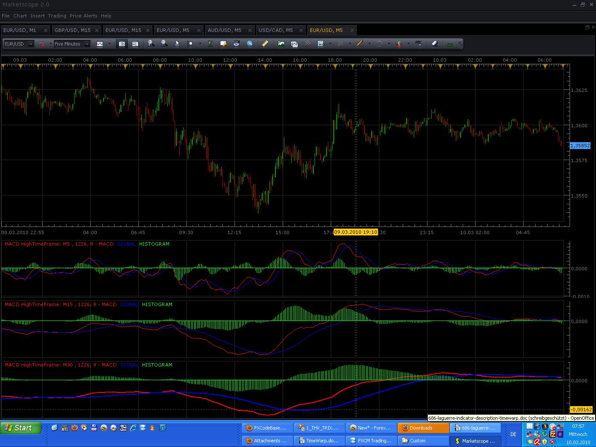
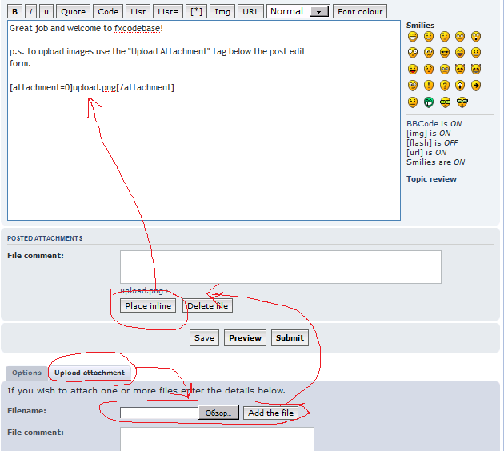

# Update Higher TimeFrame Bar Source MACD

> Source: https://fxcodebase.com/code/viewtopic.php?f=17&t=430  
> Forum: 17 · Topic 430 · 10 post(s)

---

## Update Higher TimeFrame Bar Source MACD

**Gidien** · Thu Mar 04, 2010 4:31 am

I start writing a Higher Time Frame Bar Source template. This is not relay an indicator but possibly it can be used as datasource for all other indicators to show Indicator outputs from a higher time frame on your current lower timeframe.

You can use it as template for you indicator.
Attention:
allways multiple your period parameters with the iFrame variable.

I also attached a HTF MACD Histogram as example.

This is the template code:

Code: [Select all](https://fxcodebase.com/code/)
`-- Indicator profile initialization routine
-- Defines indicator profile properties and indicator parameters
-- TODO: Add minimal and maximal value of numeric parameters and default color of the streams
-- Written by Gidien
-- This is not an indicator
-- This code creates a new Bar Source for other indicators.
-- it make it possible to show indicators regarding a higher timeframe on a low timeframe chart
-- Examble Show a MACD from Chart H4 on a Chart H1.
-- Only higher TimeFrames are possible.
-----------------------------------------------------------------------------------------------
function Init()
    indicator:name("HTF BAR SOURCE Beta");
    indicator:description("CREATE New Higher TimeFrame BAR Source");
    indicator:requiredSource(core.Bar);
    indicator:type(core.Indicator);

    indicator.parameters:addString("TF", "Time Frame", "Higher Time Frame" , "M1")
    indicator.parameters:addStringAlternative("TF", "M1", "Higher Time Frame M1" , "M1")
    indicator.parameters:addStringAlternative("TF", "M5", "Higher Time Frame M5" , "M5")
    indicator.parameters:addStringAlternative("TF", "M15", "Higher Time Frame M15" , "M15")
    indicator.parameters:addStringAlternative("TF", "M30", "Higher Time Frame M30" , "M30")
    indicator.parameters:addStringAlternative("TF", "H1", "Higher Time Frame H1" , "H1")
    indicator.parameters:addStringAlternative("TF", "H4", "Higher Time Frame H4" , "H4")
    indicator.parameters:addStringAlternative("TF", "D1", "Higher Time Frame D1" , "D1")
    indicator.parameters:addStringAlternative("TF", "W1", "Higher Time Frame W1" , "W1")
    indicator.parameters:addBoolean("bFull", "Plott Full Bar", "Plott full BAR" , true)
    indicator.parameters:addColor("HFCLOSE_color", "Color of HFCLOSE", "Color of HFCLOSE", core.rgb(255, 255, 0));
    indicator.parameters:addColor("HFOPEN_color", "Color of HFOPEN", "Color of HFOPEN", core.rgb(255, 255, 255));
    indicator.parameters:addColor("HFHIGH_color", "Color of HFHIGH", "Color of HFHIGH", core.rgb(0, 255, 0));
    indicator.parameters:addColor("HFLOW_color", "Color of HFLOW", "Color of HFLOW", core.rgb(255, 0, 0));
end

-- Indicator instance initialization routine
-- Processes indicator parameters and creates output streams
-- TODO: Refine the first period calculation for each of the output streams.
-- TODO: Calculate all constants, create instances all subsequent indicators and load all required libraries
-- Parameters block
local higherTF;
local TF
local currentTF;
local first;
local source = nil;

local iFrame;
local iRem;
local iSync;
local iMin;
local iHour;
local iDay;
local bFull;
-- Streams block
local hfClose = nil;
local hfOpen = nil;
local hfHigh = nil;
local hfLow = nil;

-- Routine
function Prepare()
    TF = instance.parameters.TF;
    bFull = instance.parameters.bFull;
    source = instance.source;
    iRem= 10;
   iSync= 0;
    local name = "TEST";
    iFrame = 0;
    if source:barSize() == "m1" then
        currentTF = 1;
    end
    if source:barSize() == "m5" then
        currentTF = 5;
    end
    if source:barSize() == "m15" then
        currentTF = 15;
    end
    if source:barSize() == "m30" then
        currentTF = 30;
    end
    if source:barSize() == "h1" then
        currentTF = 60;
    end
    if source:barSize() == "h4" then
        currentTF = 240;
    end
-- NOT USEABLE at the moment
--    if source:barSize() == "d1" then
--        currentTF = 1440;
--    end   
--    if source:barSize() == "w1" then
--        currentTF = 10080;         ---------------------------> IS 10080 correct for a WEEK ????????????????
--    end
-- NOT USEABLE at the moment     
    if TF == "M1" then
        higherTF = 1;
        name = "HTF " .. " HighTimeFrame: " .. "M1";
    end
    if TF == "M5" then
        higherTF = 5;
        name = "HTF " .. " HighTimeFrame: " .. "M5";
    end
    if TF == "M15" then
        higherTF = 15;
        name = "HTF " .. " HighTimeFrame: " .. "M15";
    end
    if TF == "M30" then
        higherTF = 30;
        name = "HTF " .. " HighTimeFrame: " .. "M30";
    end
    if TF == "H1" then
        higherTF = 60;
        name = "HTF " .. " HighTimeFrame: " .. "H1";
    end
    if TF == "H4" then
        higherTF = 240;
        name = "HTF " .. " HighTimeFrame: " .. "H4";
    end
-- NOT USEABLE at the moment   
--    if TF == "D1" then
--        higherTF = 1440;
--        name = "HTF " .. " HighTimeFrame: " .. "Daily";
--    end
--    if TF == "W1" then
--        higherTF = 10080;
--        name = "HTF " .. " HighTimeFrame: " .. "Week";
--    end
-- NOT USEABLE at the moment   

------------- Frame Calculation ----------------------------------------------------------
    if (higherTF>currentTF) then
        iFrame = higherTF/currentTF;
   else
      iFrame = 1;
   end

-- NOT USEABLE at the moment
    --if (higherTF==10080 and currentTF==1440) then
    --    iFrame=5;
    --end
-- NOT USEABLE at the moment

   if (iFrame>60) then
        error("iFRame Higher 60 Please Check your settings");
    end

    first = source:first() + iFrame;

    instance:name(name);
    hfClose = instance:addStream("hfClose", core.Line, name .. ".hfClose", "hfClose", instance.parameters.HFCLOSE_color, first);
    hfOpen = instance:addStream("hfOpen", core.Line, name .. ".hfOpen", "hfOpen", instance.parameters.HFOPEN_color, first);
    hfHigh = instance:addStream("hfHigh", core.Line, name .. ".hfHigh", "hfHigh", instance.parameters.HFHIGH_color, first);
    hfLow = instance:addStream("hfLow", core.Line, name .. ".hfLow", "hfLow", instance.parameters.HFLOW_color, first);

------ ATTENTION -----
--  ALL Period Parameters must multiplite with the iFrame Value

end

-- Indicator calculation routine
-- TODO: Add your code for calculation output values
function Update(period)
    ---------------- Call this allways first and then core.UpdateNew -----------------
    calcNewSource(period);

end

function calcNewSource(period)
--------- Time Synchronization ----------------------------------------------------
    local time;
    time = core.dateToTable(source:date(period));
    iMin = time.min;
    iHour = time.hour;
    iDay = time.day;

        if (higherTF<=60 and currentTF<=30)   then
            iRem = math.fmod(iMin,higherTF) / currentTF;
      elseif (higherTF==240 and currentTF==15)    then
            iRem = math.fmod(iHour,4) * 4 + (iMin/15);
      elseif (higherTF==240 and currentTF==30)    then
            iRem = math.fmod(iHour,4) * 2 + (iMin/30);
      elseif (higherTF==240 and currentTF==60)    then
            iRem = math.fmod(iHour,4);
-- NOT USEABLE at the MOMENT ----
--      elseif (higherTF==1440 and currentTF==30)   then
--            iRem = math.fmod(iHour,24) * 2 + (iMin/30);
--      elseif (higherTF==1440 and currentTF==60)      then
--            iRem = math.fmod(iHour,24);
--      elseif (higherTF==1440 and currentTF==240)      then
--            iRem = math.fmod(iHour,24) / 4;
--      elseif (higherTF==10080 and currentTF==1440)      then
--            iRem = math.fmod(iDay-1,7);
-- NOT USEABLE at the MOMENT ----
      else   
            iRem = math.fmod(period,iFrame);
        end
---------- Calculate the NEW HTF Source ---------------------------------------------
    if period >= iRem then
        if (iRem == 0) then
            hfOpen[period]   = source.open[period];
         hfClose[period]  = source.close[period];
         hfHigh[period]   = source.high[period];
         hfLow[period]    = source.low[period];
      else
         hfOpen[period]  = hfOpen[period-1];
         hfClose[period] = source.close[period];
         hfHigh[period]  = hfHigh[period-1];
         hfLow[period]   = hfLow[period-1];
         if (source.high[period]>hfHigh[period])   then
                hfHigh[period] = source.high[period];
         end
            if (source.low[period]<hfLow[period]) then
                hfLow[period] = source.low[period];
            end
         if bFull == true then
            for iBack=1, iRem do
               hfHigh[period-iBack] = hfHigh[period];
               hfLow[period-iBack] = hfLow[period];
               --//hfOpen[iBar-iBack] = hfOpen[iBar];
               hfClose[period-iBack] = hfClose[period];
            end
         end
      end         
    end
end`

This is the HFT MACD Histogram CODE Example:

Code: [Select all](https://fxcodebase.com/code/)
`-- Indicator profile initialization routine
-- Defines indicator profile properties and indicator parameters
function Init()
    indicator:name("HTF MACD Histogram");
    indicator:description(" HTF MACD only Histogram");
    indicator:requiredSource(core.Bar);
    indicator:type(core.Oscillator);

    indicator.parameters:addInteger("SN", "Signal Period", "Period of the Signal", 14, 2, 1000);
    indicator.parameters:addInteger("LN", "Slow Period", "Slow Period", 34, 2, 1000);
    indicator.parameters:addInteger("IN", "Fast Period", "Fast period", 50, 1, 1000);
    indicator.parameters:addString("TF", "Time Frame", "Higher Time Frame" , "M1")
    indicator.parameters:addStringAlternative("TF", "M1", "Higher Time Frame" , "M1")
    indicator.parameters:addStringAlternative("TF", "M5", "Higher Time Frame" , "M5")
    indicator.parameters:addStringAlternative("TF", "M15", "Higher Time Frame" , "M15")
    indicator.parameters:addStringAlternative("TF", "M30", "Higher Time Frame" , "M30")
    indicator.parameters:addStringAlternative("TF", "H1", "Higher Time Frame" , "H1")
    indicator.parameters:addStringAlternative("TF", "H4", "Higher Time Frame" , "H4")
    indicator.parameters:addColor("HISTOGRAM_color", "Color of Histogram", "Color of Histogram", core.rgb(0, 255, 0));
end

-- Indicator instance initialization routine
-- Processes indicator parameters and creates output streams
-- Parameters block
local SN;
local LN;
local IN;

local higherTF;
local TF
local currentTF;
local iFrame;
local iRem;
local iSync;
local iMin;
local iHour;
local iDay;
local bFull;
-- Streams block
local hfClose = nil;
local hfOpen = nil;
local hfHigh = nil;
local hfLow = nil;
local hfSlow;
local hfFast;
local hfSignal ;

--- First -------
local first;
local firstPeriodMACD;

local firstPeriodSIGNAL;
local source = nil;
local htfSource;
local EMAS = nil;
local EMAL = nil;
local MVAI = nil;

-- Streams block
local MACD = nil;
local SIGNAL = nil;
local HISTOGRAM = nil;

-- Routine
function Prepare()
    SN = instance.parameters.SN;
    LN = instance.parameters.LN;
    IN = instance.parameters.IN;

--------------------------------------------------------------------------------------------
    bFull = true;
    TF = instance.parameters.TF;
    source = instance.source;
    iRem= 10;
   iSync= 0;
    iFrame = 0;

    if source:barSize() == "m1" then
        currentTF = 1;
    end
    if source:barSize() == "m5" then
        currentTF = 5;
    end
    if source:barSize() == "m15" then
        currentTF = 15;
    end
    if source:barSize() == "m30" then
        currentTF = 30;
    end
    if source:barSize() == "h1" then
        currentTF = 60;
    end
    if source:barSize() == "h4" then
        currentTF = 240;
    end
    if TF == "M1" then
        higherTF = 1;
    end
    if TF == "M5" then
        higherTF = 5;
    end
    if TF == "M15" then
        higherTF = 15;
    end
    if TF == "M30" then
        higherTF = 30;
    end
    if TF == "H1" then
        higherTF = 60;
     end
    if TF == "H4" then
        higherTF = 240;
    end
    if (higherTF>currentTF) then
        iFrame = higherTF/currentTF;
   else
      iFrame = 1;
   end
   if (iFrame>60) then
        error("iFRame Higher 60 Please Check your settings");
    end

    first = source:first() + iFrame;
    hfClose = instance:addInternalStream(first);
    hfOpen = instance:addInternalStream(first);
    hfHigh = instance:addInternalStream(first);
    hfLow = instance:addInternalStream(first);
--------------------------------------------------------------------------------------------
    -- Check parameters

    -- Create short and long EMAs for the source
    hfSlow = LN * iFrame;
    hfFast = SN * iFrame;
    hfSignal = IN * iFrame;

    EMAS = core.indicators:create("EMA", hfClose, hfFast);
    EMAL = core.indicators:create("EMA", hfClose, hfSlow);

    -- Base name of the indicator.
    local name = profile:id() .. "(" .. source:name() .. ", " .. SN .. ", " .. LN .. ", " .. IN .. ")";
    instance:name(name);

        -- Create the output stream for the MACD. The first period is equal to the
        -- biggest first period of source EMA streams
        firstPeriodMACD = EMAL.DATA:first();
        MACD = instance:addInternalStream(firstPeriodMACD);

        -- Create MVA for the MACD output stream.
        MVAI = core.indicators:create("MVA", MACD, hfSignal);
        -- Create output for the signal and histogram
        firstPeriodSIGNAL = MVAI.DATA:first();

 --   SIGNAL = instance:addStream("SIGNAL", core.Line, name .. ".SIGNAL", "SIGNAL", instance.parameters.SIGNAL_color, firstPeriodSIGNAL);
    HISTOGRAM = instance:addStream("HISTOGRAM", core.Bar, name .. ".HISTOGRAM", "HISTOGRAM", instance.parameters.HISTOGRAM_color, firstPeriodSIGNAL);
end

-- Indicator calculation routine
function Update(period, mode)
    calcNewSource(period);
    -- and update short and long EMAs for the source.
    EMAS:update(core.UpdateNew);
    EMAL:update(core.UpdateNew);

    if (period >= firstPeriodMACD) then
        -- calculate MACD output
         MACD[period] = EMAS.DATA[period] - EMAL.DATA[period];
    end

    -- update MVA on the MACD
    MVAI:update(core.UpdateNew);
    if (period >= firstPeriodSIGNAL) then
--        SIGNAL[period] = MVAI.DATA[period];
        -- calculate histogram as a difference between MACD and signal
        HISTOGRAM[period] = MACD[period] - MVAI.DATA[period];
    end
end

function calcNewSource(period)
    local time;
    time = core.dateToTable(source:date(period));
    iMin = time.min;
    iHour = time.hour;
    iDay = time.day;

        if (higherTF<=60 and currentTF<=30)   then
            iRem = math.fmod(iMin,higherTF) / currentTF;
      elseif (higherTF==240 and currentTF==15)    then
            iRem = math.fmod(iHour,4) * 4 + (iMin/15);
      elseif (higherTF==240 and currentTF==30)    then
            iRem = math.fmod(iHour,4) * 2 + (iMin/30);
      elseif (higherTF==240 and currentTF==60)    then
            iRem = math.fmod(iHour,4);
-- NOT USEABLE at the MOMENT ----
--      elseif (higherTF==1440 and currentTF==30)   then
--            iRem = math.fmod(iHour,24) * 2 + (iMin/30);
--      elseif (higherTF==1440 and currentTF==60)      then
--            iRem = math.fmod(iHour,24);
--      elseif (higherTF==1440 and currentTF==240)      then
--            iRem = math.fmod(iHour,24) / 4;
--      elseif (higherTF==10080 and currentTF==1440)      then
--            iRem = math.fmod(iDay-1,7);
-- NOT USEABLE at the MOMENT ----
      else   
            iRem = math.fmod(period,iFrame);
        end
---------- Calculate the NEW HTF Source ---------------------------------------------
    if period >= iRem then
        if (iRem == 0) then
            hfOpen[period]   = source.open[period];
         hfClose[period]  = source.close[period];
         hfHigh[period]   = source.high[period];
         hfLow[period]    = source.low[period];
      else
         hfOpen[period]  = hfOpen[period-1];
         hfClose[period] = source.close[period];
         hfHigh[period]  = hfHigh[period-1];
         hfLow[period]   = hfLow[period-1];
         if (source.high[period]>hfHigh[period])   then
                hfHigh[period] = source.high[period];
         end
            if (source.low[period]<hfLow[period]) then
                hfLow[period] = source.low[period];
            end
         if bFull == true then
            for iBack=1, iRem do
               hfHigh[period-iBack] = hfHigh[period];
               hfLow[period-iBack] = hfLow[period];
               --//hfOpen[iBar-iBack] = hfOpen[iBar];
               hfClose[period-iBack] = hfClose[period];
            end
         end
      end         
    end
end`

All Codes were Beta Try it out and let me know , if it works for your.

Happy Day

Picture:

Shows HFT MACD on a M5 Chart.
MACD 1 = HFT set to M5 --- normal MACD
MACD 2 = HFT set to M15 ---
MACD 3 = HFT set to M30 ---

HFT MACD

 

The indicator was revised and updated

---

## Re: Higher TimeFrame Bar Source

**Nikolay.Gekht** · Mon Mar 08, 2010 12:16 pm

Great job and welcome to fxcodebase!

p.s. to upload images use the "Upload Attachment" tab below the post edit
form.

Choose the file and press "Add the file" button. The file appears in the attachment section below the post edit form.

Then click on "place inline" button to have the image (or lua) file placed into the post in the place you wish.

 

---

## Re: Update Higher TimeFrame Bar Source MACD

**miocker** · Wed Mar 10, 2010 6:26 pm

Just a small issue in the code: h1 should be changed to H1 and h4 to H4 otherwise this:

Code: [Select all](https://fxcodebase.com/code/)
`if source:barSize() == "h1" then
        currentTF = 60;
    end
    if source:barSize() == "h4" then
        currentTF = 240;
    end`
will not be executed correctly in the new version of charts.
Correct periods are:
t - ticks
m - minutes
H - hours
D - days
W - weeks
M - months

---

## Re: Update Higher TimeFrame Bar Source MACD

**Gidien** · Thu Mar 11, 2010 2:02 am

OK thanks

---

## Re: Update Higher TimeFrame Bar Source MACD

**barbs666** · Sat Mar 27, 2010 6:08 pm

Hi,

Thanks for your work here!

Is there any chance that you could impliment a indicator to draw a box around the current week, while using the last weeks high/low of the weekly time frame and that box can be adjusted in pips from that weekly high/low.

thanks

---

## Re: Update Higher TimeFrame Bar Source MACD

**barbs666** · Sun Mar 28, 2010 1:27 am

hi,

just used the code directly into the marketscope 2 chart, and it says that it cannot access higher timefram sources.

however it can draw the high/low lines on the currently selected chart.

May you be able to make an indicator for me using the timeframe source code. All I need it to do is access a higher time frame (ie: weekly bar from the last week) and draw a box envelope around the current week. This box would be nice to have adjustable top and bottom.

I have tried, but my programming skills are not what they used to be.

Thanks

---

## Re: Update Higher TimeFrame Bar Source MACD

**Nikolay.Gekht** · Mon Mar 29, 2010 12:54 pm

Please wait for the new release which will provide an access to other time frames in a "native" manner. It's only a couple of week to official release remains.

---

## Re: Update Higher TimeFrame Bar Source MACD

**satishbabut** · Mon Jul 05, 2010 3:56 am

I am trying to write a indicator in to use Higher timeframe HLC values, this example is only able to pass hfClose. You talk about ability to pass hfSource. Can you give an example on how to pass hfSource.

---

## Re: Update Higher TimeFrame Bar Source MACD

**Nikolay.Gekht** · Mon Jul 05, 2010 10:03 am

Look at High/Low band indicator. It shows High/Low of the chosen (equal or higher) time frame.
[viewtopic.php?f=17&t=607](https://fxcodebase.com/code/viewtopic.php?f=17&t=607)

To read about loading the other instrument/time frame data, please follow to the this article in the documentation:
[http://www.fxcodebase.com/documents/ind ... story.html](http://www.fxcodebase.com/documents/indicoreSDK/host.execute_getHistory.html)

---

## Re: Update Higher TimeFrame Bar Source MACD

**Apprentice** · Mon Jan 16, 2017 7:05 am

Indicator was revised and updated.
