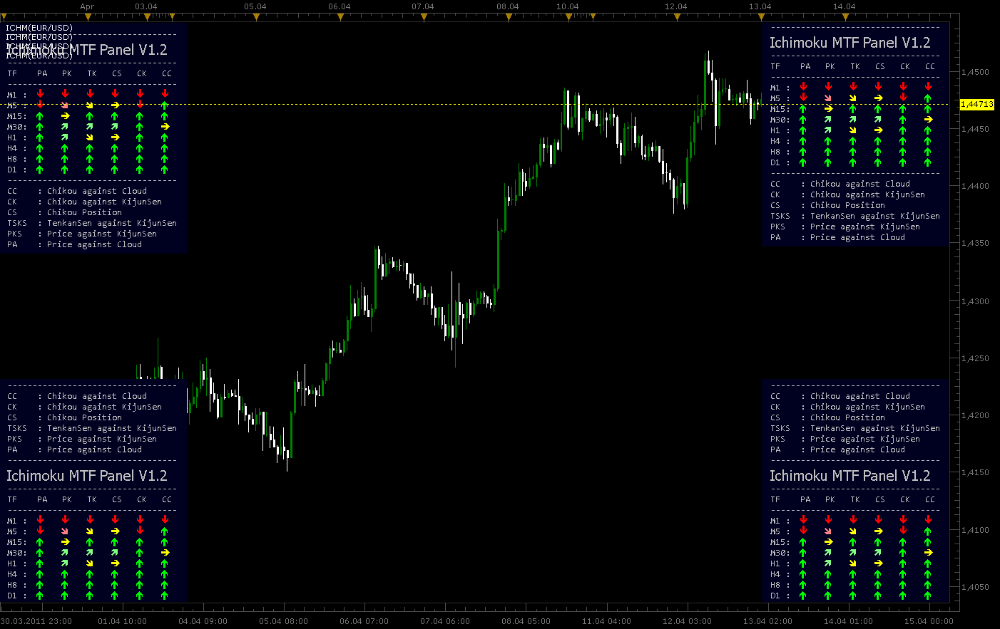
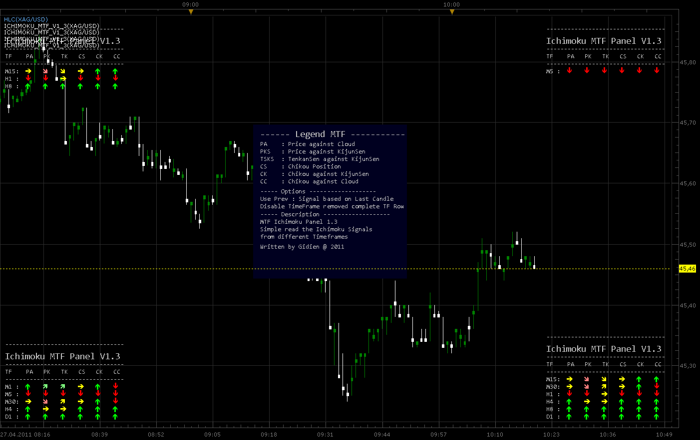
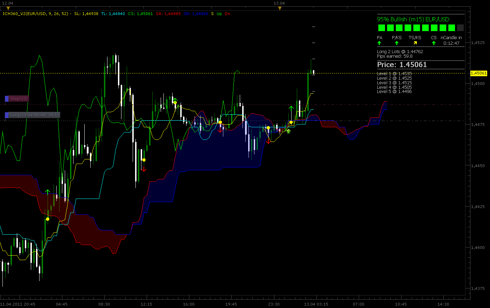
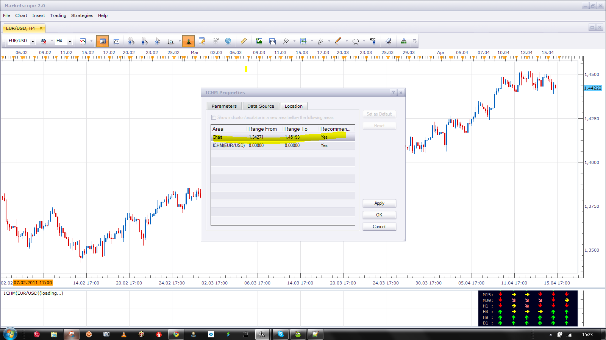

# (Update MTF Panel 1.3) Ichimoku MTF Panel and Ichimoku Meter

> Source: https://fxcodebase.com/code/viewtopic.php?f=17&t=3890  
> Forum: 17 · Topic 3890 · 53 post(s)

---

## (Update MTF Panel 1.3) Ichimoku MTF Panel and Ichimoku Meter

**Gidien** · Tue Apr 12, 2011 8:09 am

this is my first try to create a MTF Panel for Ichimoku Signals like the ICH360 Monitor from MT4

Update the Ichi MTF Panel:
14.April 2011
Version 1.2

change logic of some signals
cleanup the code
finished views:
TopRight
TopLeft
BottomRight
BottomLeft

 



file:

 [ICHM.lua](files/9589/ICHM.lua)

**New Update MTF Panel**

27.04.2011
Version 1.3

change log:
removed Background for the Panel for the moment
moved Legend to the middle of Chart
Disable Timeframes will remove the complete row of that TF from the Panel will resized.

 



Code:

 [Ichimoku_MTF_V1_3.lua](files/9589/Ichimoku_MTF_V1_3.lua)

The indicator was revised and updated

---

## Re: Ichimoku MTF Panel

**Gidien** · Tue Apr 12, 2011 2:22 pm

Update 1.1 removed see new Ich MTF Panel 1.2

---

## Re: Ichimoku MTF Panel

**Blackcat2** · Tue Apr 12, 2011 5:06 pm

Wow... it looks very nice

---

## Re: Ichimoku MTF Panel

**Blackcat2** · Tue Apr 12, 2011 7:25 pm

The new version doesn't have the percentage bear/bull, that could be handy.. can have it as an option?
In the first picture it shows up or down arrow, is that a buy/sell signal? How come the new version doesn't have it? I think it would be useful...

Cheers..
BC

---

## Re: Ichimoku MTF Panel

**Gidien** · Wed Apr 13, 2011 2:15 am

The top indicator at the first picture is not the mtf Panel.

It is different indicator which give me entry point, strenght of the trend and possible reversal Levels only at the chart timeframe. It is not a multi timeframe indicator.

The indicator is still in development, the signals and logic for trend strenght are finished, but the code is dirty and need to be optimized.

Signals were equal to the other indicator , but TS/KS is different. TS/KS only create the signal if a cross of TS and KS occured. TS/KS is not changed until next cross.
the are three levels for TS/KS
Signal Bullish
 - cross below Kumo Level 1 open position with one lot
 - cross inside Kumo Level 2 open position with two lots
 - cross above Kumo Level 3 open position with three lots
Signal Bearish
 -Reverse the logic

Pips earned gives an idea how many pips you could reach with the last TS/KS signal based also on lots level.

here a picture

 



code:

 [ICHMeter.lua](files/9618/ICHMeter.lua)

---

## Re: Ichimoku MTF Panel and Ichimoku Meter

**DS0167** · Wed Apr 13, 2011 4:03 pm

Very nice indicator !

I am eager to see it finish

---

## Re: Ichimoku MTF Panel and Ichimoku Meter

**Blackcat2** · Wed Apr 13, 2011 7:37 pm

The Ichimoku meter is soooo cool!
Thank you very much for sharing it..
This indicator provides both details and summary information so people can use either one to make their judgement..

I think this should be an example on how indicator based on complex rules should look like....

Cheers..
BC

---

## Re: Ichimoku MTF Panel and Ichimoku Meter

**Blackcat2** · Wed Apr 13, 2011 10:43 pm

Ok, I have test this for a bit and the signal is wrong most of the time. I used default parameters and applied it on EUR/USD 15M and 1H chart. You almost better off if you go the opposite of the signal..

I don't know whether this is caused by the Ichimoku rules or the calculation to generate the signal whether to go or short?

Cheers..
BC

---

## Re: Ichimoku MTF Panel and Ichimoku Meter

**Gidien** · Thu Apr 14, 2011 4:40 am

as i told Ichimoku Meter is still in development.

Ichimoku is a trend follow indicator not a system, works good in trends but failed in range markets.

The Rules for entry signal are strict to this description:

**Tenkan Sen/Kijun Sen Cross**
The tenkan sen/kijun sen cross is one of the most traditional trading strategies within the Ichimoku Kinko Hyo system. The signal for this strategy is given when the tenkan sen crosses over the kijun sen. If the tenkan sen crosses above the kijun sen, then it is a bullish signal. Likewise, if the tenkan sen crosses below the kijun sen, then that is a bearish signal. Like all strategies within the Ichimoku system, the tenkan sen/kijun sen cross needs to be viewed in terms of the bigger Ichimoku picture before making any trading decisions, as this will give the strategy the best chances of success.

In general, the tenkan sen/kijun sen strategy can be classified into three (3) major classifications: strong, neutral and weak.

**STRONG TENKAN SEN/KIJUN SEN CROSS SIGNAL**

A strong tenkan sen/kijun sen cross Buy signal takes place when a bullish cross happens above the kumo.
A strong tenkan sen/kijun sen cross Sell signal takes place when a bearish cross happens below the kumo.

my decision :
go long or short with 3 Lots, but offen give a failed signal if this happen at the end of trend or range market

**NEUTRAL TENKAN SEN/KIJUN SEN CROSS SIGNAL**

A neutral tenkan sen/kijun sen cross Buy signal takes place when a bullish cross happens within the kumo.
A neutral tenkan sen/kijun sen cross Sell signal takes place when a bearish cross happens within the kumo.

my decision :
go long or short with 2 Lots, but offen give a failed signal if this happen at retracement or range market

**WEAK TENKAN SEN/KIJUN SEN CROSS SIGNAL**

A weak tenkan sen/kijun sen cross Buy signal takes place when a bullish cross happens below the kumo.
A weak tenkan sen/kijun sen cross Sell signal takes place when a bearish cross happens above the kumo.

my decision :
go long or short with 1 Lots, but offen give a failed signal while retracement, i dont use this signal while many failed signal. wait for a strong oposite signal offen some bars later.

The conclution is :
Look at the signal , but also analyse the chart, if this signal can be wrong. Use the MTF Panel and try to catch only signals in the major trend.

I wrote a Strategy for TS/KS Signal and use the description above.
Strong with 3 lots;
Neutral with 2 lots,
Weak with 1 lots and the strategy loos, so there are many thinks to do

Good site about the Ichimoku Signals is
[http://www.kumotrader.com/ichimoku_wiki/index.php?title=Main_Page](http://www.kumotrader.com/ichimoku_wiki/index.php?title=Main_Page)

---

## Re: (Update MTF Panel 1.2) Ichimoku MTF Panel and Ichimoku Meter

**thetruth** · Fri Apr 15, 2011 9:41 am

very nice indicator, thanks!
can you add some yes/no parameter to see or erase the lines of ichimoku?

---

## Re: (Update MTF Panel 1.2) Ichimoku MTF Panel and Ichimoku Meter

**Gidien** · Fri Apr 15, 2011 11:01 am

here it comes
enable or disable Ichimoku line included

 [ICHMeter.lua](files/9725/ICHMeter.lua)

---

## Re: (Update MTF Panel 1.2) Ichimoku MTF Panel and Ichimoku Meter

**ak_nomiss** · Sat Apr 16, 2011 6:27 pm

can you tell me how did you put the indicator and price in same window ? when I insert the indicator it just create one more window below the price window

---

## Re: (Update MTF Panel 1.2) Ichimoku MTF Panel and Ichimoku Meter

**Apprentice** · Sun Apr 17, 2011 8:26 am

This indicator acts as under the char, independent entity.
However, the user can choose the location of the display.
By selection chart, as the location of the display.

 



---

## Re: (Update MTF Panel 1.2) Ichimoku MTF Panel and Ichimoku Meter

**Gidien** · Sun Apr 17, 2011 2:25 pm

Yes at the moment you have to set the location of the indicator manualy, it seems that it will be open allways in a new windows, even if the indicator type is

core.Indicator

and it should open in the same window as the price, like moving average.

I'm not sure for the moment why it is so , i think it has something to do with the background. As it is not possible to draw rectangle on the chart from inside an indicator , i use instead two big wingdings letter "n". Because the size is 300 for this fonts, the letter overlaps with the border of the chart.

---

## Re: (Update MTF Panel 1.2) Ichimoku MTF Panel and Ichimoku Meter

**kumaresan** · Tue Apr 19, 2011 2:42 am

Hi Gidien / Apprentice,

Greetings.
Appreciate your efforts on this developments and Thanks for this indicator.

Can you give a list of currency pairs which is trading with 3 Lots at this moment(ie., strong signal for Long / Short).

If you show with different color for the currency pairs which is going to / just arrived into the strong signal at this moment, which is helpful for all the traders to look into the specified currency pairs. Bcoz waiting for a strong signal with one currency pair will loss the chance to make a money with other currency pairs strong signals.

You can mix-up the volume parameters (regular volume / unusual volume) for the strong signals.

This will very helpful for the m1 chart traders (Day traders).

I think it wont affect the time frames also, if a user keeps the time frame as m1, the ICH meter will show the signals for m1.

Kindly ref the attachment, where you can keep the currency lists there.

If you could develop this indicator as this way, im sure the traders doesn't require anymore indicators for their trading. This will give them a complete solution.

Kindly check and update with the possibility.

Thank You !

Regds / Kumaresan.

---

## Re: (Update MTF Panel 1.2) Ichimoku MTF Panel and Ichimoku Meter

**Gidien** · Tue Apr 19, 2011 8:34 am

Can you tell me more about the volume effect, i never use volume, so i didn't have experience .
How i can use the volume to classify the signals?

The other part, i hope i understand correctly. you want to change the indicator to a multi currency indicator. Show the (strong) signals over more then one pair in one panel.

---

## Re: (Update MTF Panel 1.2) Ichimoku MTF Panel and Ichimoku Meter

**ak_nomiss** · Tue Apr 19, 2011 6:27 pm

can you add alert / sound and email too ? that would be perfect , Thank you very this indicator. Also, I notice that the pips earned is calculate by lots ? for example: long 2 lots, pips earned = 100
it actually only profit 50 pips ( 2 lots * 50 pips = 100 pips earned )

---

## Re: (Update MTF Panel 1.2) Ichimoku MTF Panel and Ichimoku Meter

**Gidien** · Wed Apr 20, 2011 3:00 am

> **ak_nomiss wrote:**
> can you add alert / sound and email too ? that would be perfect , Thank you very this indicator. Also, I notice that the pips earned is calculate by lots ? for example: long 2 lots, pips earned = 100
> it actually only profit 50 pips ( 2 lots * 50 pips = 100 pips earned )

Thats right, pips earned is the real pip multiplied with the lots open.

long with 3 lots and a price move of 50 pips , earned 150 pips.

alert, sound and email is not not possible inside an indicator, you can only use is at strategies or signals

from the documention

table terminal

**Brief**
The table which is used to get access to the trading terminal functions.

**Details**
The terminal table is always available at the moment of the preparing or updating of the instance of your strategy.

---

## Re: (Update MTF Panel 1.2) Ichimoku MTF Panel and Ichimoku Meter

**kumaresan** · Wed Apr 20, 2011 2:17 pm

Hi Gidien / Apprentice,

Greetings.

First, thank you for reverting to me and I need to appreciate you for the effort you are taking.

Let me explain to you from my knowledge about the volume impact.

Volumes towards a particular currency pairs will determine the movement of a market (Up/Down).

If the volume is less, even a strong signal may fail to act, if the volume is more, even a weak signal will perform well (Signals means, indicator showing for buy/sell).

You can feel the fast movement of market when regular volumes to unusual / high volume times.
The unusual volumes may come because of News about the currency pair, Pivot point reaching, over bought/Sold, the right trading time of particular country etc…

The high volumes can be calculated by base of average volume of the day (if it exceeds the avg volume it needs to give the strong signal), exceeding the sentiment of fixed volume average of a particular currency pair.

If the volumes are exceeds the expectation, your signal should give either strong buy / sell.
I have given you the real examples of failures happening on this indicator in the attached image.
Refer the same; on every Buy/Sell signals of your indicator, needs to compare with the volume status.

You can design the indicator in such a manner that, it needs to show the strong Buy/Sell signals of multiple currency pairs only when the volume is high / above the average, if the volume is not up to the mark, your indicator should not show the signal for Buy/Sell even the strong signal comes as per the Ichimoku logic.

Hope I’ve explained to you in detail.

Help us by providing this indicator as successful manner.

Expecting a positive answer from you.

Thank You!

Regds / Kumaresan.

---

## Re: (Update MTF Panel 1.2) Ichimoku MTF Panel and Ichimoku Meter

**kumaresan** · Mon Apr 25, 2011 1:00 pm

Hi Gidien / Apprentice,

Awaiting for your revert,

Kindly check and confirm the feasibility.

Rgds / Kumaresan

---

## Re: (Update MTF Panel 1.2) Ichimoku MTF Panel and Ichimoku Meter

**Gidien** · Tue Apr 26, 2011 2:19 am

Hi,

we had "Easter" in Germany, time for my family. Searching eggs with my little daughter was more important to me.

I start to code the volume into to indicator. but i m not sure if increasing the tickvolume could says us if the singal good or not. So i read something about VSA Volume Spread Analyse and i take the following rule to filter out signals, not only increasing the volume.

```lua
local Range1 = source.high[p-1] - source.low[p-1];
        local Range2 = source.high[p-2] - source.low[p-2];
        local Vol1   = source.volume[p-1];
        local Vol2   = source.volume[p-2];
        if Range1 > Range2 then
            if (Vol1 > Vol2) then
                if source.high[p - 1] - source.close[p - 1] < source.close[p - 1] - source.low[p - 1] then
                    dir ="LONG";
                elseif source.high[p - 1] - source.close[p - 1] > source.close[p - 1] - source.low[p - 1] then
                    dir ="SHORT";   
                end
               
            end
        end
```

i also take attention to the spread(H-L) and the tickvolume.

If the **Spread is increasing** and the **volume too**, then we take a look to the positon of the closevalue regarding the high and low of the candle.

If the **close is closer to the high**of the candle **increasing spread and volume** indicates more **buying**pressure.
If the close is **closer to the low**, then we have more selling pressure.

Please check the Ichimoku Meter with Volume if it is better.

 [ICHMeter_V1_5_Volume.lua](files/10032/ICHMeter_V1_5_Volume.lua)

---

## Re: (Update MTF Panel 1.2) Ichimoku MTF Panel and Ichimoku Meter

**kumaresan** · Tue Apr 26, 2011 2:44 pm

Hi Gidien,

Sorry for troubled you, and belated wishes for Easter. God has risen for to save us

I'm happy for your effort on this. I too accept this spread concept.

But when observe the 1_5 version, the signal frequency became very less, and i'm not compromised that, the few signal coming are very strong signals.

And i don't want to confuse you from the right path. I have shared the possibility that can make the signal better, but even my view may be wrong.

Awaiting for updated version.

Regds / Kumaresan.

---

## Re: (Update MTF Panel 1.3) Ichimoku MTF Panel and Ichimoku Meter

**Gidien** · Wed Apr 27, 2011 3:21 am

Add Ichimoku MTF Panel Version 1.3 see post 1

---

## Re: (Update MTF Panel 1.3) Ichimoku MTF Panel and Ichimoku Meter

**ak_nomiss** · Mon May 02, 2011 8:05 pm

can you make a strategy base on this indicator ? give out alert/signal when 2 lines cross and how many lots to trade ? Thank you

---

## Re: (Update MTF Panel 1.3) Ichimoku MTF Panel and Ichimoku Meter

**t1982t** · Wed Jul 20, 2011 11:22 am

Hello
I like ichimoku strategies: [http://www.kumotrader.com/ichimoku_wiki ... strategies](http://www.kumotrader.com/ichimoku_wiki/index.php?title=Ichimoku_trading_strategies)
And ICHMETER.lua, thank you for it.
Seems Ichimoku strategies permit a good management account wiht stop lost less than the take profit.
I wondering if it is possible pragram a strategy with ICHMETER.lua. It could be simple, buy in 90%-100% bullish, sell in 90%-100% bearish of the indicator. Or not so simple: the five strategies on the page above, with trailing stop base on ichimoku signals, with the movement of kijun for example.
Thank you
Kind regards

---

## Re: (Update MTF Panel 1.3) Ichimoku MTF Panel and Ichimoku Meter

**Apprentice** · Wed Jul 20, 2011 1:43 pm

Your request is added to the developmental cue.

---

## Re: (Update MTF Panel 1.3) Ichimoku MTF Panel and Ichimoku Meter

**RJH501** · Mon Jul 23, 2012 8:43 am

Would you please add Span Cross signals to this indicator.

Thank you,

RJH

---

## Re: (Update MTF Panel 1.3) Ichimoku MTF Panel and Ichimoku Meter

**Mickaelfx** · Wed Jul 25, 2012 7:39 am

Hi,

Would it be possible to add the possibility of an alert **when** the H1 Chikou span cross the kumo **and only if** the daily chikou span is above the kumo.

It would be great if we could change H1 by 15mns and daily by H1or whatever we want...

Hope I don't ask too much.Thanks in advance Mikl

---

## Re: (Update MTF Panel 1.2) Ichimoku MTF Panel and Ichimoku Meter

**arindam89** · Thu Oct 04, 2012 7:50 pm

> **Gidien wrote:**
> Hi,
>
> we had "Easter" in Germany, time for my family. Searching eggs with my little daughter was more important to me.
>
> I start to code the volume into to indicator. but i m not sure if increasing the tickvolume could says us if the singal good or not. So i read something about VSA Volume Spread Analyse and i take the following rule to filter out signals, not only increasing the volume.
>
>
>
> Code: [Select all](https://fxcodebase.com/code/)
> `local Range1 = source.high[p-1] - source.low[p-1];
>         local Range2 = source.high[p-2] - source.low[p-2];
>         local Vol1   = source.volume[p-1];
>         local Vol2   = source.volume[p-2];
>         if Range1 > Range2 then
>             if (Vol1 > Vol2) then
>                 if source.high[p - 1] - source.close[p - 1] < source.close[p - 1] - source.low[p - 1] then
>                     dir ="LONG";
>                 elseif source.high[p - 1] - source.close[p - 1] > source.close[p - 1] - source.low[p - 1] then
>                     dir ="SHORT";   
>                 end
>
>             end
>         end`
>
> i also take attention to the spread(H-L) and the tickvolume.
>
> If the **Spread is increasing** and the **volume too**, then we take a look to the positon of the closevalue regarding the high and low of the candle.
>
> If the **close is closer to the high**of the candle **increasing spread and volume** indicates more **buying**pressure.
> If the close is **closer to the low**, then we have more selling pressure.
>
>
> Please check the Ichimoku Meter with Volume if it is better.
>
>
>
> ICHMeter_V1_5_Volume.lua

hi gidian
see if this volume indicator can be of some help [viewtopic.php?f=17&t=23459&p=40381&hilit=buy+sell#p40381](https://fxcodebase.com/code/viewtopic.php?f=17&t=23459&p=40381&hilit=buy+sell#p40381)
thanks buy

---

## Re: (Update MTF Panel 1.3) Ichimoku MTF Panel and Ichimoku M

**MathQuant** · Fri Feb 01, 2013 11:08 pm

Thank you for ICHMeter_V1_5_Volume.lua
Impressive !

---

## Re: (Update MTF Panel 1.3) Ichimoku MTF Panel and Ichimoku M

**allisonmagic** · Sat Feb 02, 2013 7:22 pm

wicked indicator !

---

## Re: (Update MTF Panel 1.3) Ichimoku MTF Panel and Ichimoku M

**johnjacob** · Wed Dec 11, 2013 12:37 pm

So , how can i get this indicator?

---

## Re: (Update MTF Panel 1.3) Ichimoku MTF Panel and Ichimoku M

**Gidien** · Thu Dec 12, 2013 2:23 am

> **johnjacob wrote:**
> So , how can i get this indicator?

What do you meen? You can download from this thread.

MTF 1.5 with Volume this post [viewtopic.php?f=17&t=3890&start=20#p10032](https://fxcodebase.com/code/viewtopic.php?f=17&t=3890&start=20#p10032)

MTF V1.3 without volume Post 1 page 1.

ICH Meter post 5 page one.

---

## Re: (Update MTF Panel 1.3) Ichimoku MTF Panel and Ichimoku M

**johnjacob** · Thu Dec 12, 2013 2:40 am

I tried downloading on mt4 it wont work.

---

## Re: (Update MTF Panel 1.3) Ichimoku MTF Panel and Ichimoku M

**johnjacob** · Thu Dec 12, 2013 2:35 pm

so, is this indicator for mt4? i load it up the same way i download all other indicator i got .. nothing . Is there another way to load it up beside the original way.

---

## Re: (Update MTF Panel 1.3) Ichimoku MTF Panel and Ichimoku M

**Gidien** · Thu Dec 12, 2013 3:10 pm

> **johnjacob wrote:**
> I tried downloading on mt4 it wont work.

This indicators are not for mt4 , they are for FXCM trading station II.

Check forexfactory forum. [http://www.forexfactory.com/showthread.php?p=6750877](http://www.forexfactory.com/showthread.php?p=6750877)

---

## Re: (Update MTF Panel 1.3) Ichimoku MTF Panel and Ichimoku M

**cave76** · Sun Jun 22, 2014 3:44 pm

hello is it possible to have these indicators with a ability to turn on and off the signal
ie I want the indicator to only show strong signals

thanks

---

## Re: (Update MTF Panel 1.3) Ichimoku MTF Panel and Ichimoku M

**Apprentice** · Mon Jun 23, 2014 1:58 am

Can you define what is strong signals.
And if we have one, that action should be taken.

---

## Ichimoku MTF Panel V1_3

**MrRiversideDude** · Wed Mar 11, 2015 7:29 am

Is it possible to add the weekly timeframe? Can I just modify the code?

---

## Re: (Update MTF Panel 1.3) Ichimoku MTF Panel and Ichimoku M

**MrRiversideDude** · Wed Apr 15, 2015 2:04 pm

Can you modify the indicator so that the timeframes are shown from highest to lowest? I tried and I broke something.

So it would look like:

D1
H8
H4
etc

Thanks in advance.

---

## Re: (Update MTF Panel 1.3) Ichimoku MTF Panel and Ichimoku M

**Apprentice** · Fri Apr 17, 2015 4:27 am

Which version do you want to modify.

---

## Re: (Update MTF Panel 1.3) Ichimoku MTF Panel and Ichimoku M

**MrRiversideDude** · Fri Apr 17, 2015 9:08 pm

The latest version of the MTF Panel. Thanks in advance.

Ed

---

## Re: (Update MTF Panel 1.3) Ichimoku MTF Panel and Ichimoku M

**Apprentice** · Mon Apr 20, 2015 5:53 am

Major Ichimoku_MTF_V1_3.lua Update.

Note. Technology used in this indicator is obsolete.
And as it is, this indicator is not a good basis for future updates.
Deserves a new version, written for from scratch.

---

## Re: (Update MTF Panel 1.3) Ichimoku MTF Panel and Ichimoku M

**MrRiversideDude** · Mon Apr 20, 2015 8:40 am

Thank you very much!!!

---

## Re: (Update MTF Panel 1.3) Ichimoku MTF Panel and Ichimoku M

**cersoz** · Thu Feb 25, 2016 3:35 pm

EXTREMLY URGENT

pls add parameter to this indicator "price against tenkan sen"

---

## Re: (Update MTF Panel 1.3) Ichimoku MTF Panel and Ichimoku M

**Apprentice** · Fri Feb 26, 2016 4:02 am

Your request is added to the development list.

---

## Re: (Update MTF Panel 1.3) Ichimoku MTF Panel and Ichimoku M

**BigFOX** · Fri Mar 04, 2016 3:03 am

Hi,
it is possible to create "ICHMeter_V1_5_Volume.lua" in strategy with:

- "Lots For Strong Signal"
- "Lots For Avarage Signal"
- "Lots For Weak Signal"

Cordially BigFOX.

---

## Re: (Update MTF Panel 1.3) Ichimoku MTF Panel and Ichimoku M

**Apprentice** · Sun Mar 06, 2016 5:29 am

Which entry / exit algorithm will be use by such strategy.

---

## Re: (Update MTF Panel 1.3) Ichimoku MTF Panel and Ichimoku M

**BigFOX** · Sun Mar 06, 2016 6:37 pm

Entry position when there is a closing signal and the next signal, followed by a purchase for the new signal. As "close on opposite" for future signals.

Cordialy BigFOX

---

## Re: (Update MTF Panel 1.3) Ichimoku MTF Panel and Ichimoku M

**ThemBonez** · Thu Dec 15, 2016 12:02 pm

Can you define the acronyms in a message...
i.e. PA, PK, etc.

Thank You

---

## Re: (Update MTF Panel 1.3) Ichimoku MTF Panel and Ichimoku M

**papynou34** · Tue Aug 27, 2019 11:19 am

Hello,
Is it ossible to add an alert in ICHmeter when an entry is detected?

Thanks in advance.

---

## Re: (Update MTF Panel 1.3) Ichimoku MTF Panel and Ichimoku M

**Apprentice** · Wed Aug 28, 2019 11:09 am

Your request is added to the development list.
 Internal developer reference 20.

---

## Re: (Update MTF Panel 1.3) Ichimoku MTF Panel and Ichimoku M

**Apprentice** · Thu Sep 05, 2019 4:59 am

Try this version.

 [ICHMeter with alert.lua](files/128425/ICHMeter%20with%20alert.lua)
