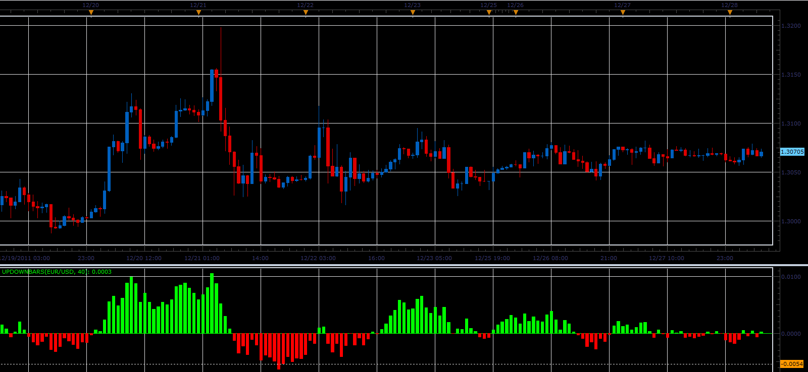

# UpDownBars indicator

> Source: https://fxcodebase.com/code/viewtopic.php?f=17&t=10552  
> Forum: 17 · Topic 10552 · 2 post(s)

---

## UpDownBars indicator

**Alexander.Gettinger** · Wed Dec 28, 2011 7:55 am

Formula:
UpDownBars=lwma(up)-lwma(down), where
lwma - linear weighted moving average,
up, down are a sum of square roots from positive and negative values (Close-Open).

 

Download:

 [UpDownBars.lua](files/21842/UpDownBars.lua)

The indicator was revised and updated

---

## Re: UpDownBars indicator

**Apprentice** · Mon Mar 20, 2017 8:20 am

Indicator was revised and updated.
