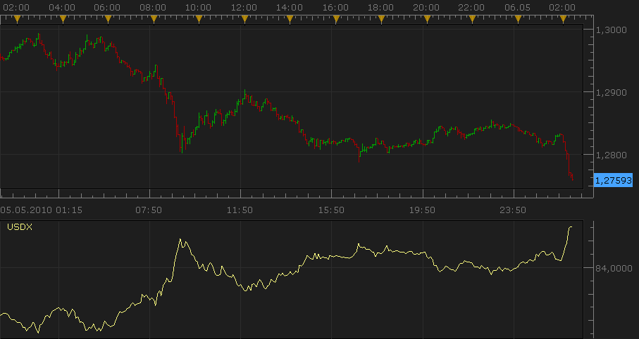
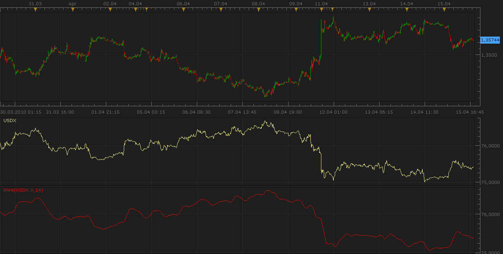
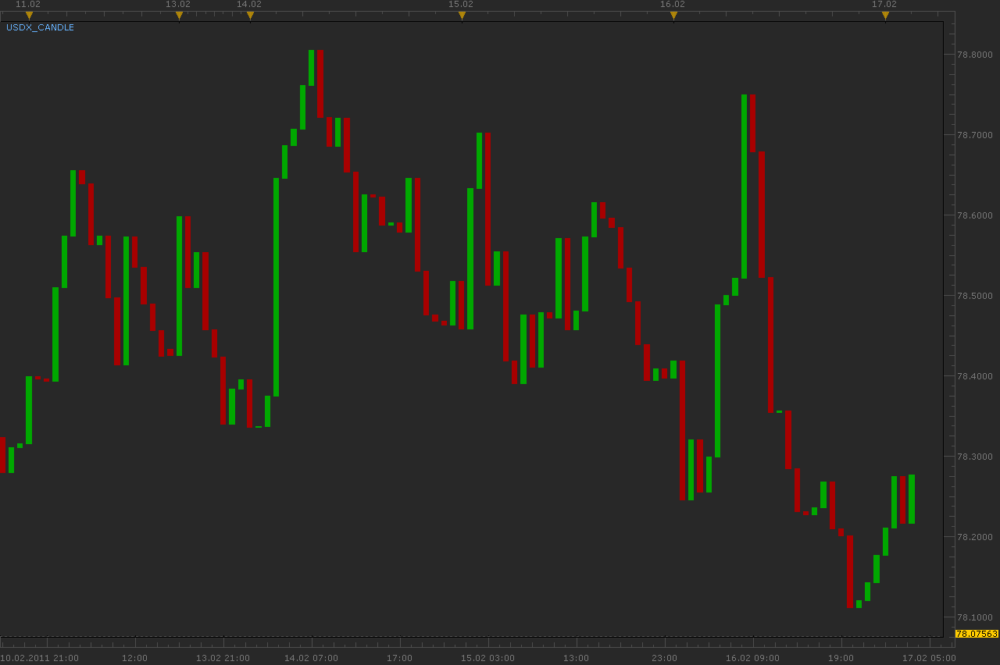
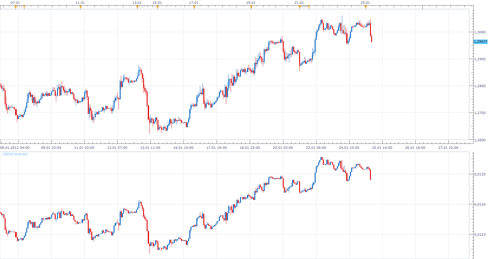

# US Dollar Index [Upd May, 05]

> Source: https://fxcodebase.com/code/viewtopic.php?f=17&t=609  
> Forum: 17 · Topic 609 · 36 post(s)

---

## US Dollar Index [Upd May, 05]

**Nikolay.Gekht** · Sun Apr 11, 2010 8:36 pm

**May, 05** USD/SEK added since it supported for all available connections.

The USD Index measures the performance of the US Dollar against a basket of currencies.

USDX := 50.14348112 × EURUSD-0.576 × USDJPY0.136 × GBPUSD-0.119 × USDCAD0.091 × AUDUSD0.042 × USDCHF0.036

Please, note, that you must be subscribed for all instruments required to calculation: EUR/USD, USD/JPY, GBP/USD, USD/CAD, AUD/USD and USD/CHF. If at least one of the instruments is not subscribed, the indicator fails!

 

Download:

 [USDX.lua](files/1078/USDX.lua)

Bar Chart Version (option)

 [USDX.lua](files/1078/USDX%20%282%29.lua)

Tick Time Frame Version

 [Tick USDX.lua](files/1078/Tick%20USDX.lua)

**Notice**
Tick based USDX Bar chart high/low values can differ from regular USDX bar cart.
This is because such values are calculated on the basis of only four data points, (Open, High, Low, Close) values. The true historical USDX bar chart High Low values can deviate from the obtained in this way.

The indicator was revised and updated

---

## Re: US Dollar Index

**highrise** · Wed Apr 14, 2010 2:49 am

Hi Nikolay,

This is interesting and thanks for the indicator. But the indicator has lot of noise and this can be smoothed by using MA instead of close price and that way, it looks better. I have couple of questions on the formula: 1. How did you derive this formula? I think the result would be better if you include AUDUSD. 2. The indicator values are progressive (by itself and differes between time period also) so it is kind of difficult to judge the high or low. Any thoughts on how it can be set to operate between fixed values?

regards

---

## Re: US Dollar Index

**Nikolay.Gekht** · Thu Apr 15, 2010 6:18 pm

> **highrise wrote:**
> This is interesting and thanks for the indicator.

You are welcome!

> **highrise wrote:**
> But the indicator has lot of noise and this can be smoothed by using MA instead of close price and that way, it looks better.

Hm... doesn't applying the Moving Average on the results of USDX indicator give us almost the same?

 

> **highrise wrote:**
> 1. How did you derive this formula? I think the result would be better if you include AUDUSD.

The formula is published in many places, for example here:
[http://www.babypips.com/school/how_to_r ... _inde.html](http://www.babypips.com/school/how_to_read_the_us_dollar_inde.html)

All I did is I removed the USD/SEK because not all connections provides it and distributed it's coefficient among other currencies using the formula
currency coeff / sum(curr coeff except USD/SEK) * coeff USD SEC

> **highrise wrote:**
> 2. The indicator values are progressive (by itself and differes between time period also) so it is kind of difficult to judge the high or low. Any thoughts on how it can be set to operate between fixed values?

Oh, this is the question not for me.

I'm a programmer, not a trader, so I can explain anything from the point of view of the mathematics and programming, but my trading experience is pretty poor. And I have no chance to improve it really because for guys like for me the markets are closed. "Are you employed by the market institution or by the company related with market institution..." question in any customer agreement is about me. Yes, I am .

I'll point to this post to the market analyst who is working with our site. Probably they can provide a better explanation.

---

## Re: US Dollar Index

**highrise** · Fri Apr 16, 2010 1:17 am

Hi Nikolay,

Thanks for the explanations. Applying MA makes it look definitely better! The link was helpful and I was able to check some more sites and learned some more on the formula.

As for me, I am a semi-programmer & trader (don't do either of the job correctly !!) and spent quite some learning mq4 and am not so keen to learn lua. I replicated the formula in mq4 and am experimenting the formula on other possibilities apart from MA - like RSI. So obviously it doesn't play within a range across timeframes. One way may be to read the highs and lows and draw a zigzag.. I will update you if I am successful and maybe you can port it to lua.

regards.

---

## Re: US Dollar Index

**Apprentice** · Fri Apr 16, 2010 1:34 am

You're right, the formula is not correct, Nikolay described the reasons for discrepancies.

USDX is not an indicator but an indicator of strength of the dollar against basket of currencies, weight of individual currencies in the formula as the very USDX formula, are defined, can not be changed.

And any further deviation from the given formula, it would be counterproductive.

The index can be treated as a currency pair, on which, you can apply the tools of technical analysis.

> Any thoughts on how it can be set to operate between fixed values?

Theoretically, index do not have limited range of movement, can go from zero to infinity.

I agree that the index may be outdated, due to the lack of AUD in its calculation, and other currency pairs, which increased its market share.

I suggest making equal weight index, which would include the AUD / USD and other currency pairs in which the USD is a component.

And, Currency correlation indicator, which showed how one currency moves against any other currency.

[http://fxtradeinfocenter.oanda.com/charts_data/fxcorrelations](http://fxtradeinfocenter.oanda.com/charts_data/fxcorrelations)

As for the averaging, if you apply averaging, you get a late indication.

Similarly, there is no point in charting the average of the EUR / USD currency pair,
instead of current price.

USDX can be considered a separate entity, not an indication.

---

## Re: US Dollar Index [Upd May, 05]

**Nikolay.Gekht** · Thu May 06, 2010 1:32 am

May, 05. Updated.

---

## Re: US Dollar Index [Upd May, 05]

**Apprentice** · Wed Sep 22, 2010 7:38 am

Bar Chart Added.

---

## Re: US Dollar Index [Upd May, 05]

**yasirali1974** · Wed Sep 22, 2010 4:31 pm

Hi,

1. its not loading on hourly chart
2. is it possible for you to explain the circle as at the time of market open usdx shows market already down?
any suggestion why like this?

regards.

---

## Re: US Dollar Index [Upd May, 05]

**Apprentice** · Thu Sep 23, 2010 5:24 am

1. I can not find a reason for it.
I corrected a potential bug, maybe it helps.

2.This is the result of code inheritance from Line version.
The algorithm ignores the last period, last period have same value as the previous .
I have adapted an algorithm that does not draw the final candle.

---

## Re: US Dollar Index [Upd May, 05]

**Apprentice** · Fri Sep 24, 2010 5:16 am

Related to the first problem.
I reported the problem to the developers of the platform.
They found a bug in the platform, which will be fixed in the next official release.

---

## Re: US Dollar Index [Upd May, 05]

**nono17** · Sun Oct 03, 2010 11:58 am

Hello,

i need a big help, in one of your post you display your USDX Indicator with a MVA Indicator is it possible you give me your code, because i would like to get the ATR of USDX. I think if can aafct MVA to USDX i can affect ATR to USDX. Sorry for my bad english.
I stand for your response with impatience.
Thanks a lot,
Nono,

---

## Re: US Dollar Index [Upd May, 05]

**Alexander.Gettinger** · Thu Feb 17, 2011 4:22 am

Candle version of USDX indicator without top and bottom shadows.

 

Download:

 [USDX_Candle.lua](files/8185/USDX_Candle.lua)

---

## Re: US Dollar Index [Upd May, 05]

**Kevin_7** · Mon May 16, 2011 6:17 pm

Doesn't appear to work.

When I apply the indicator to the chart I immediately get this error and chart is blank:
"An error occurred during the calculation of the indicator 'USDX_CANDLE'. The error details: [string "USDX_Candle.lua"]:109: Incorrect instrument name.."

I am subscribed to all the required symbols.

Also, why no wicks? I would like the wicks.

Thanks,
Kevin

---

## Re: US Dollar Index [Upd May, 05]

**Apprentice** · Tue May 17, 2011 3:55 am

I tested both versions.
Both work as expected.
Please recheck whether you have all the necessary currency pairs.

As for the lack of Wicks.

Tick based USDX Bar chart high/low values can differ from regular USDX bar cart.
This is because such values are calculated on the basis of only four data points, (Open, High, Low, Close) values. The true historical USDX bar chart High Low values can deviate from the obtained in this way.

---

## Re: US Dollar Index [Upd May, 05]

**Kevin_7** · Tue May 17, 2011 8:36 am

I figured out why it wasn't working. I needed to subscribe to USD/SEK as well. However this pair is not listed in the description of the indicator that shows in the Add Indicator box in Marketscope. There is a little instruction there that lists the pairs you need to subscribe to. USD/SEK is not listed. I understand now looking back through the posts that this pair was added in later. Would be good if the indicator description was updated as well.

Back to the wicks, is there a way to derive the indicator from the candles/bars of all the pairs of the timeframe the chart is set to (when higher than tick timeframe) so that the full OHLC data is used to calculate and then display a full USDX candle/bar of that given timeframe?

Thanks!
Kevin

---

## Re: US Dollar Index [Upd May, 05]

**Apprentice** · Tue May 17, 2011 9:35 am

About Wicks
Actually it's a good idea.
We should calculate USDX only for minute time frame.
I just hope that this calculation does not require too many resources.

---

## Re: US Dollar Index [Upd May, 05]

**alpha_bravo** · Wed May 18, 2011 12:50 pm

Would there be any chance of making the index inputs editable? Like if i wanted to make a GBP or a EURO index... i might add 6 instruments of my choice to create the index etc? Just a thought.

---

## Re: US Dollar Index [Upd May, 05]

**Apprentice** · Wed May 18, 2011 2:41 pm

Until then.
You can use this solution.
[viewtopic.php?f=17&t=970&p=6997&hilit=index#p6997](https://fxcodebase.com/code/viewtopic.php?f=17&t=970&p=6997&hilit=index#p6997)
Or similar.
[viewtopic.php?f=17&t=987&p=7552&hilit=index#p7552](https://fxcodebase.com/code/viewtopic.php?f=17&t=987&p=7552&hilit=index#p7552)
[viewtopic.php?f=17&t=2379&p=5133&hilit=index#p5133](https://fxcodebase.com/code/viewtopic.php?f=17&t=2379&p=5133&hilit=index#p5133)

---

## Re: US Dollar Index [Upd May, 05]

**alpha_bravo** · Thu May 19, 2011 6:03 am

excellent, cheers.

---

## Re: US Dollar Index [Upd May, 05]

**Alexander.Gettinger** · Fri Jul 22, 2011 2:14 am

USDX indicator with last bar calculation.

Download:

 [USDX1_2.lua](files/12985/USDX1_2.lua)

---

## Re: US Dollar Index [Upd May, 05]

**Alexander.Gettinger** · Mon Jan 23, 2012 2:47 am

USDX with reverse (1/usdx) feature.

Download:

 [USDX.lua](files/24132/USDX.lua)

Please, note, that you must be subscribed for all instruments required to calculation: EUR/USD, USD/JPY, GBP/USD, USD/CAD, USD/SEK and USD/CHF. If at least one of the instruments is not subscribed, the indicator fails!

**Notice**
Tick based USDX Bar chart high/low values can differ from regular USDX bar cart.
This is because such values are calculated on the basis of only four data points, (Open, High, Low, Close) values. The true historical USDX bar chart High Low values can deviate from the obtained in this way.

---

## Re: US Dollar Index [Upd May, 05]

**rtsayers** · Mon Jan 23, 2012 5:11 am

I am receiving a error

An error occurred during the calculation of the indicator 'USDX'. The error details: [string "USDX.lua"]:106: Incorrect instrument name..

---

## Re: US Dollar Index [Upd May, 05]

**sunshine** · Mon Jan 23, 2012 5:24 am

Please read the top post.

> **top post wrote:**
> Please, note, that you must be subscribed for all instruments required to calculation: EUR/USD, USD/JPY, GBP/USD, USD/CAD, USD/SEK and USD/CHF. If at least one of the instruments is not subscribed, the indicator fails!

Please make sure that you are subscribed to all of the symbols listed above (go to FX Trading Station -> click the Symbols button on the tool bar). This should help.

---

## Re: US Dollar Index [Upd May, 05]

**rtsayers** · Mon Jan 23, 2012 6:01 am

Thanks works perfect just one request could you add candle stick

Thanks Rick!

---

## Re: US Dollar Index [Upd May, 05]

**Apprentice** · Wed Jan 25, 2012 5:59 am

Candlestick Added
[viewtopic.php?f=17&t=609&p=24132#p24132](https://fxcodebase.com/code/viewtopic.php?f=17&t=609&p=24132#p24132)

---

## Re: US Dollar Index [Upd May, 05]

**Alexander.Gettinger** · Thu Jul 05, 2012 4:46 pm

MQL4 version of USDX: [viewtopic.php?f=38&t=20873](https://fxcodebase.com/code/viewtopic.php?f=38&t=20873)

---

## Re: US Dollar Index [Upd May, 05]

**naik3d** · Mon Jul 01, 2013 4:23 am

H ALexander,

you are a genious man, looking so long for such a neat indicator.
Just one question, i can see the the LUA version of the script will also
show the candle wicks.
I have tried the latest mq4 version and i only get bars without the wicks.
Is there any possibility to actiave the wicks also?

That would be just awesome.

keep up the fantastic work mate!!

regards

EDIT: I have read the problem with the wicks and the deviation.
 Is there any solution to this?

Naik

---

## Re: US Dollar Index [Upd May, 05]

**Alexander.Gettinger** · Tue Jul 09, 2013 10:02 am

Shadows of candles do not make sense, because moments of High and Low at USDX components do not coincide in time.

---

## Re: US Dollar Index [Upd May, 05]

**naik3d** · Fri Jul 12, 2013 7:50 am

sorry mate, but i can't follow you.
Why shouldn't they coincide in time?

When you look up at specific site ( as an example )

[http://de.investing.com/quotes/us-dollar-index](http://de.investing.com/quotes/us-dollar-index)

you can also see the shadows of the candles and for me it should be logical
to support this also.

maybe you can shed some light into this.

---

## Re: US Dollar Index [Upd May, 05]

**Apprentice** · Sun Jul 14, 2013 2:33 am

For both.

As I wrote.
Tick based USDX Bar chart high/low values can differ from regular USDX bar cart.
This is because such values are calculated on the basis of only four data points, (Open, High, Low, Close) values. The true historical USDX bar chart High Low values can deviate from the obtained in this way.

So, it is possible to have this, but the data will not necessarily correspond to the actual data.

---

## Re: US Dollar Index [Upd May, 05]

**rtsayers** · Fri Jul 19, 2013 12:31 pm

I wanted to know if it possible to reverse existing chart pairs with normal feeds instead of the high and low calculations especially for USdollar feed also to be able to use existing indicators and such.

Thanks very much!

---

## Re: US Dollar Index [Upd May, 05]

**Apprentice** · Sat Jul 20, 2013 9:38 am

I'm not sure whether I understand you.
Non Bar version is available on the topmost post.

---

## Re: US Dollar Index [Upd May, 05]

**Tahomahome** · Mon Aug 05, 2013 4:27 pm

Is it possible to make this with a current price line?
The ability to add other indicator such as pivots on to the chart?
Also candle version and different time frames? Tic to Daily?

Cheers!

---

## Re: US Dollar Index [Upd May, 05]

**james1** · Mon Jun 16, 2014 10:26 pm

The accuracy of a simulated currency index or basket should increase when it is modelled on percentage of traded volumes of currency pairs, see here: [http://www.bis.org/publ/rpfx13fx.pdf](http://www.bis.org/publ/rpfx13fx.pdf), pp 5, 10 and 11. Ideally this index would be dynamic and change as the percentage of traded volumes changed, however that depends on how available that information is and there does not to be a live source of such data. Using the example of FXCM's currency baskets on Mirror Trader ([http://www.forextrading.com.au/products ... y-baskets/](http://www.forextrading.com.au/products/specialty-platforms/mirror-trader/currency-baskets/)), rather than distributing equally trading volumes, it would be better to weight the trading volumes. As a more specific example, with the US currency basket at the moment if you invested 1 lot per trade it would invest 1 lot for each currency pair (EURUSD, USDJPY, GBPUSD, AUDUSD). Going by the results in the 2013 Triennial Bank Survey on p 10-11, t seems like it would be more accurate to invest 24.1% in the euro, 18.3% in the gofer, 8.8% in the cable, 6.8% in the Aussie, 3.7% in the Loonie, 3.4% in the USD/CHF and so on. The more currency pairs used, the greater the diversification of the portfolio, the lower the risk and so there should be higher risk-adjusted returns.

---

## Re: US Dollar Index [Upd May, 05]

**Apprentice** · Tue Jun 17, 2014 12:29 pm

For Tick Time Frame Version Added.

---

## Re: US Dollar Index [Upd May, 05]

**Apprentice** · Fri Jan 27, 2017 4:10 am

Indicator was revised and updated.
