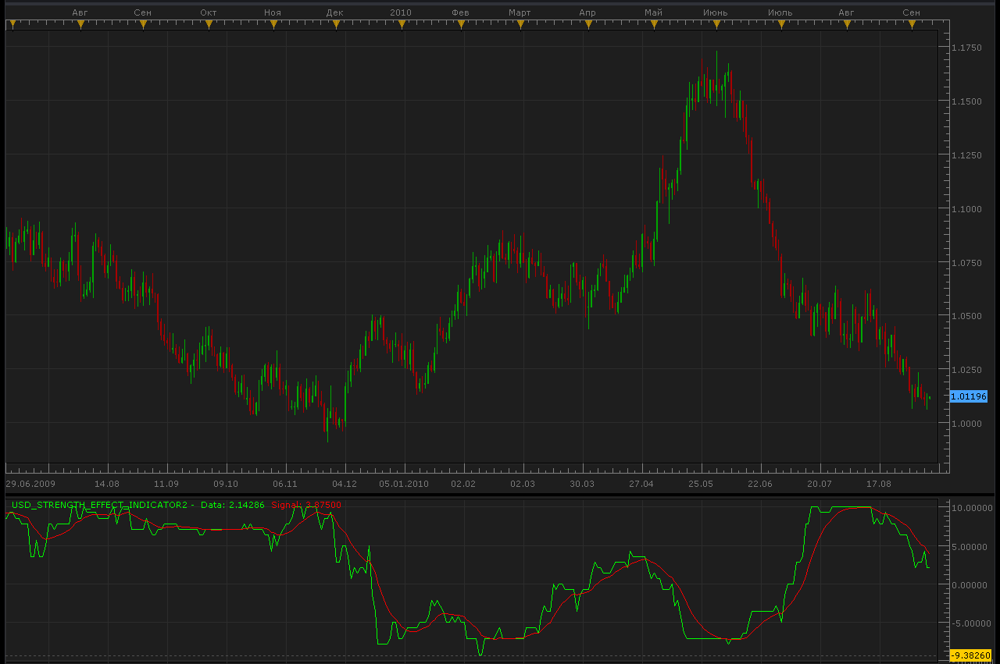

# USD Strength Effect indicator

> Source: https://fxcodebase.com/code/viewtopic.php?f=17&t=2099  
> Forum: 17 · Topic 2099 · 5 post(s)

---

## USD Strength Effect indicator

**Alexander.Gettinger** · Wed Sep 08, 2010 9:39 pm

[viewtopic.php?f=27&t=1870#p3760](https://fxcodebase.com/code/viewtopic.php?f=27&t=1870#p3760)

 

Code: [Select all](https://fxcodebase.com/code/)
`function Init()
    indicator:name("USD Strength Effect indicator");
    indicator:description("USD Strength Effect indicator");
    indicator:requiredSource(core.Bar);
    indicator:type(core.Oscillator);

    indicator.parameters:addGroup("Calculation");
    indicator.parameters:addInteger("slow_check_ma", "slow_check_ma", "slow_check_ma", 55);
    indicator.parameters:addInteger("fast_check_ma", "fast_check_ma", "fast_check_ma", 34);
    indicator.parameters:addInteger("sig_smooth", "sig_smooth", "sig_smooth", 15);

    indicator.parameters:addGroup("Style");
    indicator.parameters:addColor("DATAclr", "Color of DATA line", "Color of DATA line", core.rgb(0, 255, 0));
    indicator.parameters:addColor("SIGNALclr", "Color of SIGNAL line", "Color of SIGNAL line", core.rgb(255, 0, 0));
end

local source;
local barSize;
local DataBuff;
local loading = false;
local offset;
local weekoffset;
local slow_check_ma;
local fast_check_ma;
local sig_smooth;
local DataMajorPair1;
local DataMajorPair2;
local DataMajorPair3;
local DataMinorPair1;
local DataMinorPair2;
local DataMinorPair3;
local DataMinorPair4;
local MajorMA1_fast;
local MajorMA1_slow;
local MajorMA2_fast;
local MajorMA2_slow;
local MajorMA3_fast;
local MajorMA3_slow;
local MinorMA1_fast;
local MinorMA1_slow;
local MinorMA2_fast;
local MinorMA2_slow;
local MinorMA3_fast;
local MinorMA3_slow;
local MinorMA4_fast;
local MinorMA4_slow;
local c1=0;
local c2=0;
local c3=0;
local c4=0;
local c5=0;
local c6=0;
local c7=0;
local sig;

-- indexes for the instruments in the data table
local usdchf = 1;
local usdjpy = 2;
local usdcad = 3;
local audusd = 4;
local eurusd = 5;
local gbpusd = 6;
local nzdusd = 7;
local first = nil;
local last = nil;
-- data table
local data = {};

-- add a new item into the data table
-- index        - is the index of the item in the table
-- instrument   - the instrument name
-- weight       - the weigth of the instrument
function AddCollectionItem(index, instrument, weight)
    local t, coll, from, to, tmp;
    t = {};
    t.instrument = instrument;
    t.data = nil;
    t.loading = false;
    t.weight = weight;
    t.rqfrom = nil;
    t.rqto = nil;
    data[index] = t;

    if first == nil or first > index then
        first = index;
    end
    if last == nil or last < index then
        last = index;
    end
end

-- initialize the collection of the instruments
function InitCollection()
    -- sum of absolute values of the weights must be 1. negative sign is for the
    -- instrument which has USD as counter currency.
    AddCollectionItem(usdchf, "USD/CHF", 1);
    AddCollectionItem(usdjpy, "USD/JPY", 1);
    AddCollectionItem(usdcad, "USD/CAD", 1);
    AddCollectionItem(audusd, "AUD/USD", 1);
    AddCollectionItem(eurusd, "EUR/USD", 1);
    AddCollectionItem(gbpusd, "GBP/USD", 1);
    AddCollectionItem(nzdusd, "NZD/USD", 1);
end

-- prepare the indicator
function Prepare()
    source = instance.source;
    host = core.host;
    barSize = source:barSize();
    offset = host:execute("getTradingDayOffset");
    weekoffset = host:execute("getTradingWeekOffset");

    slow_check_ma=instance.parameters.slow_check_ma;
    fast_check_ma=instance.parameters.fast_check_ma;
    sig_smooth=instance.parameters.sig_smooth;
   
    DataMajorPair1 = instance:addInternalStream(instance.source:first(), 0);
    DataMajorPair2 = instance:addInternalStream(instance.source:first(), 0);
    DataMajorPair3 = instance:addInternalStream(instance.source:first(), 0);
    DataMinorPair1 = instance:addInternalStream(instance.source:first(), 0);
    DataMinorPair2 = instance:addInternalStream(instance.source:first(), 0);
    DataMinorPair3 = instance:addInternalStream(instance.source:first(), 0);
    DataMinorPair4 = instance:addInternalStream(instance.source:first(), 0);
   
    MajorMA1_fast = core.indicators:create("LWMA", DataMajorPair1, fast_check_ma);
    MajorMA1_slow = core.indicators:create("LWMA", DataMajorPair1, slow_check_ma);
    MajorMA2_fast = core.indicators:create("LWMA", DataMajorPair2, fast_check_ma);
    MajorMA2_slow = core.indicators:create("LWMA", DataMajorPair2, slow_check_ma);
    MajorMA3_fast = core.indicators:create("LWMA", DataMajorPair3, fast_check_ma);
    MajorMA3_slow = core.indicators:create("LWMA", DataMajorPair3, slow_check_ma);
    MinorMA1_fast = core.indicators:create("LWMA", DataMinorPair1, fast_check_ma);
    MinorMA1_slow = core.indicators:create("LWMA", DataMinorPair1, slow_check_ma);
    MinorMA2_fast = core.indicators:create("LWMA", DataMinorPair2, fast_check_ma);
    MinorMA2_slow = core.indicators:create("LWMA", DataMinorPair2, slow_check_ma);
    MinorMA3_fast = core.indicators:create("LWMA", DataMinorPair3, fast_check_ma);
    MinorMA3_slow = core.indicators:create("LWMA", DataMinorPair3, slow_check_ma);
    MinorMA4_fast = core.indicators:create("LWMA", DataMinorPair4, fast_check_ma);
    MinorMA4_slow = core.indicators:create("LWMA", DataMinorPair4, slow_check_ma);

    InitCollection();

    local name = profile:id();
    instance:name(name);
    DataBuff = instance:addStream("DataBuff", core.Line, name .. ".Data", "Data", instance.parameters.DATAclr, 0);
    SignalBuff = instance:addStream("SignalBuff", core.Line, name .. ".Signal", "Signal", instance.parameters.SIGNALclr, 0);
    sig = core.indicators:create("LWMA", DataBuff, sig_smooth);
end

local p = {};
local w = {};

-- get the price of the specified instrument
function GetPrice(index, date)
    local t;

    local from, to, tmp;

    t = data[index];

    assert(t ~= nil, "internal error!");

    if t.data == nil then
        -- data is not loaded yet at all
        if source:isAlive() then
            to = 0;
        else
            to = source:date(source:size() - 1);
        end
        from = source:date(source:first());
        t.data = host:execute("getHistory", index, t.instrument, barSize, from, to, source:isBid());
        t.rqfrom = from;
        t.rqto = to;
        t.loading = true;
        loading = true;
        return 0, 0;
    elseif date < t.rqfrom then
        -- requested date is before the first item of the collection
        -- we have ever requested
        from = date;
        to = t.data:date(0);
        host:execute("extendHistory", index, t.data, from, to);
        t.rqfrom = from;
        t.loading = true;
        loading = true;
        return 0, 0;
    elseif not(source:isAlive()) and date > t.rqto then
        -- requested date is after the last item of the collection
        -- we have ever requested
        to = date;
        from = t.data:date(t.data:size() - 1);
        host:execute("extendHistory", index, t.data, from, to);
        t.rqto = to;
        t.loading = true;
        loading = true;
        return 0, 0;
    end

    local p;
    p = findDateFast(t.data, date, false);
    if p < 0 then
        return 0, 0;
    end
    return t.data.close[p], t.weight;
end

local lastdate = nil;

-- the function which is called to calculate the period
function Update(period, mode)

    if loading or period <= source:first()+slow_check_ma then
        return ;
    end

    -- do not calculate for the floating candle
    period = period - 1;

    if lastdate ~= nil and source:date(period) == lastdate then
        return ;
    end

    lastdate = source:date(period);

    local i, x, absent, a, b;
    absent = false;
    for i = first, last, 1 do
        a, b = GetPrice(i, lastdate);
        if a == 0 then
            absent = true;
        end
        p[i] = a;
        w[i] = b;
    end

    if loading then
        DataBuff:setBookmark(1, period);
        return ;
    end

    if absent then
        if DataBuff:hasData(period - 1) then
            DataBuff[period] = DataBuff[period - 1];
        end
    else
       DataMajorPair1[period+1]=p[1];
       DataMajorPair2[period+1]=p[2];
       DataMajorPair3[period+1]=p[3];
       DataMinorPair1[period+1]=p[4];
       DataMinorPair2[period+1]=p[5];
       DataMinorPair3[period+1]=p[6];
       DataMinorPair4[period+1]=p[7];
       
       MajorMA1_fast:update(mode);
       MajorMA1_slow:update(mode);
       MajorMA2_fast:update(mode);
       MajorMA2_slow:update(mode);
       MajorMA3_fast:update(mode);
       MajorMA3_slow:update(mode);
       MinorMA1_fast:update(mode);
       MinorMA1_slow:update(mode);
       MinorMA2_fast:update(mode);
       MinorMA2_slow:update(mode);
       MinorMA3_fast:update(mode);
       MinorMA3_slow:update(mode);
       MinorMA4_fast:update(mode);
       MinorMA4_slow:update(mode);
       
     if MajorMA1_fast.DATA[period]>MajorMA1_slow.DATA[period] and MajorMA1_fast.DATA[period]>MajorMA1_fast.DATA[period-1] then
      c1=1;
     elseif MajorMA1_fast.DATA[period]>MajorMA1_slow.DATA[period] and MajorMA1_fast.DATA[period]<MajorMA1_fast.DATA[period-1] then
      c1=0.5;
     elseif MajorMA1_fast.DATA[period]<MajorMA1_slow.DATA[period] and MajorMA1_fast.DATA[period]<MajorMA1_fast.DATA[period-1] then
      c1=-1;
     elseif MajorMA1_fast.DATA[period]<MajorMA1_slow.DATA[period] and MajorMA1_fast.DATA[period]>MajorMA1_fast.DATA[period-1] then
      c1=-0.5;
     elseif MajorMA1_fast.DATA[period]==MajorMA1_slow.DATA[period] then
      c1=0;
     end

     if MajorMA2_fast.DATA[period]>MajorMA2_slow.DATA[period] and MajorMA2_fast.DATA[period]>MajorMA2_fast.DATA[period-1] then
      c2=1;
    elseif MajorMA2_fast.DATA[period]>MajorMA2_slow.DATA[period] and MajorMA2_fast.DATA[period]<MajorMA2_fast.DATA[period-1] then
      c2=0.5;
     elseif MajorMA2_fast.DATA[period]<MajorMA2_slow.DATA[period] and MajorMA2_fast.DATA[period]<MajorMA2_fast.DATA[period-1] then
      c2=-1;
     elseif MajorMA2_fast.DATA[period]<MajorMA2_slow.DATA[period] and MajorMA2_fast.DATA[period]>MajorMA2_fast.DATA[period-1] then
      c2=-0.5;
     elseif MajorMA2_fast.DATA[period]==MajorMA2_slow.DATA[period] then
      c2=0;
     end

     if MajorMA3_fast.DATA[period]>MajorMA3_slow.DATA[period] and MajorMA3_fast.DATA[period]>MajorMA3_fast.DATA[period-1] then
      c3=1;
     elseif MajorMA3_fast.DATA[period]>MajorMA3_slow.DATA[period] and MajorMA3_fast.DATA[period]<MajorMA3_fast.DATA[period-1] then
      c3=0.5;
     elseif MajorMA3_fast.DATA[period]<MajorMA3_slow.DATA[period] and MajorMA3_fast.DATA[period]<MajorMA3_fast.DATA[period-1] then
      c3=-1;
     elseif MajorMA3_fast.DATA[period]<MajorMA3_slow.DATA[period] and MajorMA3_fast.DATA[period]>MajorMA3_fast.DATA[period-1] then
      c3=-0.5;
     elseif MajorMA3_fast.DATA[period]==MajorMA3_slow.DATA[period] then
      c3=0;
     end

     if MinorMA1_fast.DATA[period]>MinorMA1_slow.DATA[period] and MinorMA1_fast.DATA[period]>MinorMA1_fast.DATA[period-1] then
      c4=-1;
     elseif MinorMA1_fast.DATA[period]>MinorMA1_slow.DATA[period] and MinorMA1_fast.DATA[period]<MinorMA1_fast.DATA[period-1] then
      c4=-0.5;
     elseif MinorMA1_fast.DATA[period]<MinorMA1_slow.DATA[period] and MinorMA1_fast.DATA[period]<MinorMA1_fast.DATA[period-1] then
      c4=1;
     elseif MinorMA1_fast.DATA[period]<MinorMA1_slow.DATA[period] and MinorMA1_fast.DATA[period]>MinorMA1_fast.DATA[period-1] then
      c4=0.5;
     elseif MinorMA1_fast.DATA[period]==MinorMA1_slow.DATA[period] then
      c4=0;
     end

     if MinorMA2_fast.DATA[period]>MinorMA2_slow.DATA[period] and MinorMA2_fast.DATA[period]>MinorMA2_fast.DATA[period-1] then
      c5=-1;
     elseif MinorMA2_fast.DATA[period]>MinorMA2_slow.DATA[period] and MinorMA2_fast.DATA[period]<MinorMA2_fast.DATA[period-1] then
      c5=-0.5;
     elseif MinorMA2_fast.DATA[period]<MinorMA2_slow.DATA[period] and MinorMA2_fast.DATA[period]<MinorMA2_fast.DATA[period-1] then
      c5=1;
     elseif MinorMA2_fast.DATA[period]<MinorMA2_slow.DATA[period] and MinorMA2_fast.DATA[period]>MinorMA2_fast.DATA[period-1] then
      c5=0.5;
     elseif MinorMA2_fast.DATA[period]==MinorMA2_slow.DATA[period] then
      c5=0;
     end

     if MinorMA3_fast.DATA[period]>MinorMA3_slow.DATA[period] and MinorMA3_fast.DATA[period]>MinorMA3_fast.DATA[period-1] then
      c6=-1;
     elseif MinorMA3_fast.DATA[period]>MinorMA3_slow.DATA[period] and MinorMA3_fast.DATA[period]<MinorMA3_fast.DATA[period-1] then
      c6=-0.5;
     elseif MinorMA3_fast.DATA[period]<MinorMA3_slow.DATA[period] and MinorMA3_fast.DATA[period]<MinorMA3_fast.DATA[period-1] then
      c6=1;
     elseif MinorMA3_fast.DATA[period]<MinorMA3_slow.DATA[period] and MinorMA3_fast.DATA[period]>MinorMA3_fast.DATA[period-1] then
      c6=0.5;
     elseif MinorMA3_fast.DATA[period]==MinorMA3_slow.DATA[period] then
      c6=0;
     end

     if MinorMA4_fast.DATA[period]>MinorMA4_slow.DATA[period] and MinorMA4_fast.DATA[period]>MinorMA4_fast.DATA[period-1] then
      c7=-1;
     elseif MinorMA4_fast.DATA[period]>MinorMA4_slow.DATA[period] and MinorMA4_fast.DATA[period]<MinorMA4_fast.DATA[period-1] then
      c7=-0.5;
     elseif MinorMA4_fast.DATA[period]<MinorMA4_slow.DATA[period] and MinorMA4_fast.DATA[period]<MinorMA4_fast.DATA[period-1] then
      c7=1;
     elseif MinorMA4_fast.DATA[period]<MinorMA4_slow.DATA[period] and MinorMA4_fast.DATA[period]>MinorMA4_fast.DATA[period-1] then
      c7=0.5;
     elseif MinorMA4_fast.DATA[period]==MinorMA4_slow.DATA[period] then
      c7=0;
     end

     DataBuff[period+1]=(c1+c2+c3+c4+c5+c6+c7)*(-1.4285714285714285714285714285714);
     sig:update(mode);
     SignalBuff[period+1]=sig.DATA[period+1];
    end

    period = period + 1;

    if period > 0 and period == source:size() - 1 then
        DataBuff[period] = DataBuff[period - 1];
    end
end

function AsyncOperationFinished(cookie)

    local t;
    t = data[cookie];
    t.loading = false;
    for i = first, last, 1 do
        if data[i].loading then
            return ;
        end
    end
    loading = false;

    local period;
    period = DataBuff:getBookmark(1);

    if (period < 0) then
        period = 0;
    end
    instance:updateFrom(period);
end

function findDateFast(stream, date, precise)
    local datesec = nil;
    local periodsec = nil;
    local min, max, mid;

    datesec = math.floor(date * 86400 + 0.5)

    min = 0;
    max = stream:size() - 1;

    while true do
        mid = math.floor((min + max) / 2);
        periodsec = math.floor(stream:date(mid) * 86400 + 0.5);
        if datesec == periodsec then
            return mid;
        elseif datesec > periodsec then
            min = mid + 1;
        else
            max = mid - 1;
        end
        if min > max then
            if precise then
                return -1;
            else
                return min - 1;
            end
        end
    end
end`

---

## Re: USD Strength Effect indicator

**boursicoton** · Thu Sep 09, 2010 5:00 am

thanks alexander the great !

---

## bug..?

**boursicoton** · Thu Sep 09, 2010 5:08 am

no line on this indicator..
i open parameters
no change
but alert : string "USD_strenght.." : 170 name of instrument false ..

---

## Re: USD Strength Effect indicator

**Alexander.Gettinger** · Mon Sep 13, 2010 10:34 pm

For work of indicator in rates must be symbols: USD/CHF, USD/JPY, USD/CAD, AUD/USD,
EUR/USD, GBP/USD, NZD/USD.

---

## Re: USD Strength Effect indicator

**Apprentice** · Mon Feb 05, 2018 8:06 am

The Indicator was revised and updated.
