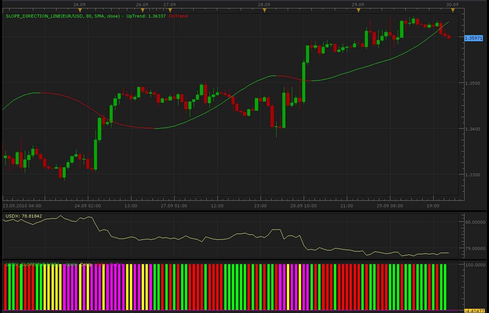

# USDX Slope

> Source: https://fxcodebase.com/code/viewtopic.php?f=17&t=2304  
> Forum: 17 · Topic 2304 · 3 post(s)

---

## USDX Slope

**Alexander.Gettinger** · Wed Sep 29, 2010 10:59 pm

This indicator use 2 other indicators: Slope Direction Line ([viewtopic.php?f=17&t=949](https://fxcodebase.com/code/viewtopic.php?f=17&t=949)) and USDX ([viewtopic.php?f=17&t=609&p=1078](https://fxcodebase.com/code/viewtopic.php?f=17&t=609&p=1078)).

If Slope Direction Line growing and USDX[period]-USDX[period-Shift]>0 then USDX_SLope UpUp
and also

 

Slope Direction Line and USDX must be installed.

 [USDX_Slope.lua](files/4893/USDX_Slope.lua)

MQ4/MT4 version
[viewtopic.php?f=38&t=63997](https://fxcodebase.com/code/viewtopic.php?f=38&t=63997)

The indicator was revised and updated

---

## Re: USDX Slope

**Alexander.Gettinger** · Mon Oct 04, 2010 10:09 pm

Update indicator.
Added other moving average methods and other prices for calculation.

Code: [Select all](https://fxcodebase.com/code/)
`function Init()
    indicator:name("USDX Slope indicator");
    indicator:description("USDX Slope indicator");
    indicator:requiredSource(core.Bar);
    indicator:type(core.Oscillator);
   
    indicator.parameters:addGroup("Calculation");
    indicator.parameters:addInteger("Shift", "Shift", "Shift", 1);
    indicator.parameters:addInteger("Period", "Period", "Period", 80);
    indicator.parameters:addString("Method", "Method", "", "MVA");
    indicator.parameters:addStringAlternative("Method", "MVA", "", "MVA");
    indicator.parameters:addStringAlternative("Method", "EMA", "", "EMA");
    indicator.parameters:addStringAlternative("Method", "KAMA", "", "KAMA");
    indicator.parameters:addStringAlternative("Method", "LWMA", "", "LWMA");
    indicator.parameters:addStringAlternative("Method", "TMA", "", "TMA");
    indicator.parameters:addString("Price", "Price", "", "close");
    indicator.parameters:addStringAlternative("Price", "open", "", "open");
    indicator.parameters:addStringAlternative("Price", "close", "", "close");
    indicator.parameters:addStringAlternative("Price", "high", "", "high");
    indicator.parameters:addStringAlternative("Price", "low", "", "low");
    indicator.parameters:addStringAlternative("Price", "median", "", "median");
    indicator.parameters:addStringAlternative("Price", "typical", "", "typical");
    indicator.parameters:addStringAlternative("Price", "weighted", "", "weighted");

    indicator.parameters:addGroup("Style");
    indicator.parameters:addColor("clr1", "Color UpUp", "Color UpUp", core.rgb(0, 255, 0));
    indicator.parameters:addColor("clr2", "Color DnUp", "Color DnUp", core.rgb(255, 255, 0));
    indicator.parameters:addColor("clr3", "Color UpDn", "Color UpDn", core.rgb(255, 0, 0));
    indicator.parameters:addColor("clr4", "Color DnDn", "Color DnDn", core.rgb(255, 0, 255));
end

local first;
local source = nil;
local USDX;
local Slope;
local Shift;
local buff1=nil;
local buff2=nil;
local buff3=nil;
local buff4=nil;

function Prepare()
    source = instance.source;
    Shift=instance.parameters.Shift;
    USDX = core.indicators:create("USDX", source);
    if instance.parameters.Price=="open" then
     Slope = core.indicators:create("SLOPE_DIRECTION_LINE", source.open, instance.parameters.Period, instance.parameters.Method, instance.parameters.Price);
    elseif instance.parameters.Price=="close" then
     Slope = core.indicators:create("SLOPE_DIRECTION_LINE", source.close, instance.parameters.Period, instance.parameters.Method, instance.parameters.Price);
    elseif instance.parameters.Price=="high" then
     Slope = core.indicators:create("SLOPE_DIRECTION_LINE", source.high, instance.parameters.Period, instance.parameters.Method, instance.parameters.Price);
    elseif instance.parameters.Price=="low" then
     Slope = core.indicators:create("SLOPE_DIRECTION_LINE", source.low, instance.parameters.Period, instance.parameters.Method, instance.parameters.Price);
    elseif instance.parameters.Price=="median" then
     Slope = core.indicators:create("SLOPE_DIRECTION_LINE", source.median, instance.parameters.Period, instance.parameters.Method, instance.parameters.Price);
    elseif instance.parameters.Price=="typical" then
     Slope = core.indicators:create("SLOPE_DIRECTION_LINE", source.typical, instance.parameters.Period, instance.parameters.Method, instance.parameters.Price);
    else
     Slope = core.indicators:create("SLOPE_DIRECTION_LINE", source.weighted, instance.parameters.Period, instance.parameters.Method, instance.parameters.Price);
    end
    first = math.max(USDX.DATA:first(),Slope.DATA:first())+2;
    local name = profile:id() .. "(" .. source:name() .. ")";
    instance:name(name);
    buff1 = instance:addStream("buff1", core.Bar, name .. "UpUp", "UpUp", instance.parameters.clr1, first);
    buff2 = instance:addStream("buff2", core.Bar, name .. "DnUp", "DnUp", instance.parameters.clr2, first);
    buff3 = instance:addStream("buff3", core.Bar, name .. "UpDn", "UpDn", instance.parameters.clr3, first);
    buff4 = instance:addStream("buff4", core.Bar, name .. "DnDn", "DnDn", instance.parameters.clr4, first);
end

function Update(period, mode)
    USDX:update(mode);
    Slope:update(mode);
    local i;
    if (period>first+Shift) then
     for i=first+Shift,period,1 do
     local USDX_Diff=USDX.DATA[i]-USDX.DATA[i-Shift];
     if Slope.UpTrend[i]>0 then
      if USDX_Diff>0. then
       buff1[i]=100;
       buff2[i]=0;
       buff3[i]=0;
       buff4[i]=0;
      elseif USDX_Diff<0. then
       buff3[i]=100;
       buff1[i]=0;
       buff2[i]=0;
       buff4[i]=0;
      end
     elseif Slope.DnTrend[i]>0 then
      if USDX_Diff>0. then
       buff2[i]=100;
       buff1[i]=0;
       buff3[i]=0;
       buff4[i]=0;
      elseif USDX_Diff<0. then
       buff4[i]=100;
       buff1[i]=0;
       buff2[i]=0;
       buff3[i]=0;
      end
     end
     end
    end
end`

---

## Re: USDX Slope

**Apprentice** · Fri Jan 27, 2017 3:58 am

Indicator was revised and updated.
