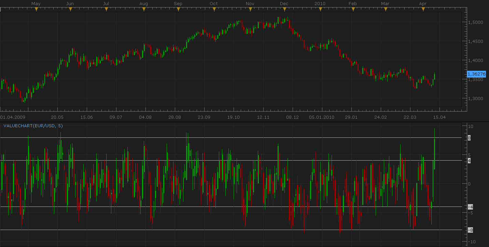

# Value Chart

> Source: https://fxcodebase.com/code/viewtopic.php?f=17&t=612  
> Forum: 17 · Topic 612 · 7 post(s)

---

## Value Chart

**Nikolay.Gekht** · Sun Apr 11, 2010 8:56 pm

The value chart indicator is developed by David Stendhal.

He has explained the indicator in his interview to TradeStation Technologies Inc.

> **Stendahl interview wrote:**
> Traditional bar charts may not provide the information traders need to make appropriate trading decisions. Value Charts represent a market analysis tool that allow traders to trade stocks, bonds and futures with additional poise and confidence. It's a different view of the markets because they were developed to display the valuation of the market.

Read the full interview text for details about this indicator and it's usage: [http://www.chartresearch.com/TSInterview.htm](http://www.chartresearch.com/TSInterview.htm)

The formula of the indicator is:
OPEN = (OPEN - MVA(TYPICAL)) / (ATR / ATR_N)
HIGH = (HIGH - MVA(TYPICAL)) / (ATR / ATR_N)
LOW = (LOW - MVA(TYPICAL)) / (ATR / ATR_N)
CLOSE = (CLOSE - MVA(TYPICAL)) / (ATR / ATR_N)
TYPICAL = (HIGH + LOW + CLOSE) / 3

 

Download:

 [VALUECHART.lua](files/1081/VALUECHART.lua)

The indicator was revised and updated

---

## Re: Value Chart

**keyrama** · Wed Nov 17, 2010 9:05 am

Excuse me but, In the formula, what does the ATR_N stands for, and why it doesn't seem to be implemented in the code ?

I'm not syaing it's an error, I just want to undersand.

Thank you !!

keyrama

(btw, great indicator)

---

## Re: Value Chart

**Apprentice** · Wed Nov 17, 2010 1:02 pm

ATRN represents the number of periods to calculate the ATR

This parameter is used in line 36,
 when establishing the call for ATR indicator.

ATR = core.indicators:create("ATR", source, N);

---

## Re: Value Chart

**keyrama** · Mon Jan 10, 2011 4:41 am

Hello,

since the new marketscope version, value chart indicator has lines at 8 4 -4 -8.
You can't remove them and it's really annoying especially if you set the indicator at a higher number of periods.( because these levels are fitted (kind of...) only at periods=5. )

Thank you for adding an option to remove them !

---

## Re: Value Chart

**Apprentice** · Mon Jan 10, 2011 5:56 am

Show Line Option Added.

---

## Re: Value Chart

**keyrama** · Mon Jan 10, 2011 6:15 am

Thanks !

---

## Re: Value Chart

**Apprentice** · Sun Feb 12, 2017 7:16 am

Indicator was revised and updated.
