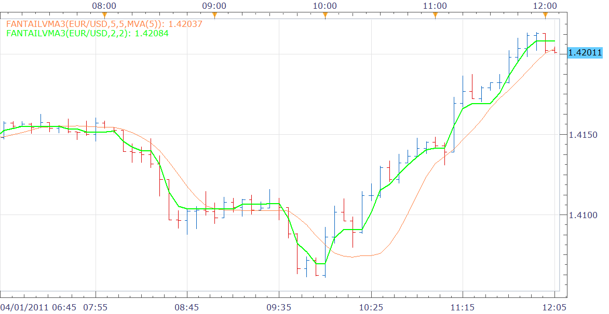

# Variable MA with addn' smoothing (port of FantailVMA3.mq4)

> Source: https://fxcodebase.com/code/viewtopic.php?f=17&t=3812  
> Forum: 17 · Topic 3812 · 2 post(s)

---

## Variable MA with addn' smoothing (port of FantailVMA3.mq4)

**Nikolay.Gekht** · Fri Apr 01, 2011 11:07 am

Here is a port of ADX-based Variable Moving Average with optional additional smoothing by chosen Moving Average indicator.

A variable Moving Average is similar to [Exponential Moving Average (EMA)](https://fxcodebase.com/wiki/index.php/Exponential_Moving_Average_%28EMA%29) but is able to tune its smoothing percentage based on market inconstancy automatically. Its sensitivity grows by providing more weight to the ongoing data as it generates a better signal for short and long term markets.

As far as I know, the indicator was initially developed for VTTrader, then optimized and modified by IgorAD for metatrader 4.

 

Download indicator:

 [FantailVMA3.lua](files/9298/FantailVMA3.lua)

The indicator was revised and updated

---

## Re: Variable MA with addn' smoothing (port of FantailVMA3.mq

**Apprentice** · Wed Mar 08, 2017 5:20 pm

Indicator was revised and updated.
