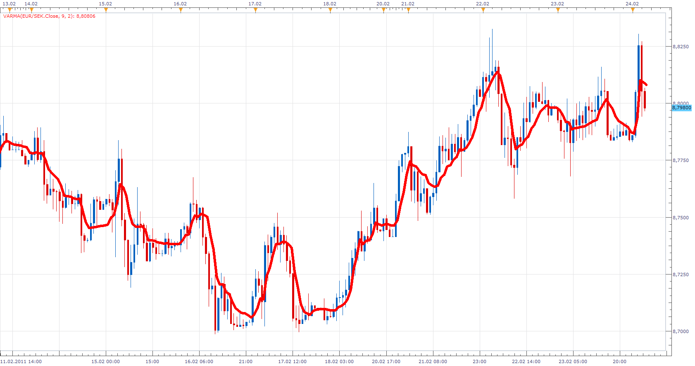

# Variable Moving Average(VARMA)

> Source: https://fxcodebase.com/code/viewtopic.php?f=17&t=3521  
> Forum: 17 · Topic 3521 · 13 post(s)

---

## Variable Moving Average(VARMA)

**Apprentice** · Thu Feb 24, 2011 4:35 am

Variable moving average is an exponential moving average that automatically adjusts the smoothing constant based on the volatility of the data series. The more volatile the data, the larger the smoothing constant used in the moving average calculation. The larger the smoothing constant, the more weight given to the current data. The opposite is true for less volatile data.

 Typical moving averages suffer from the inability to compensate for changes in volatility. During volatile markets, you want a moving average to increase its sensitivity, so that you will quickly be on the correct side of any wild gyrations. By automatically adjusting the smoothing constant, a variable moving average is able to adjust its sensitivity, allowing it to perform better in both high and low volatility markets.

AbsCMO:=(Abs(CMO(Close,CMOPeriod)))/100;
SC:=2/(SmoothPeriod+1);
if period > CMOPeriod + SmoothPeriod+ 2 then
VARMA=(SC*AbsCMO*C)+(1-(SC*AbsCMO))*VARMA[PREV]);
else
VARMA = Close
end

The absolute value of a 9-period Chande Momentum Oscillator is used for the volatility index. The higher this index the more volatile the market, thereby increasing the sensitivity of the moving average.

This method of calculating a variable moving average was presented by Tushar Chande in the March 1992 issue of Technical Analysis of Stocks & Commodities magazine.

 [VARMA.lua](files/8412/VARMA.lua)

 [VARMA Cross With Alert.lua](files/8412/VARMA%20Cross%20With%20Alert.lua)

This indicator will provides Audio / Email Alerts on Slow/Fast VARMA Line cross .

Dec 14, 2015: Compatibility issue Fixed. _Alert helper is not longer needed.

The indicator was revised and updated

VARMA based strategy.
[viewtopic.php?f=31&t=66303](https://fxcodebase.com/code/viewtopic.php?f=31&t=66303)

---

## Re: Variable Moving Average(VARMA)

**Alexander.Gettinger** · Fri Jun 29, 2012 1:53 pm

MQL4 version of VARMA: [viewtopic.php?f=38&t=20682](https://fxcodebase.com/code/viewtopic.php?f=38&t=20682)

---

## Re: Variable Moving Average(VARMA)

**Coondawg71** · Tue Jul 08, 2014 12:16 pm

Can we please request a new indicator that Alerts at point of breach when crossing of two different Varma values occurs.

Example : Varma 12/6 cross up through Varma 24/12 = Green Dot
 Varma 12/6 cross down through Varma 24/12= Red Dot

Please see attached image for illustration.

Thanks!

sjc

---

## Re: Variable Moving Average(VARMA)

**Apprentice** · Thu Jul 10, 2014 5:06 am

Your request is added to the development list.

---

## Re: Variable Moving Average(VARMA)

**Apprentice** · Thu Jul 10, 2014 1:32 pm

VARMA Cross With Alert.lua Added.

---

## Re: Variable Moving Average(VARMA)

**4x4partners** · Thu May 07, 2015 1:49 pm

Is there any existing strategies that use VARMA Cross ?

Or can it be added to the another group (such as AVERAGES) so as to use those strategies that are already coded?

Thanks in advance.
Best
4x4

---

## Re: Variable Moving Average(VARMA)

**Apprentice** · Fri May 08, 2015 4:41 am

Not that I know.
Please formalize your request and post it here.
[viewforum.php?f=27](https://fxcodebase.com/code/viewforum.php?f=27)
Explain your trading idea.

---

## Re: Variable Moving Average(VARMA)

**Apprentice** · Mon Dec 14, 2015 5:43 am

Dec 14, 2015: Compatibility issue Fixed. _Alert helper is not longer needed.

If you want to use updated version of this indicator,
please make sure to use TS Version 01.14.101415. or higher.

---

## Re: Variable Moving Average(VARMA)

**Apprentice** · Thu Mar 02, 2017 7:58 am

Indicator was revised and updated.

---

## Re: Variable Moving Average(VARMA)

**Apprentice** · Fri Mar 03, 2017 4:52 am

Indicator was revised and updated.

---

## Re: Variable Moving Average(VARMA)

**AEKARAOLE** · Mon Jul 23, 2018 6:19 am

Hi apprentice,

Can you make a strategy with the indicator VARMA cross with alert, as below:

To open a trade buy: if VARMA ["FAST"]> VARMA ["SLOW"] and the trade close if VARMA ["FAST"] < VARMA["SLOW"]

The opposite exists for the trade sale.

Thank you

---

## Re: Variable Moving Average(VARMA)

**Apprentice** · Tue Jul 24, 2018 4:09 pm

Try this version.
[viewtopic.php?f=31&t=66303](https://fxcodebase.com/code/viewtopic.php?f=31&t=66303)

---

## Re: Variable Moving Average(VARMA)

**AEKARAOLE** · Wed Jul 25, 2018 8:34 am

THANK YOU
