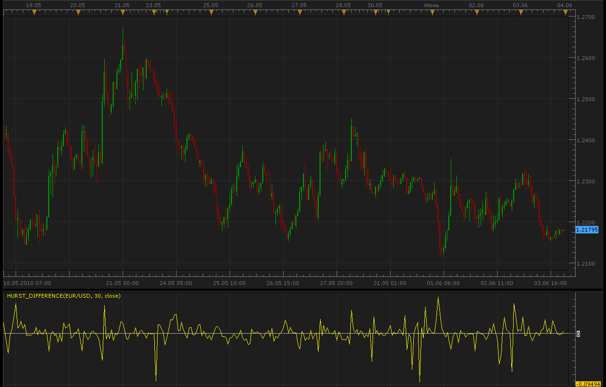

# Variations of the Hurst Exponent over time

> Source: https://fxcodebase.com/code/viewtopic.php?f=17&t=1258  
> Forum: 17 · Topic 1258 · 7 post(s)

---

## Variations of the Hurst Exponent over time

**Alexander.Gettinger** · Thu Jun 03, 2010 10:20 pm

This indicator is based on the assumption that the price variations follow a multi-fractal model. From there, the Hurst exponent can be easily computed from the fractal dimension (as obtained in [viewtopic.php?f=17&t=1250](https://fxcodebase.com/code/viewtopic.php?f=17&t=1250)). The variations of this Hurst exponent can actually be seen as predicting the variations of the volatility, and they therefore provide a time for entering into a trade (whenever this variation is positive), in order to profit from the high volatility period.

It must be noticed however, that this indicator doesn't give any information as to the direction of the trade, for that a directional indicator must be used.

 

Code: [Select all](https://fxcodebase.com/code/)
`function Init()
    indicator:name("Hurst Difference");
    indicator:description("Hurst Difference");
    indicator:requiredSource(core.Bar);
    indicator:type(core.Oscillator);
   
    indicator.parameters:addInteger("Period", "Period", "Period", 30);
    indicator.parameters:addString("app_price", "app_price", "", "close");
    indicator.parameters:addStringAlternative("app_price", "close", "", "close");
    indicator.parameters:addStringAlternative("app_price", "open", "", "open");
    indicator.parameters:addStringAlternative("app_price", "high", "", "high");
    indicator.parameters:addStringAlternative("app_price", "low", "", "low");
    indicator.parameters:addStringAlternative("app_price", "median", "", "median");
    indicator.parameters:addStringAlternative("app_price", "typical", "", "typical");
    indicator.parameters:addStringAlternative("app_price", "weighted", "", "weighted");

    indicator.parameters:addColor("clr_Line", "Color of Line", "Color of Line", core.rgb(255, 255, 0));
end

local first;
local source = nil;
local Period;
local app_price;
local Price;
local fdi;
local HurstBuff=nil;

function Prepare()
    source = instance.source;
    Period=instance.parameters.Period;
    app_price=instance.parameters.app_price;
    first = source:first()+2;
    local name = profile:id() .. "(" .. source:name() .. ", " .. instance.parameters.Period .. ", " .. instance.parameters.app_price .. ")";
    instance:name(name);
    Price = instance:addInternalStream(0, 0);
    fdi = instance:addInternalStream(0, 0);
    HurstBuff = instance:addStream("HurstBuff", core.Line, name .. ".HurstBuff", "HurstBuff", instance.parameters.clr_Line, first);
    HurstBuff:addLevel(0);
end

function Update(period, mode)
    if app_price=="close" then
     Price[period]=source.close[period];
    elseif app_price=="open" then
     Price[period]=source.open[period];
    elseif app_price=="high" then
     Price[period]=source.high[period];
    elseif app_price=="low" then
     Price[period]=source.low[period];
    elseif app_price=="median" then
     Price[period]=(source.high[period]+source.low[period])/2.;
    elseif app_price=="typical" then
     Price[period]=(source.high[period]+source.low[period]+source.close[period])/3.;
    else
     Price[period]=(source.high[period]+source.low[period]+2.*source.close[period])/4.;
    end
     
    if (period>first+Period) then

     local priceMax=core.max(Price,core.rangeTo(period,Period));
     local priceMin=core.min(Price,core.rangeTo(period,Period));
     local length=0.;
     local priorDiff=0.;
     local sum=0.;
     
     for i=period-Period+1,period,1 do
      if priceMax-priceMin>0. then
       diff=(Price[i]-priceMin)/(priceMax-priceMin);
       if i>period-Period+1 then
        length=length+math.sqrt(math.pow(diff-priorDiff,2)+(1./math.pow(Period,2)));
       end
       priorDiff=diff;
      end
     end
     
     if length>0. then
      fdi[period]=1.+(math.log(length)+math.log(2.))/math.log(2.*(Period-1))
     else
      fdi[period]=0.;
     end
     
     HurstBuff[period]=fdi[period-1]-fdi[period];

    end
end`

 [Hurst_Difference.lua](files/2391/Hurst_Difference.lua)

 [Tick Hurst_Difference.lua](files/2391/Tick%20Hurst_Difference.lua)

Mq4/MT4 version.
[viewtopic.php?f=38&t=63898](https://fxcodebase.com/code/viewtopic.php?f=38&t=63898)

---

## Re: Variations of the Hurst Exponent over time

**boursicoton** · Thu Aug 19, 2010 7:20 am

hust worked on cycle of price,10,20,40,18-80,200-220 weeks
possible on marketscope ?

---

## Re: Variations of the Hurst Exponent over time

**Apprentice** · Mon Feb 05, 2018 8:07 am

The Indicator was revised and updated.

---

## Re: Variations of the Hurst Exponent over time

**mayk01** · Sun Sep 03, 2023 4:46 am

Hi Apprentice,

Is it possible to use this Fractal Dimension Index to calculate the Hurst Exponent? :
[https://fxcodebase.com/code/viewtopic.p ... ex#p152254](https://fxcodebase.com/code/viewtopic.php?f=17&t=73007&p=152254&hilit=dimension+index#p152254)

That indicator shows the changes of the Fractal Dimension differently and this Hurst Exponent does not fit, because it is not based on that calculation.
M.

---

## Re: Variations of the Hurst Exponent over time

**Apprentice** · Sun Sep 10, 2023 3:15 pm

We have added your request to the development list.
Development reference 836.

---

## Re: Variations of the Hurst Exponent over time

**Apprentice** · Mon Sep 11, 2023 9:31 am

 [Fractal Dimension Index Hurst_Difference.lua](files/152518/Fractal%20Dimension%20Index%20Hurst_Difference.lua)

It is also possible to use Tick Hurst_Difference.lua
Use the Fractal Dimension Index.lua as a source for it.

---

## Re: Variations of the Hurst Exponent over time

**mayk01** · Tue Sep 12, 2023 6:57 am

That's great

M.
