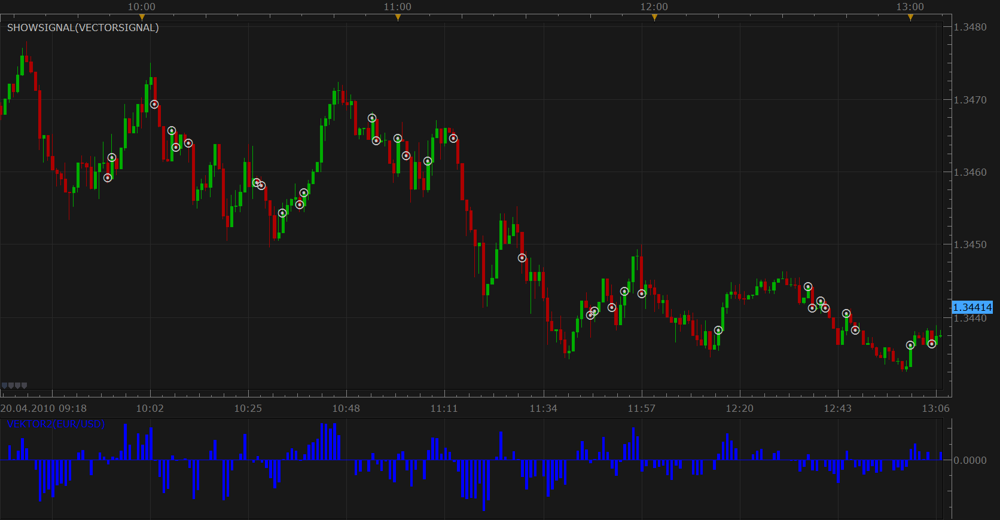

# Vector

> Source: https://fxcodebase.com/code/viewtopic.php?f=17&t=257  
> Forum: 17 · Topic 257 · 20 post(s)

---

## Vector

**Apprentice** · Tue Jan 26, 2010 12:41 pm

Vector is one of the indicators that I designed and wrote for Marketscope platform.
Indicator follow the movement of prices, very well, gives relatively few false signals.

Crossover of Vector and zero line generates Buy and Sell signals.
Buy - Vector > 0
Sell - Vector < 0

At the same time they are shown two Vector indicators slower (red) and fast (green) lines.

When faster vector completely covers the slower we are at an early stage of formation of a new trend.
The weakening trend, slower Vector prevails faster, the trend will continue because of inertia.
Cessation of action of inertia on the movement of the market, inertia is presented with a slower Vector indicator, there are preconditions for the emergence of a new trend, the trend is shown by rapid Vector indicator.

The calculation of individual vectors
Vector (Slow) = ( Vector(2) + Vector (4) + Vector(8) + Vector (16) ) / 4
Vector (Fast) = ( 0,50*Vector(2) + 0,25*Vector (4) + 0,125 Vector(8) + 0,0625* Vector (16) )

The calculation of each component vector
Vector(i) = Close (n) - Close(n-i)

The data are NOT averaged, you can apply EMA for smoothing of the obtained data.
 Personally I prefer this format.

Updated

 [Vektor.lua](files/391/Vektor.lua)

The indicator was revised and updated

---

## Re: Vector

**Nikolay.Gekht** · Fri Jan 29, 2010 8:44 am

Great job! Thank you!

---

## Re: Vector

**TonyMod** · Mon Feb 01, 2010 1:22 pm

Excellent! Thanks for developing a new indicator.

Its nice to see that other people are starting to learn Indicore and developing indicators for their needs.

Soon when new version of Indicore will be included into MarketScope, new features will make it nothing short of "best" on the market. (I hope so anyway )

We'll post notification about release as soon as we have more definite dates.

Cheers!

---

## Re: Vector

**Charli** · Sat Feb 06, 2010 1:01 pm

Great job, well done! Seams great, can not wait to try

---

## Re: Vector Usage

**clifford** · Mon Feb 22, 2010 6:40 pm

Hi : I have used your indicator it is excellent . However I would like suggest some improvements on your instructions for use .

The VECTOR is in fact an enhanced description of the FAST MACD line . Use VECTOR in tandem with the standard MACDH indicator . For example on a MACDH setting of 5 11 16 ( non standard ) set on 5 minutes .
You will get a clearer set of choices involving the strength of momentum of the fast line in relation to the slower line . . This is will enable you to precisely act on those 5 min momentum trades which occur around obvious S/R levels and OO zones which we all battle with for on a daily basis . This indicator is an excellent accessory tool to help eliminate those loosing trades based purely on the MACDH alone .

---

## Re: Vector

**Apprentice** · Tue Feb 23, 2010 11:47 am

Thank you for your compliments and suggestions.
I currently working on varieties of Vector indicators that excluded the indications,
 when inertia prevails trend...

Another thing, the indicator has a variance of 6,26 percent,
reason for the discrepancies, I have not finished the series...

Vector (Slow) = ( Vector(2) + Vector (4) + Vector(8) + Vector (16) + ... ) / 4
Vector (Fast) = ( 0,50*Vector(2) + 0,25*Vector (4) + 0,125 Vector(8) + 0,0625* Vector (16) + ...)
and added Vektors 32, 64, 128...

Thinking about adding vector 32, variance 3,13 , but not further continuation of a series,
there is a risk of indicator becomes too slow ...

Currently doing the calculations and testing, I hope to soon publish a new version of the indicators.

---

## Re: Vector

**Apprentice** · Tue Feb 23, 2010 2:20 pm

Vector 2 Indicator trying to identify periods with no particular trend, then, does not give any signals.

I have another idea how to filter data, but still do not know the programming language well enough so that it could be implemented.

Idea, ignoring indications that are smaller than the average of inertia of a period.

P.S. Vector 2 proved to be a very good indicator of divergence.

---

## Re: Vector

**wogenl** · Tue Mar 09, 2010 2:59 am

thank you very much.

---

## Re: Vector

**michaelwen** · Sun Mar 28, 2010 11:31 pm

good job, keep up , can not wait for your future creating indicator.

---

## Re: Vector

**Apprentice** · Tue Apr 20, 2010 11:24 am

Give you the related signal for Vector2

 [Vector2Signal.lua](files/1296/Vector2Signal.lua)

---

## Re: Vector

**Nikolay.Gekht** · Tue Apr 20, 2010 2:05 pm

Could you please check the signal:

1) Does it use Vector (this first indicator you published, with the name vector.lua) or vektor2 (the second indicator you published, the name is vektor2.lua)

2) If it uses vektor2 lua, please correct the name of the indicator in the signal. I think that majority of users installed it "as is".

3) It looks a bit noisy in case it's vektor is used:

 

---

## Re: Vector

**Apprentice** · Wed Apr 21, 2010 5:18 am

Yes you are right, I have not thought about it.
I have corrected the matter...

---

## Re: Vector

**michaelwen** · Thu Apr 22, 2010 12:05 am

> **Apprentice wrote:**
> Yes you are right, I have not thought about it.
> I corrected the matter...

good job. waiting for your currect signal

---

## Re: Vector

**Alexander.Gettinger** · Fri Jul 27, 2012 3:31 pm

MQL4 version of Vector indicator: [viewtopic.php?f=38&t=21472](https://fxcodebase.com/code/viewtopic.php?f=38&t=21472)

---

## Re: Vector

**AlphaBagel** · Thu Feb 25, 2016 4:37 pm

Vector2 signal produces a nil value when I attempt to set up the strategy as an alert. Anyone else have this issue? Is there a workaround?

---

## Re: Vector

**Apprentice** · Fri Feb 26, 2016 4:00 am

Try it now.

---

## Re: Vector

**Apprentice** · Sun Jul 30, 2017 11:22 am

The indicator was revised and updated.

---

## Re: Vector

**jaricarr** · Sun Jul 30, 2017 8:47 pm

Hi Apprentice,

Just to add a visual touch, can you please add the following:

Up Trend:
Fast Vector Color (Green)
Slow Vector Color (Red)

Down Trend:
Fast Vector Color (Red)
Slow Vector Color (Green)

---

## Re: Vector

**jaricarr** · Sun Jul 30, 2017 8:48 pm

Also please add the ability to customize the central line.

---

## Re: Vector

**Apprentice** · Mon Jul 31, 2017 4:43 am

Cental Line Style option added.
