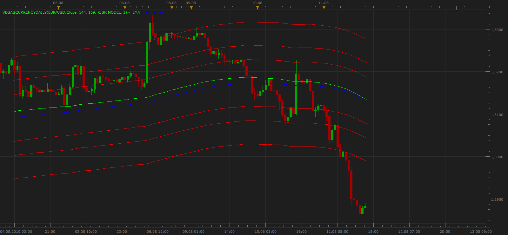

# VegasCurrencyDaily

> Source: https://fxcodebase.com/code/viewtopic.php?f=17&t=1751  
> Forum: 17 · Topic 1751 · 5 post(s)

---

## VegasCurrencyDaily

**Apprentice** · Wed Aug 11, 2010 2:40 pm

I could find out more about this strategy.
If you have more information I would be grateful for your help.

Indicator offers 4 RISK strategies,
depending on the chosen strategy varies the distance between the lines.

Although the original indicator used exactly this setup.
My opinion, is more useful to have a smaller period ema.

 [VegasCurrencyDaily.lua](files/3519/VegasCurrencyDaily.lua)

The indicator was revised and updated

---

## Re: VegasCurrencyDaily

**marejp** · Thu Aug 12, 2010 2:20 pm

I have the original material but "The file is too big, maximum allowed size is 512 KiB." Can admin increase the filesize or would you prefer to have it placed on an external site?

Enjoy
Johan

---

## Re: VegasCurrencyDaily

**Apprentice** · Thu Aug 12, 2010 2:25 pm

You can send your materials to my email also.

---

## Re: VegasCurrencyDaily

**steve50us** · Sat Jun 18, 2011 11:58 pm

this is the vwap ind. the blue line is the most important?

---

## Re: VegasCurrencyDaily

**Apprentice** · Tue Mar 14, 2017 8:18 am

Indicator was revised and updated.
