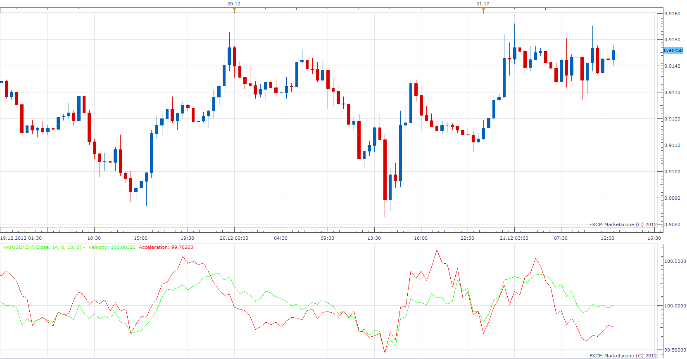

# Velocity/Acceleration

> Source: https://fxcodebase.com/code/viewtopic.php?f=17&t=27873  
> Forum: 17 · Topic 27873 · 6 post(s)

---

## Velocity/Acceleration

**Apprentice** · Fri Dec 21, 2012 6:42 am

Velocity=source[period]*100/source[period-Velocity];
Velocity = Momentum of Price;
Acceleration
Acceleration = Velocity[period]*100/Velocity[period-AccelerationPeriod];
Acceleration = Momentum of Velocity;

 [VA.lua](files/48899/VA.lua)

---

## Re: Velocity/Acceleration

**Coondawg71** · Tue May 07, 2013 5:31 pm

Can we please convert the vaMA (Velocity and Acceleration) of this posting to Lua.

Velocity and Accerlation Moving Average, vaMA, not to be confused with VAMA (Volume Adjusted Moving Average).

P.S. the second portion of this indicator vaZZ will be requested in separate request.

thanks,

sjc

[http://www.mql5.com/en/code/1661](http://www.mql5.com/en/code/1661)

---

## Re: Velocity/Acceleration

**Apprentice** · Wed May 08, 2013 5:48 am

Your request is added to the development list.

---

## Re: Velocity/Acceleration

**Apprentice** · Wed May 08, 2013 6:28 am

Requested can be found here.
[viewtopic.php?f=17&t=36832](https://fxcodebase.com/code/viewtopic.php?f=17&t=36832)

---

## Re: Velocity/Acceleration

**Alexander.Gettinger** · Wed Aug 14, 2013 3:19 pm

MQL4 version of Velocity/Acceleration: [http://www.fxcodebase.com/code/viewtopi ... 38&t=59134](http://www.fxcodebase.com/code/viewtopic.php?f=38&t=59134).

---

## Re: Velocity/Acceleration

**Apprentice** · Wed Aug 01, 2018 10:02 am

The Indicator was revised and updated.
