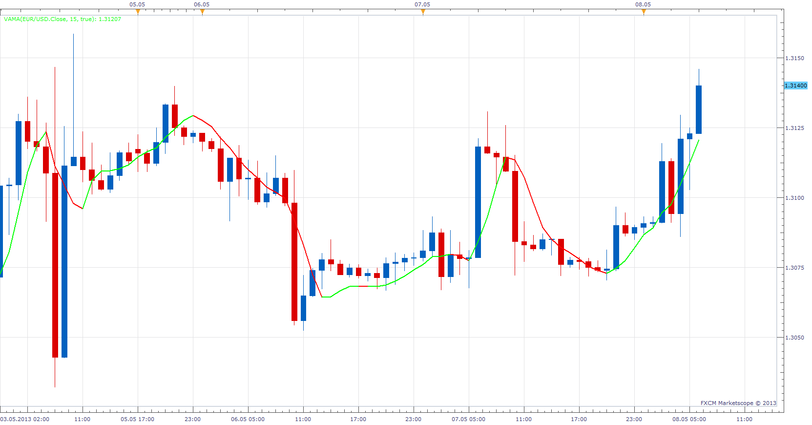

# Velocity and Accerlation Moving Average

> Source: https://fxcodebase.com/code/viewtopic.php?f=17&t=36832  
> Forum: 17 · Topic 36832 · 4 post(s)

---

## Velocity and Accerlation Moving Average

**Apprentice** · Wed May 08, 2013 6:28 am

 [vaMA.lua](files/61604/vaMA.lua)

The indicator was revised and updated

---

## Re: Velocity and Accerlation Moving Average

**Patrick Sweet** · Wed May 08, 2013 9:29 am

Thank you A! Much appreciated!

---

## Re: Velocity and Accerlation Moving Average

**Alexander.Gettinger** · Mon Sep 15, 2014 12:11 pm

MQL4 version of Velocity and Accerlation Moving Average: [viewtopic.php?f=38&t=61149](https://fxcodebase.com/code/viewtopic.php?f=38&t=61149).

---

## Re: Velocity and Accerlation Moving Average

**Apprentice** · Sat Jun 24, 2017 4:52 am

The indicator was revised and updated.
