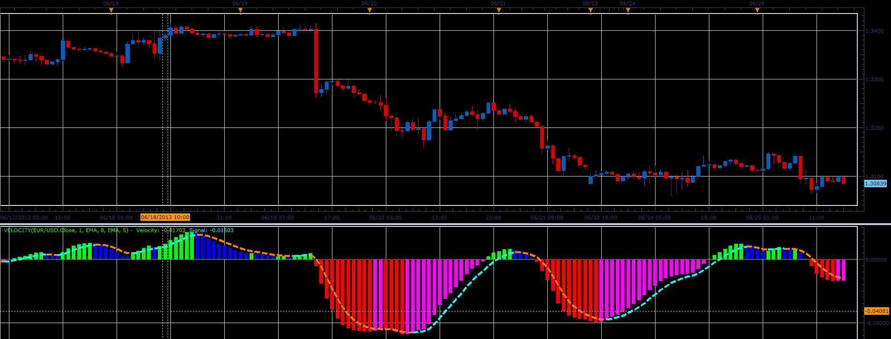

# Velocity oscillator

> Source: https://fxcodebase.com/code/viewtopic.php?f=17&t=42268  
> Forum: 17 · Topic 42268 · 4 post(s)

---

## Velocity oscillator

**Alexander.Gettinger** · Thu Jun 27, 2013 11:20 am

This indicator is a ported MQL5 indicator from [http://www.mql5.com/ru/code/1779](http://www.mql5.com/ru/code/1779) (in Russian).

Formulas:
Velocity = MA3-100,
Signal = MA4-100, where
MA4 = Moving average(MA3) with Signal_Method as Method and Signal_Period as Period,
MA3 = Moving average(MA2) with Velocity_Method as Method and Velocity_Period as Period,
MA2 = Moving average(MA1) with Velocity_Method as Method and Velocity_Period as Period,
MA1 = Moving average(Momentum) with Velocity_Method as Method and Velocity_Period as Period.

 

Download:

 [Velocity.lua](files/68734/Velocity.lua)

For this indicators must be installed Averages indicator ([viewtopic.php?f=17&t=2430](https://fxcodebase.com/code/viewtopic.php?f=17&t=2430)).

For this indicators, MOMENTUM indicator must be installed.
[viewtopic.php?f=17&t=896&p=1638&hilit=MOMENTUM#p1638](https://fxcodebase.com/code/viewtopic.php?f=17&t=896&p=1638&hilit=MOMENTUM#p1638)

The indicator was revised and updated

---

## Re: Velocity oscillator

**mulligan** · Fri Jun 28, 2013 10:42 am

When I try put the indicator on the chart, I get the message Velocity.lua:88: the indicator with id MOMENTUM is not found. I have averages installed as noted and could not find an indicator in the code base labeled MOMENTUM. Thanks for your help.

---

## Re: Velocity oscillator

**Apprentice** · Fri Jun 28, 2013 11:25 am

MOMENTUM can be found here.
[viewtopic.php?f=17&t=896&p=1638&hilit=MOMENTUM#p1638](https://fxcodebase.com/code/viewtopic.php?f=17&t=896&p=1638&hilit=MOMENTUM#p1638)

---

## Re: Velocity oscillator

**Apprentice** · Thu Jun 01, 2017 10:13 am

Indicator was revised and updated.
