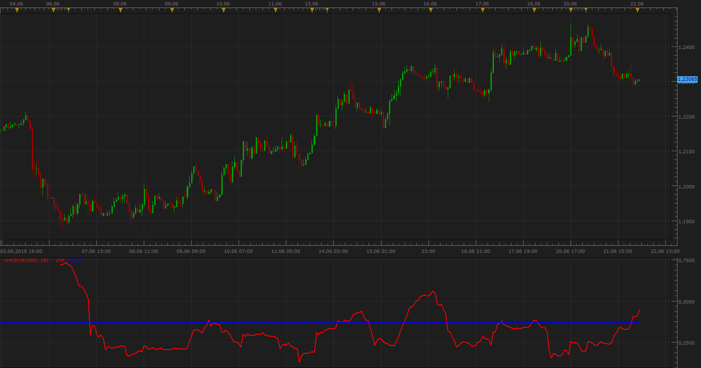

# Vertical Horizontal Filter (VHF)

> Source: https://fxcodebase.com/code/viewtopic.php?f=17&t=1394  
> Forum: 17 · Topic 1394 · 3 post(s)

---

## Vertical Horizontal Filter (VHF)

**Apprentice** · Tue Jun 22, 2010 12:36 am

*Vertical Horizontal Filter*

Vertical Horizontal Filter (VHF) was created by Adam White.
Identify trending and ranging markets.

Rising values indicate a trend.
Falling values indicate a ranging market.
High values precede the end of a trend.
Low values precede a trend start.

Depending on the period of the signal (demarcation) line has different levels.

 [VHF.lua](files/2706/VHF.lua)

The indicator was revised and updated

---

## Re: Vertical Horizontal Filter (VHF)

**bodybody** · Tue Jun 22, 2010 1:29 am

Really thank you for your effort so much at all.

Marketscope be my best trading system now.

 Marketscope come strong out of the strong back-up team.

---

## Re: Vertical Horizontal Filter (VHF)

**Apprentice** · Sun Jan 08, 2017 6:51 am

Indicator was revised and updated.
