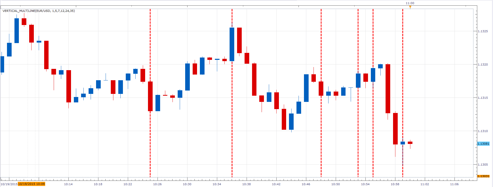

# Vertical Line

> Source: https://fxcodebase.com/code/viewtopic.php?f=17&t=62723  
> Forum: 17 · Topic 62723 · 6 post(s)

---

## Vertical Line

**Apprentice** · Fri Sep 25, 2015 2:48 am

Based on request.
[viewtopic.php?f=27&t=62722](https://fxcodebase.com/code/viewtopic.php?f=27&t=62722)
Will draw a vertical line,
N periods back from the current candle.

 [Vertical Line.lua](files/102533/Vertical%20Line.lua)

The indicator was revised and updated

---

## Re: Vertical Line

**Alexander.Gettinger** · Mon Oct 19, 2015 10:36 am

Version with several lines.

 

Download:

 [Vertical_Multiline.lua](files/102922/Vertical_Multiline.lua)

---

## Re: Vertical Line

**Apprentice** · Wed Jul 26, 2017 9:50 am

The indicator was revised and updated.

---

## Re: Vertical Line

**fx1954** · Thu Jul 15, 2021 7:40 am

> **Apprentice wrote:**
>
>
> Vertical Line.png
>
>
> Based on request.
> [viewtopic.php?f=27&t=62722](https://fxcodebase.com/code/viewtopic.php?f=27&t=62722)
> Will draw a vertical line,
> N periods back from the current candle.
>
>
> Vertical Line.lua
>
>
>
> The indicator was revised and updated

Hi

is there a Vertical Line indicator, which draws a line at full hour each?

---

## Re: Vertical Line

**Apprentice** · Thu Jul 15, 2021 1:20 pm

Not that I know.

Your request is added to the development list.
Development reference 644.

---

## Re: Vertical Line

**Apprentice** · Thu Jul 15, 2021 1:54 pm

Try this version.
[https://fxcodebase.com/code/viewtopic.php?f=17&t=71347](https://fxcodebase.com/code/viewtopic.php?f=17&t=71347)
