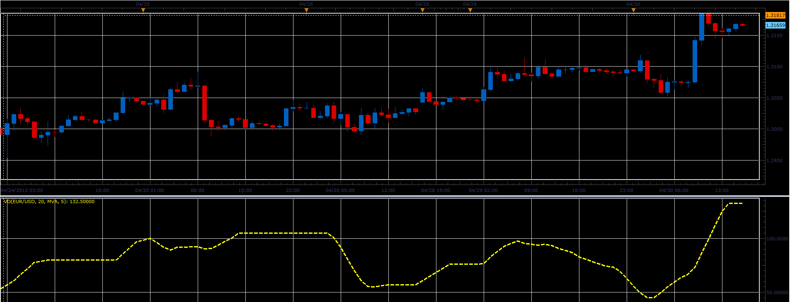

# Vo oscillator

> Source: https://fxcodebase.com/code/viewtopic.php?f=17&t=36262  
> Forum: 17 · Topic 36262 · 2 post(s)

---

## Vo oscillator

**Alexander.Gettinger** · Thu May 02, 2013 10:24 am

This indicator is ported MQL5 indicator from [http://www.mql5.com/ru/code/1656](http://www.mql5.com/ru/code/1656) (in Russian).

Formulas:
Vo[i] = MA(Range), where
Range = Max-Min,
Max, Min - maximum and minimum prices at range from (i-Period+1) to i.

 

Download:

 [Vo.lua](files/60889/Vo.lua)

For this indicator must be installed Averages indicator ([viewtopic.php?f=17&t=2430](https://fxcodebase.com/code/viewtopic.php?f=17&t=2430)).

The indicator was revised and updated

---

## Re: Vo oscillator

**Apprentice** · Thu May 11, 2017 1:27 pm

Indicator was revised and updated.
