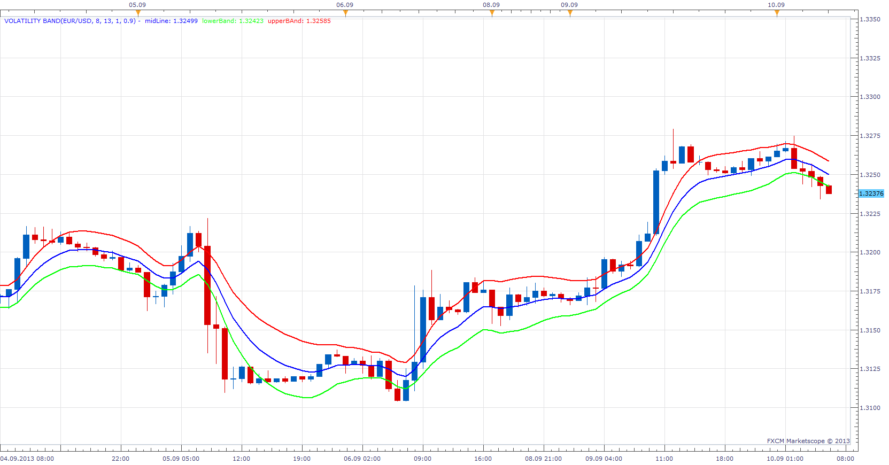

# Volatility Band

> Source: https://fxcodebase.com/code/viewtopic.php?f=17&t=59444  
> Forum: 17 · Topic 59444 · 4 post(s)

---

## Volatility Band

**Apprentice** · Tue Sep 10, 2013 5:33 am

As described by Sylvain Vervoort's article "Within The Volatility Band."

 [Volatility Band.lua](files/89317/Volatility%20Band.lua)

My modification regarding Band_Adjust parameter.

 [Volatility Band Mod.lua](files/89317/Volatility%20Band%20Mod.lua)

The indicator was revised and updated

---

## Re: Volatility Band

**Patrick Sweet** · Wed Sep 11, 2013 3:47 am

Hi and thanks!

As usual, I like your mod.adjustments! Veervort has tightened BBs a bit. A

I am wondering: In a paper by a math prof (see link) [http://www.math.ucsd.edu/~politis/PAPER/VolBandsJTA.pdf](http://www.math.ucsd.edu/~politis/PAPER/VolBandsJTA.pdf)
GEOMEAN is used for constructing VolBands. The math looks good as do the bands. The type of moving average impacts the results. Also, in that paper, he introduces q and Q (periods and bias) as parameters.

1. Could you modify your Volbands Mod.lua to include multiple methods for calculating averages, especially GEOMEAN...? and/or
2. If possible, could you create a VolBand based on q and Q as in the paper above or some variation of these two alternatives? I do not know which is most effective.

Patrick

---

## Re: Volatility Band

**Alexander.Gettinger** · Mon Sep 30, 2013 10:02 am

MQL4 version of Volatility Band indicators: [viewtopic.php?f=38&t=59600](https://fxcodebase.com/code/viewtopic.php?f=38&t=59600).

---

## Re: Volatility Band

**Apprentice** · Thu Jun 22, 2017 6:33 am

The indicator was revised and updated.
