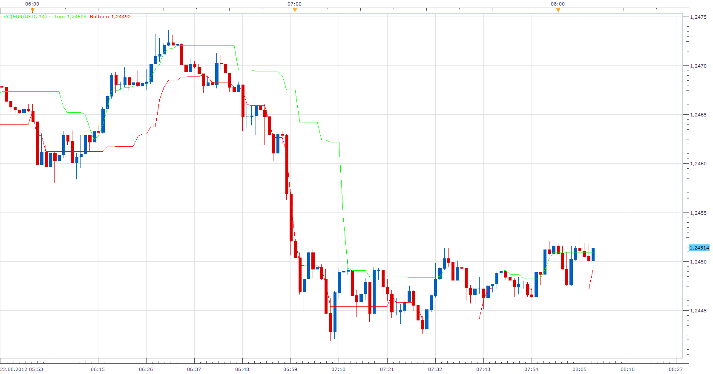

# Volatility Channel by Larry Williams

> Source: https://fxcodebase.com/code/viewtopic.php?f=17&t=22632  
> Forum: 17 · Topic 22632 · 3 post(s)

---

## Volatility Channel by Larry Williams

**Apprentice** · Wed Aug 22, 2012 7:05 am

Top = max( ( ( ( (H+L+C) / 3 ) * 2 ) - H) , Top)
Bottom = min( ( ( ( (H+L+C) / 3 ) * 2 ) - L) , Bottom)

 [VC.lua](files/39056/VC.lua)

The indicator was revised and updated

---

## Re: Volatility Channel by Larry Williams

**Alexander.Gettinger** · Mon Nov 17, 2014 5:14 pm

MQL4 version of Volatility Channel: [viewtopic.php?f=38&t=61453](https://fxcodebase.com/code/viewtopic.php?f=38&t=61453).

---

## Re: Volatility Channel by Larry Williams

**Apprentice** · Tue Jun 27, 2017 4:29 am

The indicator was revised and updated.
