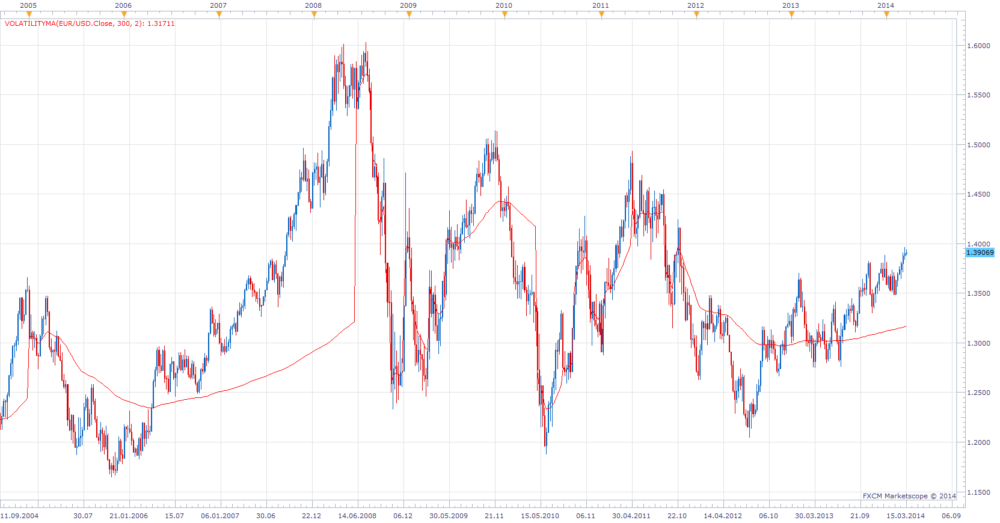

# Volatility Moving Average

> Source: https://fxcodebase.com/code/viewtopic.php?f=17&t=60418  
> Forum: 17 · Topic 60418 · 6 post(s)

---

## Volatility Moving Average

**Apprentice** · Tue Mar 18, 2014 4:47 am

Benoit Mandelbrot, in his book, The Misbehavior of Markets, discusses important consequences on the fractal nature of markets. All charts, whether you view the fifteen minute or the daily, resemble each other.
Volatility Moving Average a.k.a. Resetting Moving Average Indicator
attempts to eliminate this by resetting average period Whenever a candle closes more than 2 standard deviations beyond the previous close.

 [VolatilityMA.lua](files/93106/VolatilityMA.lua)

 [Timed Tick VolatilityMA.lua](files/93106/Timed%20Tick%20VolatilityMA.lua)

---

## Re: Volatility Moving Average

**Alexander.Gettinger** · Mon Jun 02, 2014 4:59 pm

MQL4 version of Volatility Moving Average: [viewtopic.php?f=38&t=60761](https://fxcodebase.com/code/viewtopic.php?f=38&t=60761).

---

## Re: Volatility Moving Average

**Apprentice** · Thu Jun 22, 2017 7:08 am

The indicator was revised and updated.

---

## Re: Volatility Moving Average

**oxbx99** · Tue Dec 05, 2017 5:19 am

hi,

can i please request timed tick version for this indicator

thanks

---

## Re: Volatility Moving Average

**Apprentice** · Tue Dec 05, 2017 6:58 am

Timed Tick VolatilityMA.lua

---

## Re: Volatility Moving Average

**Apprentice** · Tue May 08, 2018 5:09 am

The indicator was revised and updated.
