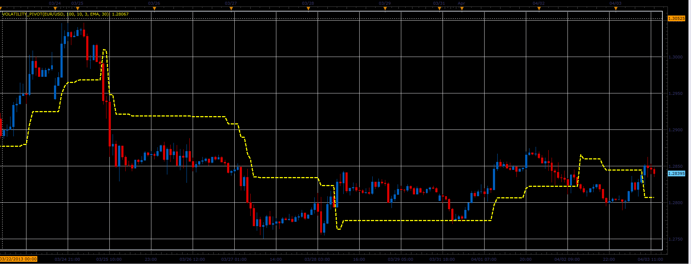

# Volatility Pivot indicator

> Source: https://fxcodebase.com/code/viewtopic.php?f=17&t=34059  
> Forum: 17 · Topic 34059 · 2 post(s)

---

## Volatility Pivot indicator

**Alexander.Gettinger** · Wed Apr 03, 2013 2:27 pm

This indicator is a ported MQL5 indicators from [http://www.mql5.com/en/code/1563](http://www.mql5.com/en/code/1563)

 

Download:

 [Volatility_Pivot.lua](files/57898/Volatility_Pivot.lua)

The indicator was revised and updated

---

## Re: Volatility Pivot indicator

**Apprentice** · Tue May 09, 2017 5:49 am

Indicator was revised and updated.
