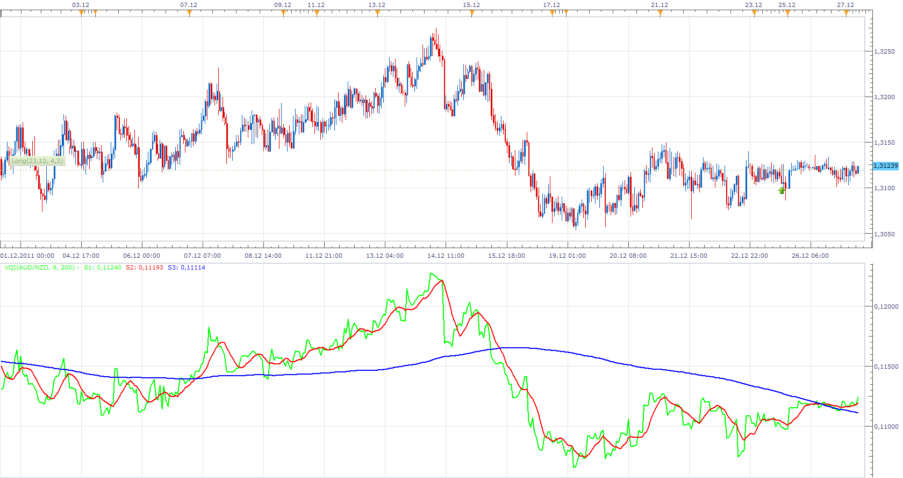
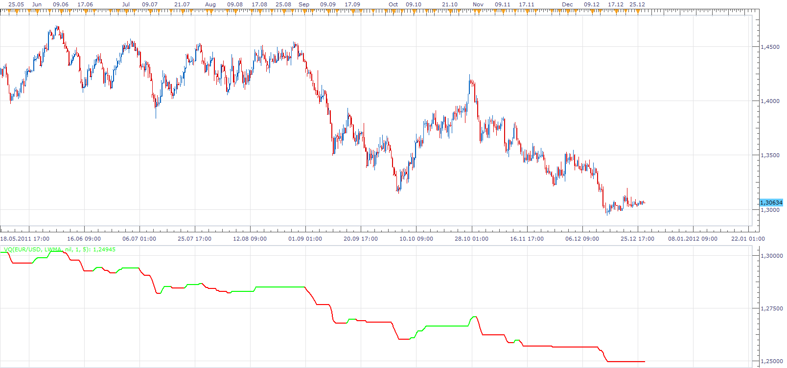

# Volatility Quality Index (VQI)

> Source: https://fxcodebase.com/code/viewtopic.php?f=17&t=10504  
> Forum: 17 · Topic 10504 · 14 post(s)

---

## Volatility Quality Index (VQI)

**Apprentice** · Tue Dec 27, 2011 6:08 am

The Volatility Quality Index can help you identify better trade opportunities by distinguishing between good and bad volatility. Formula for the system discussed in Advanced Strategies (p. 56) / August 2002 Active Trader Magazine.

On the internet I found two different versions of this indicator.
So I added the both algorithms.
If someone has the original specification would ask him to forward it to me,

Algorithm One

If TrueRange <> 0 and (High - Low) <> 0 Then
VQI = ((Close - Close[1]) / TrueRange + (Close - Open) / (High - Low)) * 0.5
Else
VQI=VQI[1];
VQI = AbsValue(VQI) * ((Close - Close[1] + (Close - Open)) * 0.5);
End

Algorithm Two

VQI:=If(ATR(1)<>0 AND (H-L)<>0, ((C-Ref(C,-1)/ATR(1)) + ((C-O)/(H-L)))*0.5,PREV);
VQI:=Abs(VQI)*((C-Ref(C,-1)+(C-O))*0.5);

 [VQI.lua](files/21765/VQI.lua)

The indicator was revised and updated

---

## Re: Volatility Quality Index (VQI)

**Apprentice** · Tue Dec 27, 2011 10:24 am

Volatility Quality Index by Thomas Stridsman

 

 [VQ.lua](files/21774/VQ.lua)

Simple Vq strategy is available here.
[http://fxcodebase.com/code/viewtopic.ph ... 86#p114686](https://fxcodebase.com/code/viewtopic.php?f=31&t=65052&p=114686#p114686)

---

## Re: Volatility Quality Index (VQI)

**rebeljedi** · Tue Dec 27, 2011 12:22 pm

hi Apprentice,

Thank you for creating the VQ lua indicator.
I have found that the lua version did not give as many signals as the VQ MT4 version which I attached in [viewtopic.php?f=27&t=10134&p=21775#p21232](https://fxcodebase.com/code/viewtopic.php?f=27&t=10134&p=21775#p21232).
Could you kindly help to review?

In addition, is it possible to add the arrow signals and create a strategy?

Thank you.

---

## Re: Volatility Quality Index (VQI)

**rebeljedi** · Thu Jan 05, 2012 12:45 am

> **Apprentice wrote:**
> Volatility Quality Index by Thomas Stridsman
>
>
> The attachment **vq.png** is no longer available
>
>
>
>
> The attachment **vq.png** is no longer available

Hello Apprentice,

Happy New Year!

I tested the VQ lua version but it does not have the same signals as FXCM MT4.
The VQ lua version only gives a straight line, compared to the MT4 FXCM which gives several signals with arrows in the same timeframe.
Please see enclosed comparisons.

Can you please help to review the code?
Thank you.

---

## Re: Volatility Quality Index (VQI)

**Apprentice** · Fri Jan 06, 2012 3:26 am

Thanks for the information.
Someone will take a second look.

---

## Re: Volatility Quality Index (VQI)

**mosesnobleraj** · Thu Jan 12, 2012 12:42 pm

i request a strategy based on VQI

**buy: s2 cross over s3
sell: s2 cross under s3**

---

## Re: Volatility Quality Index (VQI)

**Apprentice** · Fri Jan 13, 2012 3:47 am

Your request is added to the developmental cue.

---

## Re: Volatility Quality Index (VQI)

**virgilio** · Mon Jan 23, 2012 12:43 pm

Hello Apprentice,

This indicator after I put it at the bottom of the chart keeps disappearing after a while showing an error message. Am I doing anything wrong myself or is it the indicator working funny?

---

## Re: Volatility Quality Index (VQI)

**virgilio** · Mon Jan 23, 2012 6:08 pm

Apprentice, as far the prior email, this indicator disappears ONLY when I use it with algorithm 1.
Algorithm 2 instead seems to be working fine. Please tell me if I am doing anything wrong?

---

## Re: Volatility Quality Index (VQI)

**Apprentice** · Tue Jan 24, 2012 3:21 am

Bug Fixed.

---

## Re: Volatility Quality Index (VQI)

**Alexander.Gettinger** · Tue Jan 24, 2012 4:05 am

Strategy based on VQI indicator: [viewtopic.php?f=31&t=12221](https://fxcodebase.com/code/viewtopic.php?f=31&t=12221)

---

## Re: Volatility Quality Index (VQI)

**Apprentice** · Wed Sep 26, 2012 3:56 am

 [VQ Bar.lua](files/40944/VQ%20Bar.lua)

---

## Re: Volatility Quality Index (VQI)

**Apprentice** · Wed Sep 26, 2012 4:16 am

This is a spin off of VQI Indicator,
shows the current value of the VQ internal components,
which is used in calculation of VQI indicator.

 [Raw VQ.lua](files/40947/Raw%20VQ.lua)

---

## Re: Volatility Quality Index (VQI)

**Apprentice** · Thu Apr 13, 2017 8:38 am

Indicator was revised and updated.
