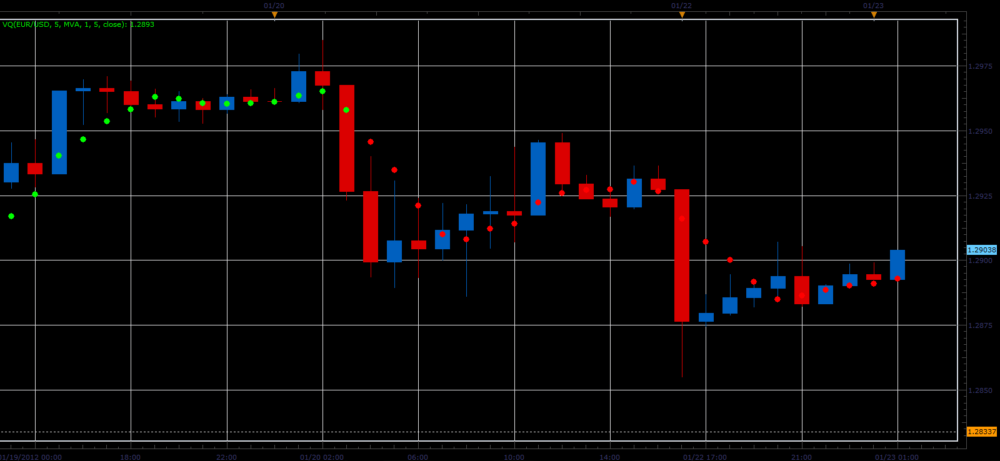
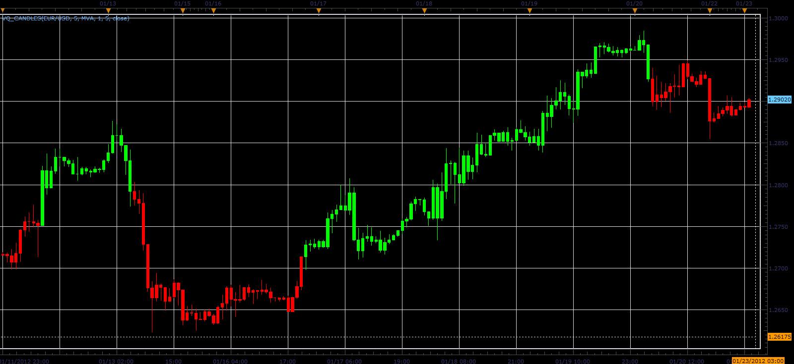

# Volatility Quality indicator

> Source: https://fxcodebase.com/code/viewtopic.php?f=17&t=12170  
> Forum: 17 · Topic 12170 · 4 post(s)

---

## Volatility Quality indicator

**Alexander.Gettinger** · Mon Jan 23, 2012 2:06 am

This indicator is a ported MQL5 indicator from [http://www.mql5.com/en/code/709](http://www.mql5.com/en/code/709).

Formulas:
VQ[i]=MA_C[i] and UP color if Dir[i]>0 or DN color if Dir[i]<0, where
Dir[i]>0 if Var>0 and Dir[i]<0 if Var<0,
if abs(Var)<Filter(in pips) Dir[i]=Dir[i-1],
Var=0.25*abs((MA_C[i]-MA_C[i-Smoothing])/Max+(MA_C[i]-MA_O[i])/(MA_H[i]-MA_L[i]))*(2*MA_C[i]-MA_C[i-Smoothing]-MA_O[i]),
Max[i]=Max(MA_H[i]-MA_L[i],MA_H[i]-MA_C[i-Smoothing],MA_C[i-Smoothing]-MA_L[i]),
MA_H - moving average for High,
MA_L - moving average for Low,
MA_O - moving average for Open,
MA_C - moving average for [MainPrice].

 

Download:

 [VQ.lua](files/24128/VQ.lua)

For this indicator must be installed AVERAGES indicator ([viewtopic.php?f=17&t=2430](https://fxcodebase.com/code/viewtopic.php?f=17&t=2430)).

The indicator was revised and updated

---

## Re: Volatility Quality indicator

**Alexander.Gettinger** · Mon Jan 23, 2012 2:07 am

Indicator paints the bars, in accordance with VQ.

 

Download:

 [VQ_Candles.lua](files/24129/VQ_Candles.lua)

---

## Re: Volatility Quality indicator

**Alexander.Gettinger** · Mon Jan 23, 2012 2:58 am

Strategy based on this indicator :http://fxcodebase.com/code/viewtopic.php?f=31&t=12173.

---

## Re: Volatility Quality indicator

**Apprentice** · Thu Mar 23, 2017 2:56 pm

Indicator was revised and updated.
