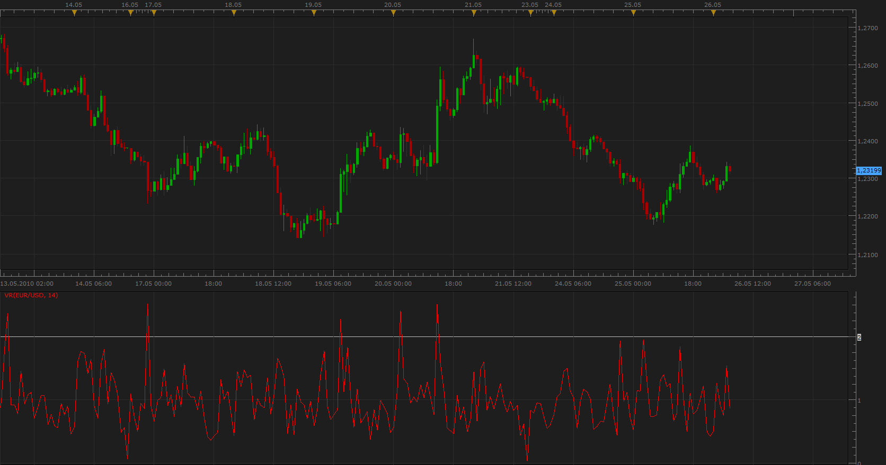

# Volatility Ratio & Normalized ATR

> Source: https://fxcodebase.com/code/viewtopic.php?f=17&t=1126  
> Forum: 17 · Topic 1126 · 6 post(s)

---

## Volatility Ratio & Normalized ATR

**Apprentice** · Wed May 26, 2010 4:53 am

**Volatility Ratio**

 

*Volatility Ratio*

This ratio is used to identify wide-ranging days.
Wide ranging days are signaled by a Volatility Ratio greater than 2.0.

Identifies
1. Wide-ranging days, signals a likely reversal
2. Price gaps
3. Island Price pattern

Formula
Volatility Ratio = True Range / EMA of True Range for the past n periods

 [VR.lua](files/2152/VR.lua)

MT4/MQ4 version.
[viewtopic.php?f=38&t=63770](https://fxcodebase.com/code/viewtopic.php?f=38&t=63770)

The indicator was revised and updated

---

## Re: Volatility Ratio & Normalized ATR

**Apprentice** · Wed May 26, 2010 5:05 am

**Normalized ATR**

 

*Normalized ATR*

The normalized ATR by John Forman expresses the ATR as a percentage of the current closing price. This makes it possible to compare ATR values over long periods where a share price level (and hence the typical daily ranges) have changed greatly.

Formula
 NATR = 100 *ATR / Close

 [Normalized ATR.lua](files/2154/Normalized%20ATR.lua)

---

## Re: Volatility Ratio & Normalized ATR

**Apprentice** · Mon Feb 05, 2018 6:30 am

The Indicator was revised and updated.

---

## Re: Volatility Ratio & Normalized ATR

**amvt85** · Wed Aug 15, 2018 10:49 am

> **Apprentice wrote:**
> **Volatility Ratio**
>
>
> VR.png
>
>
> This ratio is used to identify wide-ranging days.
> Wide ranging days are signaled by a Volatility Ratio greater than 2.0.
>
> Identifies
> 1. Wide-ranging days, signals a likely reversal
> 2. Price gaps
> 3. Island Price pattern
>
> Formula
> Volatility Ratio = True Range / EMA of True Range for the past n periods
>
>
> VR.lua
>
>
>
> MT4/MQ4 version.
> [viewtopic.php?f=38&t=63770](https://fxcodebase.com/code/viewtopic.php?f=38&t=63770)
>
> The indicator was revised and updated

Hello,

Can we get an option to adjust the levels please?

Thank you.

---

## Re: Volatility Ratio & Normalized ATR

**Apprentice** · Thu Aug 16, 2018 10:10 am

Try it now.

---

## Re: Volatility Ratio & Normalized ATR

**amvt85** · Fri Aug 17, 2018 2:15 pm

> **Apprentice wrote:**
> Try it now.

Aces mate!
