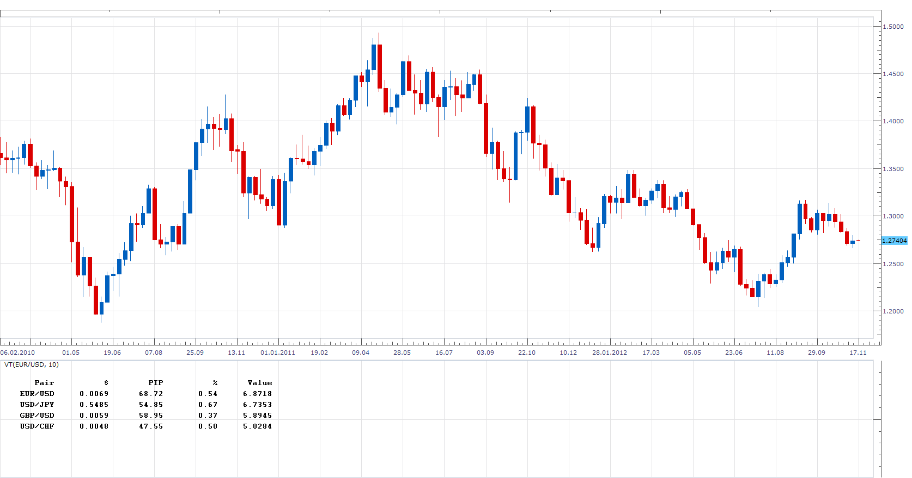

# Volatility Table

> Source: https://fxcodebase.com/code/viewtopic.php?f=17&t=26238  
> Forum: 17 · Topic 26238 · 8 post(s)

---

## Volatility Table

**Apprentice** · Sun Nov 18, 2012 5:43 pm

This indicator shows the average volatility, of last N Periods, for the selected time frame.
Volatility is defined as High-Low.
Presented as $, Pip, %, value.
$ - Volatility
Pip - volatility in Pips.
$ - Volatility in %
Value - change depending on the number of Lots

 [VT.lua](files/45037/VT.lua)

 

 [VT_2.lua](files/45037/VT_2.lua)

---

## Re: Volatility Table

**Apprentice** · Tue May 02, 2017 1:31 pm

Indicator was revised and updated.

---

## Re: Volatility Table

**Avignon** · Sun Feb 09, 2020 6:10 pm

Hello,

Can you do it on this model?

[http://fxcodebase.com/code/viewtopic.ph ... lit=Movers](https://fxcodebase.com/code/viewtopic.php?f=17&t=3234&hilit=Movers)

Thanks.

---

## Re: Volatility Table

**Apprentice** · Mon Feb 10, 2020 6:10 am

Your request is added to the development list.
Development reference 697.

---

## Re: Volatility Table

**Apprentice** · Mon Feb 10, 2020 6:55 am

VT_2.lua added.

---

## Re: Volatility Table

**Avignon** · Mon Feb 10, 2020 8:00 pm

Hello,

The result is in percentages, I wish I had it in pips.

The parameter Period corresponds to what? Should we leave the default settings?

Thanks.

---

## Re: Volatility Table

**Apprentice** · Tue Feb 11, 2020 5:57 am

Your request is added to the development list.
Development reference 707.

---

## Re: Volatility Table

**Apprentice** · Tue Feb 11, 2020 6:41 am

[VT_2.lua](files/131218/VT_2.lua)

Try this version.
