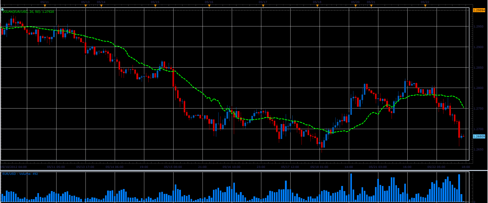

# VolMA indicator

> Source: https://fxcodebase.com/code/viewtopic.php?f=17&t=18973  
> Forum: 17 · Topic 18973 · 6 post(s)

---

## VolMA indicator

**Alexander.Gettinger** · Tue May 22, 2012 4:18 pm

Formulas:
VolMA=MVA(Price), where
Period of MVA=RSI(Volume)*[Period]/100.

 

Download:

 [VolMA.lua](files/33827/VolMA.lua)

 

 [Volume Moving Average Cross Indicator.lua](files/33827/Volume%20Moving%20Average%20Cross%20Indicator.lua)

Compatibility issue fixed.
_Alert Helper is not longer needed.

---

## Re: VolMA indicator

**Alexander.Gettinger** · Tue May 22, 2012 4:20 pm

MQL4 version of VolMA indicator: [viewtopic.php?f=38&t=18974](https://fxcodebase.com/code/viewtopic.php?f=38&t=18974)

---

## Re: VolMA indicator

**guangho** · Tue Oct 23, 2012 12:29 pm

The index is very good, but can not import for " Strategy Builder", is there may be modified to use? Thank you.

[viewtopic.php?f=31&t=2368](https://fxcodebase.com/code/viewtopic.php?f=31&t=2368)

---

## Re: VolMA indicator

**Apprentice** · Sun Feb 22, 2015 7:28 am

Volume Moving Average Cross Indicator Added.

---

## Re: VolMA indicator

**Apprentice** · Mon Dec 07, 2015 7:22 am

Compatibility issue fixed.
_Alert Helper is not longer needed.

---

## Re: VolMA indicator

**Apprentice** · Sat Oct 27, 2018 8:51 am

The indicator was revised and updated.
