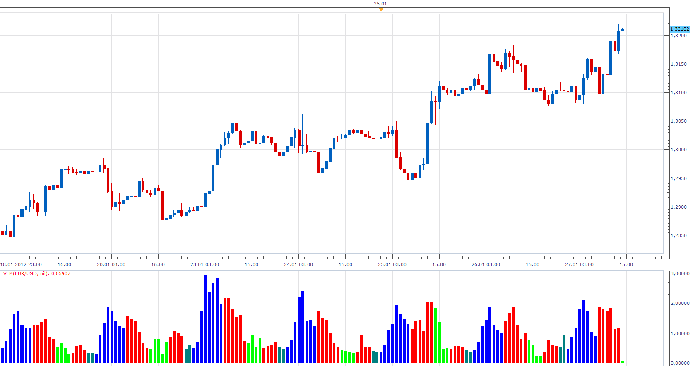

# Voltest (VLM)

> Source: https://fxcodebase.com/code/viewtopic.php?f=17&t=12322  
> Forum: 17 · Topic 12322 · 3 post(s)

---

## Voltest (VLM)

**Apprentice** · Fri Jan 27, 2012 2:01 pm

This indicator is a direct translation of MQ4 implementation.

 VLM[period] = Volume[period] / Avg ( Volume, MA_Period);
Ma_Period vary depending on the Time Frame you are using.

 [VLM.lua](files/24390/VLM.lua)

I am effectively color blind, help in color choosing will be welcomed.

The indicator was revised and updated

---

## Re: Voltest (VLM)

**Alexander.Gettinger** · Thu Nov 20, 2014 10:12 am

MQL4 version of VLM oscillator: [viewtopic.php?f=38&t=61492](https://fxcodebase.com/code/viewtopic.php?f=38&t=61492).

---

## Re: Voltest (VLM)

**Apprentice** · Wed Jun 28, 2017 5:15 am

The indicator was revised and updated.
