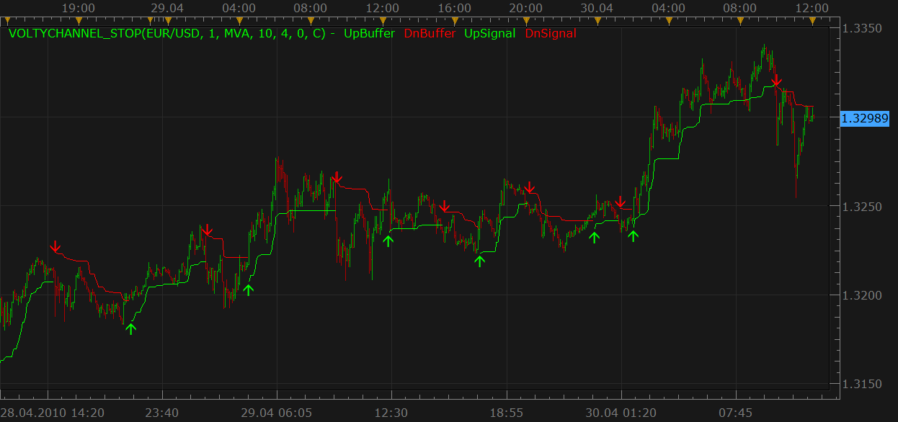

# Volty Channel Stop + bigger time frame version

> Source: https://fxcodebase.com/code/viewtopic.php?f=17&t=893  
> Forum: 17 · Topic 893 · 20 post(s)

---

## Volty Channel Stop + bigger time frame version

**Nikolay.Gekht** · Fri Apr 30, 2010 11:10 am

Upd Sep 22 2010: The bigger time frame version is added. See below in the download section.

The indicator is a port of TrendLaboratory's MT4 VoltyStop.2.1 indicator published at
[http://finance.groups.yahoo.com/group/TrendLaboratory](http://finance.groups.yahoo.com/group/TrendLaboratory)
The classic recommendation is to
Buy when VoltyChannel_Stop long signal appears over SMA.
Sell when VoltyChannel_Stop short signal appears under SMA.
([http://www.tradingsystemforex.com/exper ... op-ea.html](http://www.tradingsystemforex.com/expert-advisors-backtesting/803-voltychannel_stop-ea.html))

 

Download:

 [VoltyChannel_Stop.lua](files/1634/VoltyChannel_Stop.lua)

 [Volty Channel Stop Indicator.lua](files/1634/Volty%20Channel%20Stop%20Indicator.lua)

 [Volty Channel Stop Indicator Overlay.lua](files/1634/Volty%20Channel%20Stop%20Indicator%20Overlay.lua)

Bigger time frame version:

 [Bf_VoltyChannel_Stop.lua](files/1634/Bf_VoltyChannel_Stop.lua)

Code: [Select all](https://fxcodebase.com/code/)
`-- The original indicator VoltyChannel_Stop_v2.1.mq4
--  Copyright © 2007, TrendLaboratory
--  http://finance.groups.yahoo.com/group/TrendLaboratory
--  E-mail: [[email protected]](https://fxcodebase.com/cdn-cgi/l/email-protection)
-- v2.1. Modified by
--  MODIFIED BY AVERY T. HORTON, JR. AKA [[email protected]](https://fxcodebase.com/cdn-cgi/l/email-protection)
-- ---------------------------------------------------------------------
-- This port to lua is made by http://fxcodebase.com team.
-- ---------------------------------------------------------------------
-- Indicator profile initialization routine
-- Defines indicator profile properties and indicator parameters
function Init()
    indicator:name("Volty Channel Stop");
    indicator:description("");
    indicator:requiredSource(core.Bar);
    indicator:type(core.Indicator);

    indicator.parameters:addInteger("MA_N", "Moving Average Period", "", 1);
    indicator.parameters:addString("MA_M", "Moving Average Method", "The methods marked by an asterisk (*) require the appropriate indicators to be loaded.", "MVA");
    indicator.parameters:addStringAlternative("MA_M", "MVA", "", "MVA");
    indicator.parameters:addStringAlternative("MA_M", "EMA", "", "EMA");
    indicator.parameters:addStringAlternative("MA_M", "LWMA", "", "LWMA");
    indicator.parameters:addStringAlternative("MA_M", "SMMA*", "", "SMMA");
    indicator.parameters:addStringAlternative("MA_M", "Vidya (1995)*", "", "VIDYA");
    indicator.parameters:addStringAlternative("MA_M", "Vidya (1992)*", "", "VIDYA92");
    indicator.parameters:addStringAlternative("MA_M", "Wilders*", "", "WMA");
    indicator.parameters:addInteger("ATR_N", "ATR period", "", 10);
    indicator.parameters:addDouble("VF", "Volatility's Factor or Multiplier", "", 4);
    indicator.parameters:addInteger("OF", "Offset factor", "", 0);
    indicator.parameters:addString("P", "Price", "The price to the indicator apply to", "C");
    indicator.parameters:addStringAlternative("P", "Open", "", "O");
    indicator.parameters:addStringAlternative("P", "High", "", "H");
    indicator.parameters:addStringAlternative("P", "Low", "", "L");
    indicator.parameters:addStringAlternative("P", "Close", "", "C");
    indicator.parameters:addStringAlternative("P", "Median", "", "M");
    indicator.parameters:addStringAlternative("P", "Typical", "", "T");
    indicator.parameters:addStringAlternative("P", "Weighted", "", "W");
    indicator.parameters:addBoolean("HiLoE", "Use High/Low envelope", "", false);
    indicator.parameters:addBoolean("HiLoB", "Hi/Lo Break", "", true);
    indicator.parameters:addColor("UpBuffer_color", "Color of UpBuffer", "", core.rgb(0, 255, 0));
    indicator.parameters:addColor("DnBuffer_color", "Color of DnBuffer", "", core.rgb(255, 0, 0));
    indicator.parameters:addColor("UpSignal_color", "Color of UpSignal", "", core.rgb(0, 255, 0));
    indicator.parameters:addColor("DnSignal_color", "Color of DnSignal", "", core.rgb(255, 0, 0));
end

-- Indicator instance initialization routine
-- Processes indicator parameters and creates output streams
-- Parameters block
local MA_N;
local MA_M;
local ATR_N;
local VF;
local OF;
local P;
local HiLoE;
local HiLoB;

local first;
local source = nil;

-- Streams block
local UpBuffer = nil;
local DnBuffer = nil;
local UpSignal = nil;
local DnSignal = nil;
local SMin = nil;
local SMax = nil;
local Trend = nil;
local BPRICE;
local SPRICE;
local ATR;

-- Routine
function Prepare()
    MA_N = instance.parameters.MA_N;
    MA_M = instance.parameters.MA_M;
    ATR_N = instance.parameters.ATR_N;
    VF = instance.parameters.VF;
    OF = instance.parameters.OF;
    P = instance.parameters.P;
    HiLoE = instance.parameters.HiLoE;
    HiLoB = instance.parameters.HiLoB;
    source = instance.source;

    local bsrc, ssrc;

    if HiLoE then
        bsrc = source.high;
        ssrc = source.low;
    else
        if P == "O" then
            bsrc = source.open;
            ssrc = source.open;
        elseif P == "H" then
            bsrc = source.high;
            ssrc = source.high;
        elseif P == "L" then
            bsrc = source.low;
            ssrc = source.low;
        elseif P == "C" then
            bsrc = source.close;
            ssrc = source.close;
        elseif P == "M" then
            bsrc = source.median;
            ssrc = source.median;
        elseif P == "T" then
            bsrc = source.typical;
            ssrc = source.typical;
        elseif P == "W" then
            bsrc = source.weighted;
            ssrc = source.weighted;
        end
    end

    BPRICE = core.indicators:create(MA_M, bsrc, MA_N);
    SPRICE = core.indicators:create(MA_M, ssrc, MA_N);
    ATR = core.indicators:create("ATR", source, ATR_N);

    first = source:first() + MA_N + ATR_N;

    local name = profile:id() .. "(" .. source:name() .. ", " .. MA_N .. ", " .. MA_M .. ", " .. ATR_N .. ", " .. VF .. ", " .. OF .. ", " .. P .. ")";
    instance:name(name);
    UpBuffer = instance:addStream("UpBuffer", core.Line, name .. ".UpBuffer", "UpBuffer", instance.parameters.UpBuffer_color, first);
    DnBuffer = instance:addStream("DnBuffer", core.Line, name .. ".DnBuffer", "DnBuffer", instance.parameters.DnBuffer_color, first);
    UpSignal = instance:createTextOutput ("UpSignal", "UpSignal", "Wingdings", 10, core.H_Center, core.V_Bottom, instance.parameters.UpSignal_color, 0);
    DnSignal = instance:createTextOutput ("DnSignal", "DnSignal", "Wingdings", 10, core.H_Center, core.V_Top, instance.parameters.DnSignal_color, 0);
    SMin = instance:addInternalStream(0, 0);
    SMax = instance:addInternalStream(0, 0);
    Trend = instance:addInternalStream(0, 0);
end

-- Indicator calculation routine
function Update(period, mode)
    BPRICE:update(mode);
    SPRICE:update(mode);
    ATR:update(mode);
    if period >= first then
        local bprice, sprice, atr;
        bprice = BPRICE.DATA[period];
        sprice = SPRICE.DATA[period];
        atr = ATR.DATA[period];

        SMax[period] = bprice + VF * atr;
        SMin[period] = sprice - VF * atr;
        Trend[period] = Trend[period - 1];
        if (HiLoB) then
            if source.high[period] > SMax[period - 1] then
                Trend[period] = 1;
            end
            if source.low[period] < SMin[period - 1] then
                Trend[period] = -1;
            end
        else
            if bprice > SMax[period - 1] then
                Trend[period] = 1;
            end
            if sprice < SMin[period - 1] then
                Trend[period] = -1;
            end
        end

        if Trend[period] > 0 then
            if SMin[period] < SMin[period - 1] then
                SMin[period] = SMin[period - 1];
            end
            UpBuffer[period] = SMin[period] - (OF - 1) * atr;
            if UpBuffer[period] < UpBuffer[period - 1] and UpBuffer:hasData(period - 1)  then
                UpBuffer[period] = UpBuffer[period - 1];
            end
            if Trend[period] ~= Trend[period - 1] and Trend[period - 1] ~= 0 then
                UpSignal:set(period, UpBuffer[period], "\225");
            end
        elseif Trend[period] < 0 then
            if SMax[period] > SMax[period - 1] then
                SMax[period] = SMax[period - 1];
            end
            DnBuffer[period] = SMax[period] + (OF - 1) * atr;
            if DnBuffer[period] > DnBuffer[period - 1] and DnBuffer:hasData(period - 1) then
                DnBuffer[period] = DnBuffer[period - 1];
            end
            if Trend[period] ~= Trend[period - 1] and Trend[period - 1] ~= 0 then
                DnSignal:set(period, DnBuffer[period], "\226");
            end
        end
    else
        Trend[period] = 0;
    end
end`

MT4/MQ4 version.
[viewtopic.php?f=38&t=68347](https://fxcodebase.com/code/viewtopic.php?f=38&t=68347)

---

## Re: Volty Channel Stop

**Rainbowlighthousecp** · Mon May 10, 2010 6:19 am

Hi,

What should the SMA value be?

Anyone has any experience to share using this system?

Thanks!

---

## Re: Volty Channel Stop

**boursicoton** · Fri Sep 17, 2010 3:23 pm

it's a good indicator..marvellus work !
mtf indicator is possible ?
thanks nikolay....
I think that the indicators of this style are the right tools ...
when we have candles in range, or Renko ... we will have a certain advantage Stats!

---

## Re: Volty Channel Stop + bigger time frame version

**Nikolay.Gekht** · Wed Sep 22, 2010 4:24 pm

bigger time frame version is added. See the first post.

---

## Re: Volty Channel Stop + bigger time frame version

**craige** · Sat Dec 25, 2010 3:27 am

Hi Dear

thanks for the great work, this indicator is very important to me.

as you know, this indicator is very helpful, so could you give me the original code about this indicator.

I will appreciate it for your great help

best regards

PS:my English is not good, hoping you are able to understand what I am writing down.

---

## Re: Volty Channel Stop + bigger time frame version

**christhesquid** · Mon Jan 30, 2012 10:05 pm

Is it possible to make a version of this that shows different time frames and what direction the trend is in? It'd be nice to have the arrows in the top right hand corner similar to the multi time frame stochastic indicator.

---

## Re: Volty Channel Stop + bigger time frame version

**Apprentice** · Tue Jan 31, 2012 3:57 am

I'll arrange something similar soon.

---

## Re: Volty Channel Stop + bigger time frame version

**Apprentice** · Tue Jan 31, 2012 4:54 am

Requested can be found here.
[viewtopic.php?f=17&t=12521](https://fxcodebase.com/code/viewtopic.php?f=17&t=12521)

---

## Re: Volty Channel Stop + bigger time frame version

**RJH501** · Mon Jul 23, 2012 7:11 am

When you get time could you please add the options of changing line width and style.

Thank you,

RJH

---

## Re: Volty Channel Stop + bigger time frame version

**easytrading** · Wed Apr 22, 2015 12:44 am

hello Apprentice,

is it possible to add line style option for volty channel stop indicator, please?
my appreciation in advance.

---

## Re: Volty Channel Stop + bigger time frame version

**Apprentice** · Thu Apr 23, 2015 4:37 am

Style option added to Volty Channel Stop Indicator.lua

---

## Re: Volty Channel Stop + bigger time frame version

**easytrading** · Mon May 11, 2015 7:30 pm

kindly Apprentice,
is it posible to devolope the price OVERLAY of Volty Channel Stop Indicator.lua please,?
my appreciation in advance.

note:
is there any chance to code a general indicator that produce the price overlay for any input indicator of our choice??

---

## Re: Volty Channel Stop + bigger time frame version

**Apprentice** · Tue May 12, 2015 2:54 am

Volty Channel Stop Indicator Overlay.lua Added.

---

## Re: Volty Channel Stop + bigger time frame version

**Apprentice** · Tue May 12, 2015 3:35 am

Generic Overlay can be found here.
[viewtopic.php?f=17&t=62211](https://fxcodebase.com/code/viewtopic.php?f=17&t=62211)

---

## Re: Volty Channel Stop + bigger time frame version

**Apprentice** · Wed Aug 01, 2018 9:55 am

The Indicator was revised and updated.

---

## Re: Volty Channel Stop + bigger time frame version

**TazmasterT** · Fri Mar 29, 2019 7:51 am

Hi,

I really love this indicator but could you please allow the line width to be altered on the VoltyChannel_Stop.lua

Many thanks
TMT

---

## Re: Volty Channel Stop + bigger time frame version

**Apprentice** · Mon Apr 01, 2019 5:07 am

Try it now.

---

## Re: Volty Channel Stop + bigger time frame version

**MemphisRokudo** · Wed Apr 03, 2019 1:30 am

is there a mt4 version?

---

## Re: Volty Channel Stop + bigger time frame version

**Apprentice** · Wed Apr 03, 2019 5:06 am

Your request is added to the development list under Id Number 4582

---

## Re: Volty Channel Stop + bigger time frame version

**Apprentice** · Tue Apr 16, 2019 5:08 am

Try this version.
[viewtopic.php?f=38&t=68347](https://fxcodebase.com/code/viewtopic.php?f=38&t=68347)
