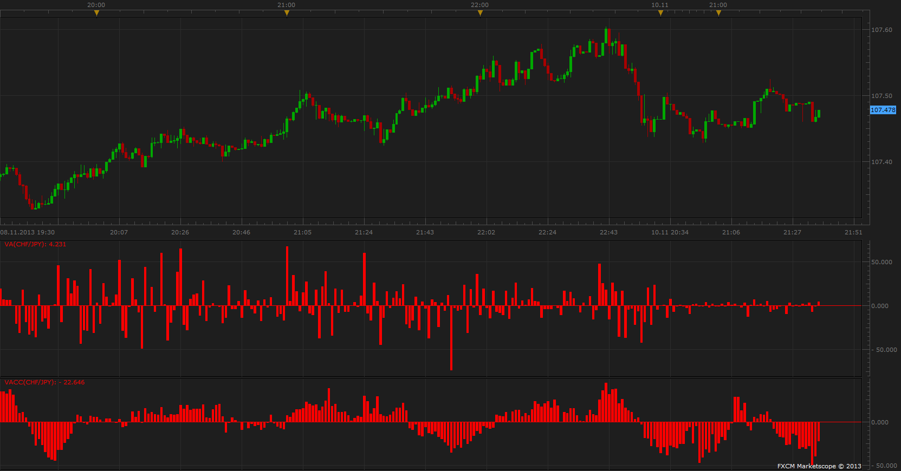

# Volume Accumulation Percentage Indicator

> Source: https://fxcodebase.com/code/viewtopic.php?f=17&t=59830  
> Forum: 17 · Topic 59830 · 3 post(s)

---

## Volume Accumulation Percentage Indicator

**Apprentice** · Sun Nov 10, 2013 3:45 pm

VA = Volume * ((Close-Low)-(High-Close))/(High-Low).

 [VA.lua](files/90707/VA.lua)

TVA= N period Sum of VA
TV = N period Sum of Volume
VACC[period] = (TVA / TV) * 100

 [VACC.lua](files/90707/VACC.lua)

The indicator was revised and updated

---

## Re: Volume Accumulation Percentage Indicator

**Alexander.Gettinger** · Mon Dec 02, 2013 10:44 am

MQL4 version of this oscillators: [viewtopic.php?f=38&t=60045](https://fxcodebase.com/code/viewtopic.php?f=38&t=60045).

---

## Re: Volume Accumulation Percentage Indicator

**Apprentice** · Sun Jun 18, 2017 1:02 pm

The indicator was revised and updated.
