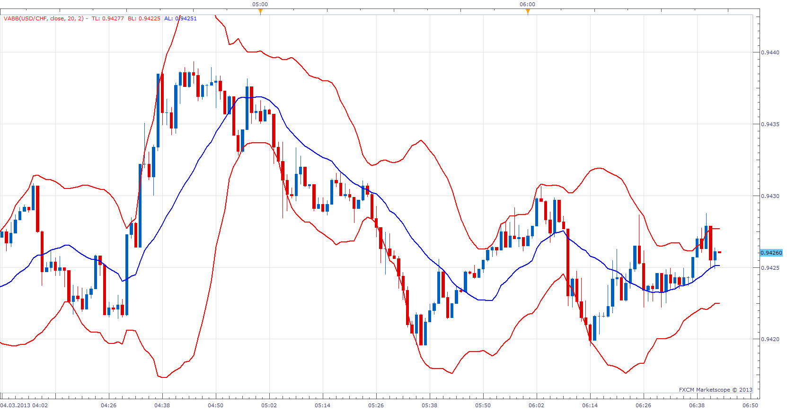

# Volume Adjusted Moving Average Bollinger Band

> Source: https://fxcodebase.com/code/viewtopic.php?f=17&t=32688  
> Forum: 17 · Topic 32688 · 11 post(s)

---

## Volume Adjusted Moving Average Bollinger Band

**Apprentice** · Mon Mar 04, 2013 8:03 am

This version of Bollinger Band use Volume Adjusted Moving Average (VAMA), for Averaging
of Price and Standard deviation alike.

 [VABB.lua](files/55653/VABB.lua)

 [VABB with Alert.lua](files/55653/VABB%20with%20Alert.lua)

Give Audio / Email Alerts on Price /Band Crossover.
VAMA
[viewtopic.php?f=17&t=2349&hilit=vama](https://fxcodebase.com/code/viewtopic.php?f=17&t=2349&hilit=vama)

Dec 14, 2015: Compatibility issue Fixed. _Alert helper is not longer needed.

---

## Re: Volume Adjusted Moving Average Bollinger Band

**Falkor** · Wed Mar 13, 2013 1:21 am

Thank you!

---

## Re: Volume Adjusted Moving Average Bollinger Band

**Coondawg71** · Tue Nov 19, 2013 1:50 pm

Can we please add the function of alert on the deviation bands and please the shading between bands, just like Triple Bollinger Band with Alert.

Great indicators, very very useful!

Thanks,

sjc

[viewtopic.php?f=17&t=6008&hilit=DBB](https://fxcodebase.com/code/viewtopic.php?f=17&t=6008&hilit=DBB)

---

## Re: Volume Adjusted Moving Average Bollinger Band

**Apprentice** · Tue Nov 19, 2013 3:17 pm

Requested functionality added.

---

## Re: Volume Adjusted Moving Average Bollinger Band

**Coondawg71** · Fri Apr 17, 2015 1:01 pm

Can we please request a MT4 version of VABB with Alert.

Thanks,

sjc

---

## Re: Volume Adjusted Moving Average Bollinger Band

**Apprentice** · Mon Dec 14, 2015 4:47 am

Dec 14, 2015: Compatibility issue Fixed. _Alert helper is not longer needed.

If you want to use updated version of this indicator,
please make sure to use TS Version 01.14.101415. or higher.

---

## Re: Volume Adjusted Moving Average Bollinger Band

**Apprentice** · Wed Aug 02, 2017 7:42 am

The indicator was revised and updated.

---

## Re: Volume Adjusted Moving Average Bollinger Band

**bartwas1** · Wed May 09, 2018 8:49 am

Hi Apprentice,

Can this version of BB be adapted to use high and low prices in such a fashion as in Alexander's indicator (posted in mt4 forum: Thu Jun 13, 2013 4:23 pm): High-Low moving average band for meta trader?

Kind regards
Bart

---

## Re: Volume Adjusted Moving Average Bollinger Band

**Apprentice** · Wed May 09, 2018 12:48 pm

Can you provide web reference?

---

## Re: Volume Adjusted Moving Average Bollinger Band

**bartwas1** · Wed May 09, 2018 7:59 pm

Hi Apprentice

I meant fxcodebase.com forum - under MT4 tab, entitled: High-Low moving average band by Alexander Gettinger.

[/viewtopic.php?f=38&t=40835](https://fxcodebase.com/code//viewtopic.php?f=38&t=40835)

---

## Re: Volume Adjusted Moving Average Bollinger Band

**Apprentice** · Thu May 10, 2018 4:46 am

Try this version.
[viewtopic.php?f=17&t=66114](https://fxcodebase.com/code/viewtopic.php?f=17&t=66114)
