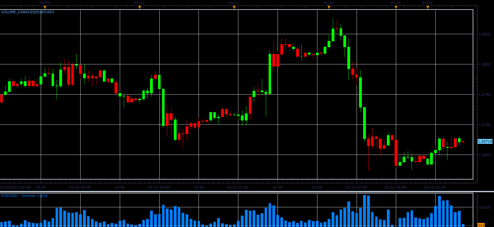

# Volume candles

> Source: https://fxcodebase.com/code/viewtopic.php?f=17&t=11786  
> Forum: 17 · Topic 11786 · 5 post(s)

---

## Volume candles

**Alexander.Gettinger** · Mon Jan 16, 2012 9:17 am

This indicator is a ported MQL5 indicator from [http://www.mql5.com/en/market/product/37](http://www.mql5.com/en/market/product/37)

The bar has a UP color if the volume on it more than volume of previous bar.
The bar has a DN color if the volume on it less than volume of previous bar.

 

Download:

 [Volume_Candles.lua](files/23589/Volume_Candles.lua)

---

## Re: Volume candles

**asedic** · Fri Jul 31, 2015 7:21 am

Thank you for this indicator, very simple and useful.

Is it possible to create a version of Constant range bars indicator ([viewtopic.php?f=17&t=3347&hilit=crb](https://fxcodebase.com/code/viewtopic.php?f=17&t=3347&hilit=crb)) with real volume or transactions (Constant volume bars).

Thanks.

---

## Re: Volume candles

**Apprentice** · Wed Aug 05, 2015 7:23 am

Your request is added to the development list.

---

## Re: Volume candles

**asedic** · Wed Aug 05, 2015 3:39 pm

Thank you.

---

## Re: Volume candles

**Apprentice** · Sun Oct 14, 2018 6:18 am

The indicator was revised and updated.
