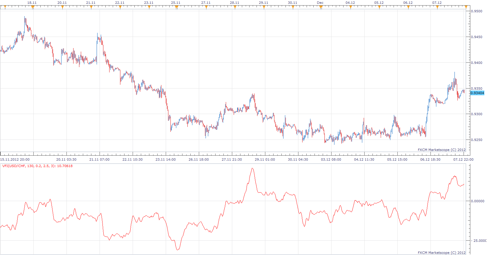

# VOLUME FLOW INDICATOR

> Source: https://fxcodebase.com/code/viewtopic.php?f=17&t=27497  
> Forum: 17 · Topic 27497 · 15 post(s)

---

## VOLUME FLOW INDICATOR

**Apprentice** · Sat Dec 08, 2012 6:49 pm

This indicator was first introduced by Markos Katsanos,
June 2004 article in Technical Analysis of STOCKS & COMMODITIES.

A level above zero is considered bullish and indicates accumulation.
Values below zero indicate distribution.
A divergence in volume can be evidence of a reversal.
The VFI is based on Balance Volume (OBV)

 [VFI.lua](files/48125/VFI.lua)

---

## Re: VOLUME FLOW INDICATOR

**Alexander.Gettinger** · Thu Sep 25, 2014 9:44 am

MQL4 version of Volume Flow: [viewtopic.php?f=38&t=61253](https://fxcodebase.com/code/viewtopic.php?f=38&t=61253).

---

## KatsanosDivergence

**Apprentice** · Thu Mar 05, 2020 7:16 am

 [KatsanosDivergence.lua](files/131735/KatsanosDivergence.lua)

---

## Re: VOLUME FLOW INDICATOR

**NothingPersona1** · Thu Mar 05, 2020 4:14 pm

Could you pls make a port for MT4 terminal?

---

## Re: VOLUME FLOW INDICATOR

**Apprentice** · Fri Mar 06, 2020 6:23 am

Your request is added to the development list.
Development reference 831.

---

## Re: VOLUME FLOW INDICATOR

**Apprentice** · Mon Mar 09, 2020 5:31 am

It's impossible to code a universal KatsanosDivergence for MQ4.
We need to hardcode some indicator (use one of them as source)
Can you please select one indicator.

---

## Re: VOLUME FLOW INDICATOR

**papynou34** · Fri May 01, 2020 8:22 am

Hello,
Is it possible to code an indicator showing the VFI + difference like it is for RSI : [http://www.fxcodebase.com/code/viewtopi ... difference](http://www.fxcodebase.com/code/viewtopic.php?f=17&t=846&hilit=rsi+difference)

Thanks a lot

---

## Re: VOLUME FLOW INDICATOR

**Apprentice** · Fri May 01, 2020 8:35 am

I do not understand your request,
can you clarify with more details?

---

## Re: VOLUME FLOW INDICATOR

**papynou34** · Fri May 01, 2020 10:41 am

Hello Apprentice,
There is an indicator which is named RSI_Divergence. You will find it in the attached chart.
Can you do the same for VFI?
Thanks in advance.

[viewtopic.php?f=17&t=846](https://fxcodebase.com/code/viewtopic.php?f=17&t=846)

---

## Re: VOLUME FLOW INDICATOR

**Apprentice** · Sat May 02, 2020 5:06 am

Your request is added to the development list.
Development reference 1201.

---

## Re: VOLUME FLOW INDICATOR

**Apprentice** · Mon May 04, 2020 7:01 am

 [VFI Divergence.lua](files/133506/VFI%20Divergence.lua)

MT4 version
[https://fxcodebase.com/code/viewtopic.php?f=38&t=73362](https://fxcodebase.com/code/viewtopic.php?f=38&t=73362)

VFI.lua
[https://fxcodebase.com/code/viewtopic.php?f=17&t=27497](https://fxcodebase.com/code/viewtopic.php?f=17&t=27497)

---

## Re: VOLUME FLOW INDICATOR

**papynou34** · Mon May 04, 2020 7:52 am

Thanks Apprentice.
Great job

---

## Re: VOLUME FLOW INDICATOR

**Gilles** · Fri Dec 30, 2022 3:36 am

Hi Apprentice,

Please convert VFI to MT4 version.

Thank you :) !

---

## Re: VOLUME FLOW INDICATOR

**Apprentice** · Fri Dec 30, 2022 4:02 am

We have added your request to the development list.
Development reference 861.

---

## Re: VOLUME FLOW INDICATOR

**Apprentice** · Fri Feb 10, 2023 8:08 am

MT4 version
[https://fxcodebase.com/code/viewtopic.php?f=38&t=73362](https://fxcodebase.com/code/viewtopic.php?f=38&t=73362)
