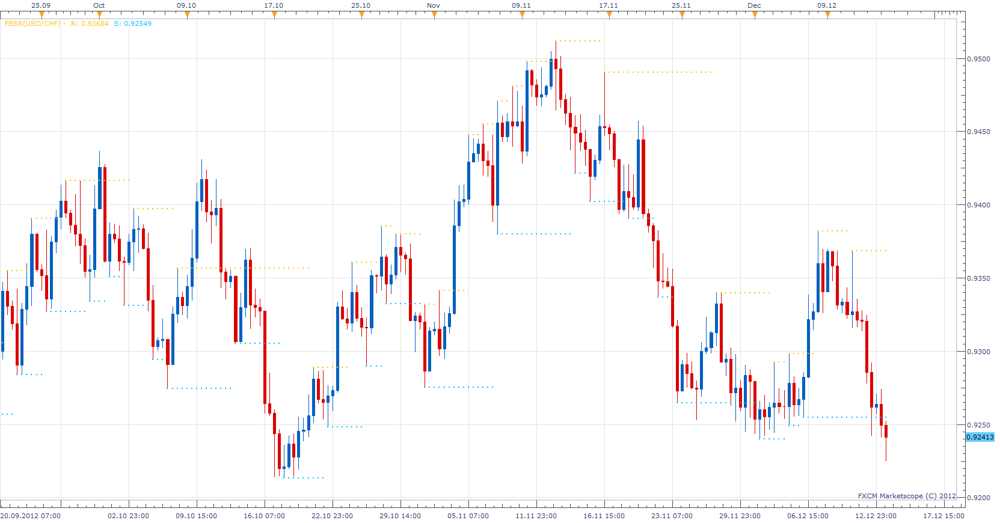
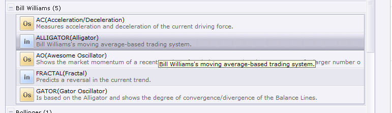

# Volume Fractal

> Source: https://fxcodebase.com/code/viewtopic.php?f=17&t=27687  
> Forum: 17 · Topic 27687 · 9 post(s)

---

## Volume Fractal

**Apprentice** · Thu Dec 13, 2012 11:56 am

Basically this is a Fractal Indicator.
Added Value is Volume filter.
If turned on, U will have only a fractal, which satisfies following condition.
Volume [Fractal]> (Volume [Fractal-1] + Volume [Fractal-2] + Volume [Fractal-3]) / 3

 [VFractal.lua](files/48448/VFractal.lua)

 [VFractal with Alert.lua](files/48448/VFractal%20with%20Alert.lua)

---

## Re: Volume Fractal

**james1** · Mon Jun 16, 2014 8:28 pm

Do we have alligator indicators and fibonacci moving averages? Maybe we can also have multiple time frames?

---

## Re: Volume Fractal

**Apprentice** · Tue Jun 17, 2014 12:36 pm

Alligator indicator is standard on FXCM TS.

Can u tell something more about Fibonacci moving average.
Offer Web reference, formula, description or Indicator code.

Explain "Multiple time frames."

---

## Re: Volume Fractal

**rose123** · Mon Sep 14, 2015 11:57 am

hi apprendice,
can you add line stye and with option and look back period for this indicator

---

## Re: Volume Fractal

**Apprentice** · Tue Sep 15, 2015 4:05 am

Option added.

---

## Re: Volume Fractal

**Apprentice** · Tue Jul 25, 2017 11:32 am

The indicator was revised and updated.

---

## Re: Volume Fractal

**Avignon** · Thu Apr 09, 2020 8:02 am

Hello,

Do you add with alert? (email, sound, pop up).

Thanks.

---

## Re: Volume Fractal

**Apprentice** · Fri Apr 10, 2020 6:40 am

Your request is added to the development list.
Development reference 1043.

---

## Re: Volume Fractal

**Apprentice** · Mon Apr 13, 2020 7:41 am

VFractal with Alert.lua added.
