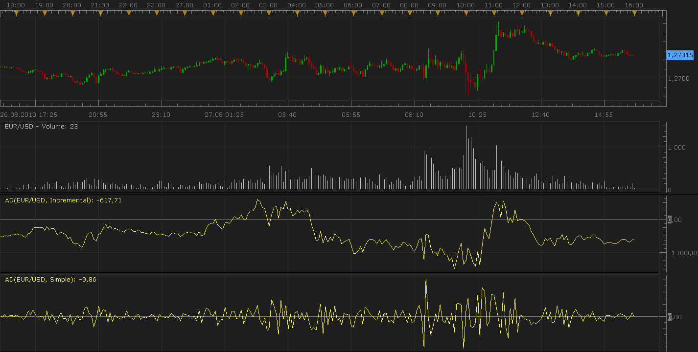

# Volume Indicator: Accumulation/Distribution

> Source: https://fxcodebase.com/code/viewtopic.php?f=17&t=1961  
> Forum: 17 · Topic 1961 · 2 post(s)

---

## Volume Indicator: Accumulation/Distribution

**Nikolay.Gekht** · Sat Aug 28, 2010 8:13 pm

Accumulation Distribution confirms price trends or notifies of weak movements that could result in a price reversal using volume.

* Accumulation: Volume is considered to be accumulated when the day's close is higher than the previous day's closing price. Thus the term "accumulation day"

* Distribution: Volume is distributed when the day's close is lower than the previous day's closing price. Many traders use the term "distribution day"

The basic A/D formula is
A/D = ((close - low) - (high - close)) / (high - low) * volume

Btw, some analysis methods use the accumulated version of the indicator:
A/D = (((close - low) - (high - close)) / (high - low) * volume) + A/Dprevious

This implementation supports both modes. The mode can be chosen via the indicator parameters.

 

Download:

 [ad.lua](files/3985/ad.lua)

See also [the version of the indicator with Tradestation's formula](https://fxcodebase.com/code/viewtopic.php?f=17&t=2524)

The indicator was revised and updated

---

## Re: Volume Indicator: Accumulation/Distribution

**Apprentice** · Thu Jan 12, 2017 8:35 am

Indicator was revised and updated.
