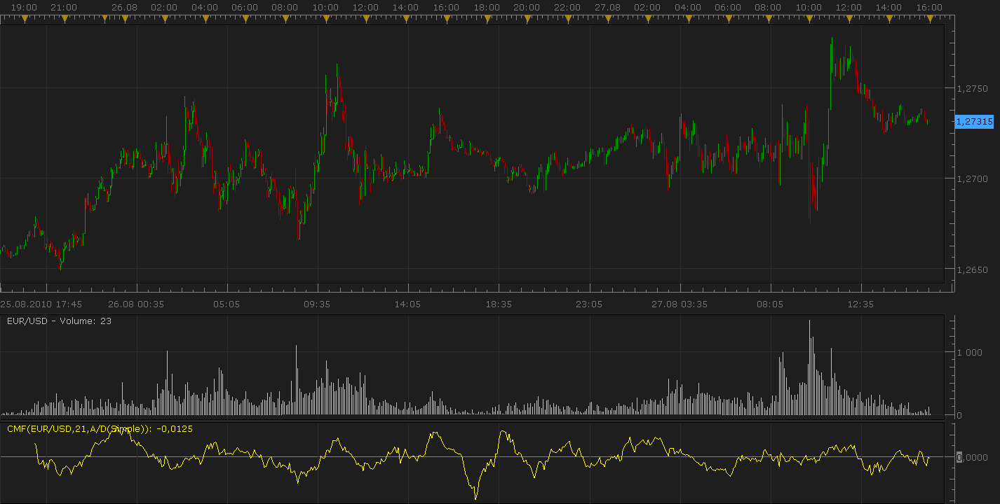

# Volume Indicator: Chaikin Money Flow

> Source: https://fxcodebase.com/code/viewtopic.php?f=17&t=1965  
> Forum: 17 · Topic 1965 · 3 post(s)

---

## Volume Indicator: Chaikin Money Flow

**Nikolay.Gekht** · Sat Aug 28, 2010 8:43 pm

The Chaikin Money Flow (CMF) is another Marc Chaikin's indicator intended to determine whether the instrument is under accumulation or distribution by comparing the closing price to the high-low range of the trading session. In other words, if the stock closes near the high of the session with increased volume, the CMF increases in value. If the stock closes near the low of the session with increased volume, the CMF decreases in value.

Formula is:
CMF(N) = SUM(A/D, N) / SUM(VOLUME, N)

 

Download:

 [cmf.lua](files/3989/cmf.lua)

The indicator was revised and updated

MT4/MQ4 version.
[viewtopic.php?f=38&t=67159](https://fxcodebase.com/code/viewtopic.php?f=38&t=67159)

---

## Re: Volume Indicator: Chaikin Money Flow

**Apprentice** · Sat Nov 08, 2014 6:16 am

OB/OS lines Added.

---

## Re: Volume Indicator: Chaikin Money Flow

**Apprentice** · Sat Jul 01, 2017 5:35 am

The indicator was revised and updated.
