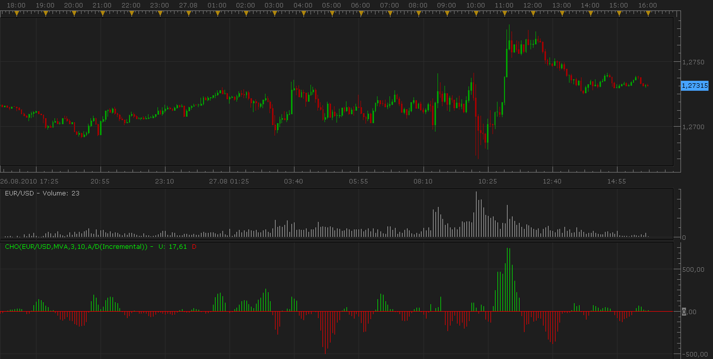

# Volume Indicator: Chaikin Oscillator

> Source: https://fxcodebase.com/code/viewtopic.php?f=17&t=1964  
> Forum: 17 · Topic 1964 · 2 post(s)

---

## Volume Indicator: Chaikin Oscillator

**Nikolay.Gekht** · Sat Aug 28, 2010 8:36 pm

The Chaikin Oscillator is the Moving Average Convergence Divergence (MACD) applied to the Accumulation/Distribution. The formula is the difference between the S-day exponential moving average and the L-day exponential moving average of the Accumulation/Distribution Line (where S is a short period, typically 3, and L is a long period, typically 10). As the MACD-Histogram is an indicator to predict moving average crossovers in MACD, the Chaikin Oscillator is an indicator to predict changes in the Accumulation/Distribution Line.

Many of the signals that apply to MACD can be also applied to the Chaikin Oscillator. Just remember that these signals relate to the Accumulation/Distribution Line rather than to the price of the instrument itself.

 

Download:

 [Chaikin.lua](files/3988/Chaikin.lua)

This indicator requires A/D indicator installed, so, please do not forget to download and install it first. A/D indicator can be found here: [viewtopic.php?f=17&t=1961](https://fxcodebase.com/code/viewtopic.php?f=17&t=1961)

---

## Re: Volume Indicator: Chaikin Oscillator

**Apprentice** · Mon Feb 05, 2018 7:44 am

The Indicator was revised and updated.
