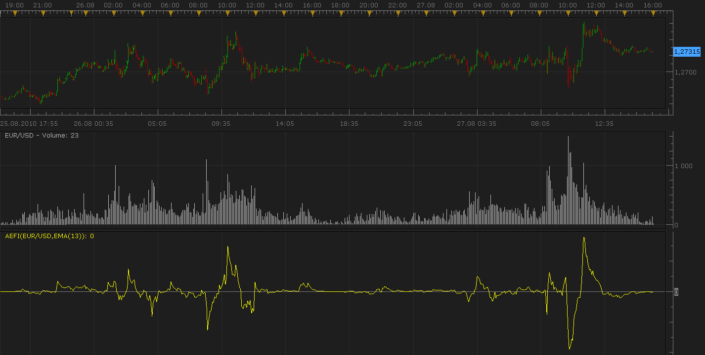
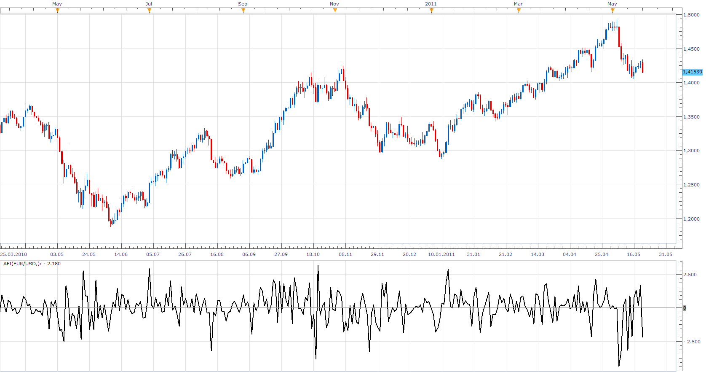
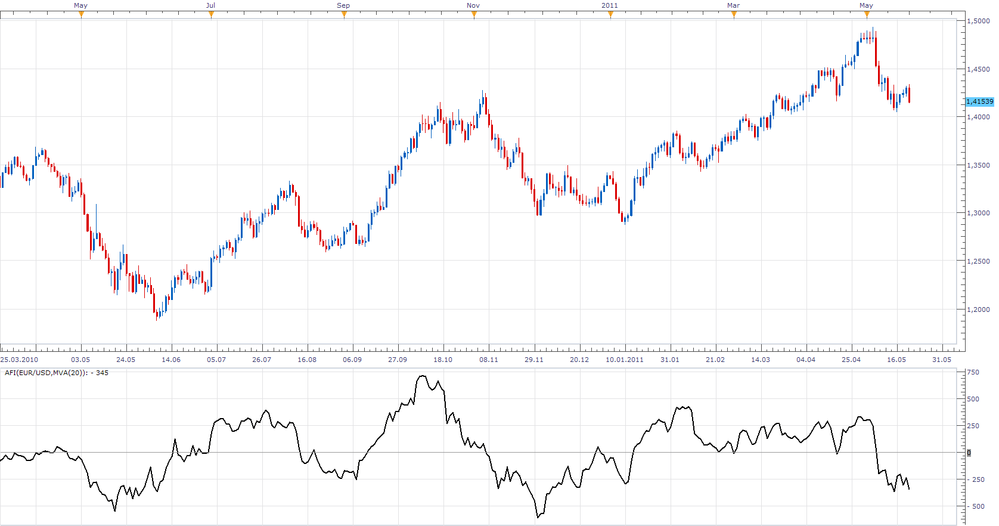
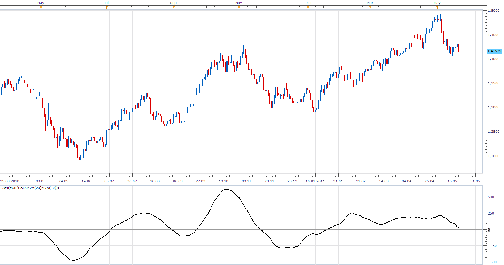

# Volume Indicator : Elder's Force Index

> Source: https://fxcodebase.com/code/viewtopic.php?f=17&t=1966  
> Forum: 17 · Topic 1966 · 14 post(s)

---

## Volume Indicator : Elder's Force Index

**Nikolay.Gekht** · Sat Aug 28, 2010 8:49 pm

Developed by Dr Alexander Elder, the Force index combines price movements and volume to measure the strength of bulls and bears in the market. The raw index is rather erratic and better results are achieved by smoothing with a 2-day or 13-day exponential moving average (EMA).

The 2-day EMA of Force is used to track the strength of buyers and sellers in the short term;
The 13-day EMA of Force measures the strength of bulls and bears in intermediate cycles.

If the Force index is above zero it signals that the bulls are in control. Negative Force index signals that the bears are in control. If the index whipsaws around zero it signals that neither side has control and no strong trend exists.

Formula:
FI(N) = EMA((Close - Close[Previouis]) * Volume, N);

 

Download:

 [aefi.lua](files/3990/aefi.lua)

Note: The indicator is compatible with Trading Station/Marketscope August 27, 2010 release or above only and won't work in earlier Trading Station/Marketscope releases. If your broker didn't provide an update (FXCM-Japan surely didn't), please contact to the broker's user support about expected date of the update.

The indicator was revised and updated

---

## Re: Volume Indicator : Elder's Force Index

**twitjaksono** · Sat Jan 29, 2011 12:08 pm

Hello.

Just one quick question: when you mention the calculation of this indicator that involves volume, where is this volume data coming from? Is it from FXCM own client's volume data or is it from the rest of the market? The reason I'm asking is because the forex market (unlike the stock market) is not regulated in an exchange body.

Thanks a lot.

---

## Re: Volume Indicator : Elder's Force Index

**Apprentice** · Sun Jan 30, 2011 9:41 am

Most forex brokers, or almost all forex brokers do not use the right volume, but tick volume.
We also use the Tick Volume.
It represents the number of price changes in a defined period of time.
Correlation between real and tick volume is about 80 percent.

---

## Re: Volume Indicator : Elder's Force Index

**twitjaksono** · Tue Feb 01, 2011 9:03 am

Thank you Apprentice for your explanation, it is clear now

---

## Re: Volume Indicator : Elder's Force Index

**Apprentice** · Sun May 22, 2011 12:53 pm

Advanced Force Index can Smooth Price and Raw Force Index.
Depending on your selection.

1.Raw Force Index

 

Smoothing Selector
Prior Off
Post Off

2.Raw Force Index based on Smoothed Price

 

Smoothing Selector
Prior On
Post Off

3. Smoothed Raw Force Index

 

Smoothing Selector
Prior Off
Post On

4.Smoothed Raw Force Index based on Smoothed Price

 

Smoothing Selector
Prior On
Post On

 [Afi.lua](files/10931/Afi.lua)

---

## Re: Volume Indicator : Elder's Force Index

**Alexander.Gettinger** · Fri Jun 29, 2012 1:42 pm

MQL4 version of this indicator: [viewtopic.php?f=38&t=20679](https://fxcodebase.com/code/viewtopic.php?f=38&t=20679)

---

## Re: Volume Indicator : Elder's Force Index

**swingtrader** · Mon Dec 03, 2012 1:29 pm

hi,

can you create a strategy based on .Smoothed Raw Force Index with smoothening factor prior on and post on.

buy level:0
sell level:0

buy: afi cross over buy level
sell: afi cross under sell level

---

## Re: Volume Indicator : Elder's Force Index

**Apprentice** · Mon Dec 03, 2012 2:46 pm

Requested can be found here.
[viewtopic.php?f=31&t=27335](https://fxcodebase.com/code/viewtopic.php?f=31&t=27335)

---

## Re: Volume Indicator : Elder's Force Index

**Patrick Sweet** · Thu Nov 21, 2013 9:34 am

Hi,
Would it be possible to please make the AEFI present values to MScope out to the 3rd or 4th decimal point? Currently it is rounding to whole numbers.
Patrick

---

## Re: Volume Indicator : Elder's Force Index

**Apprentice** · Sat Nov 23, 2013 5:54 am

5 decimal point added

---

## Re: Volume Indicator : Elder's Force Index

**Patrick Sweet** · Sat Nov 23, 2013 6:21 am

And a 5 decimal thank you back!
P

---

## Re: Volume Indicator : Elder's Force Index

**ThemBonez** · Thu May 21, 2015 8:41 pm

Hi
Is it possible to create a version of the Force Index that fills in the space above the 0 line and the oscillator line green and fills in the space below 0 red?
Thank You

---

## Re: Volume Indicator : Elder's Force Index

**Apprentice** · Fri May 22, 2015 3:57 am

Presentation Method parameter added to aefi.lua

---

## Re: Volume Indicator : Elder's Force Index

**Apprentice** · Tue Jul 04, 2017 9:29 am

The indicator was revised and updated.
