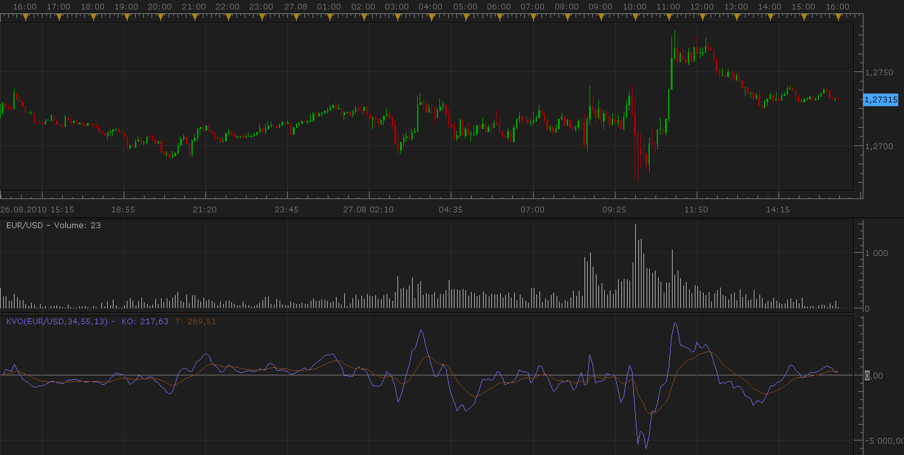

# Volume Indicator : Klinger Oscillator

> Source: https://fxcodebase.com/code/viewtopic.php?f=17&t=1967  
> Forum: 17 · Topic 1967 · 5 post(s)

---

## Volume Indicator : Klinger Oscillator

**Nikolay.Gekht** · Sat Aug 28, 2010 8:58 pm

The description of the indicator from investopedia ([http://www.investopedia.com/terms/k/kli ... llator.asp](http://www.investopedia.com/terms/k/klingeroscillator.asp))

A technical indicator developed by Stephen Klinger that is used to determine long-term trends of money flow while remaining sensitive enough to short-term fluctuations to enable a trader to predict short-term reversals. This indicator compares the volume flowing in and out of a security to price movement, and it is then turned into an oscillator.

A signal line (13-period moving average) is used to trigger transaction decisions. This technique is very similar to signals that are created with other indicators such as the 'moving average convergence divergence'.

The Klinger Oscillator also uses divergence to identify when price and volume are not confirming the direction of the move. It is considered to be a bullish sign when the value of the indicator is heading upward while the price of the security continues to fall. Traders will use other tools such as trendlines, moving averages and other indicators to confirm the reversal.

 

Download:

 [kvo.lua](files/3991/kvo.lua)

The indicator was revised and updated

---

## Re: Volume Indicator : Klinger Oscillator

**alpha24** · Mon Dec 29, 2014 1:09 am

hi,
Can you post is in mt4 version?
Thank you

---

## Re: Volume Indicator : Klinger Oscillator

**Apprentice** · Mon Dec 29, 2014 6:47 am

Mq4 version can be found here.
[viewtopic.php?f=38&t=61644](https://fxcodebase.com/code/viewtopic.php?f=38&t=61644)

---

## Re: Volume Indicator : Klinger Oscillator

**jaricarr** · Fri Nov 11, 2016 11:46 pm

Hi Apprentice,

Not sure why but the indicator is not showing any data.

see screenshot.

---

## Re: Volume Indicator : Klinger Oscillator

**Apprentice** · Sat Nov 12, 2016 2:52 pm

Unfortunately I can not repeat this problem.
Can you re-install your TS, in my experience, this can sometimes be helpful.
