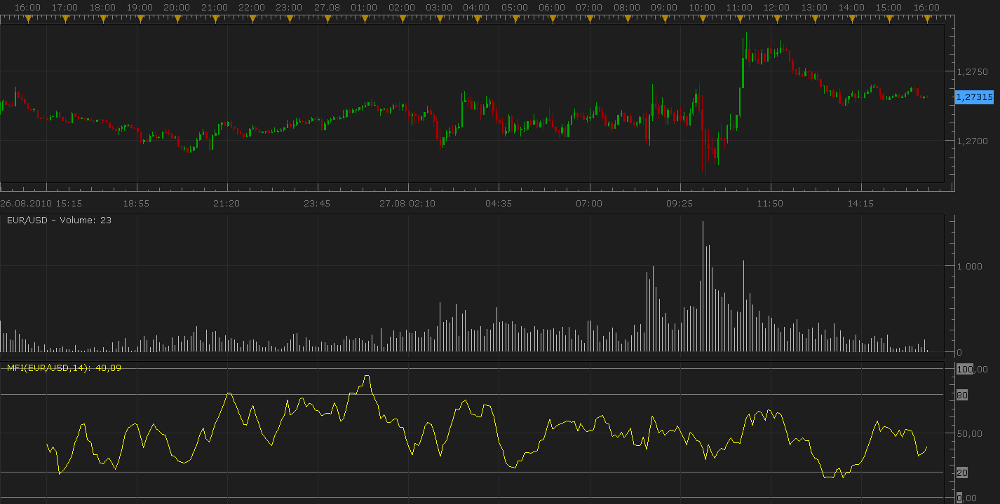
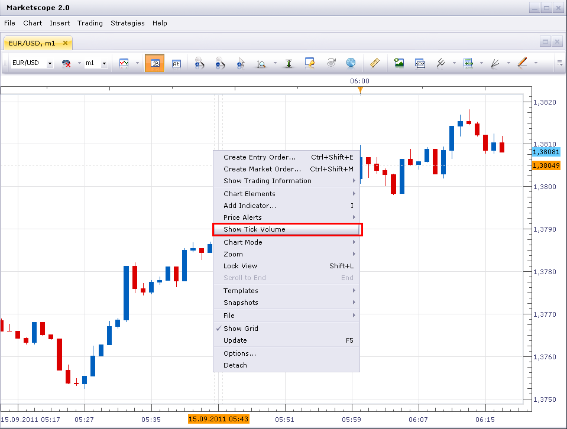

# Volume Indicator: Money Flow Index (MFI)

> Source: https://fxcodebase.com/code/viewtopic.php?f=17&t=1963  
> Forum: 17 · Topic 1963 · 21 post(s)

---

## Volume Indicator: Money Flow Index (MFI)

**Nikolay.Gekht** · Sat Aug 28, 2010 8:29 pm

MFI is a momentum indicator, similar to RSI (Relative Strength Index), but it's more rigid because it is volume-weighted, and, therefore, is a good method to measure of the strength of money flowing in and out of a security. As RSI, the MFI scale is 0 - 100 and the indicator is often calculated using a 14 day period.

Formula:
Typical Price is (High + Low + Close) / 3

Positive = Typical * Volume IF Typical > Typical[previous]
Negative = Typical * Volume IF Typical < Typical[previous]
R(N) = Sum(Positive, N) / Sum(Negative, N)
MFI(N) = 100 - (100 / (1 + R(N))

 

Download:

 [mfi.lua](files/3987/mfi.lua)

 [MFI with Alert.lua](files/3987/MFI%20with%20Alert.lua)

 

 [Tick MFI.lua](files/3987/Tick%20MFI.lua)

---

## Re: Volume Indicator: Money Flow Index (MFI)

**bgmays** · Wed Sep 14, 2011 12:08 pm

Great work! I found this to be very accurate. The only problem I have is that I need to draw a center line at 50.00. Is there any way that you could add an option to show the center line and pick a color?

---

## Re: Volume Indicator: Money Flow Index (MFI)

**trendwatch** · Thu Sep 15, 2011 4:38 am

Nice indicator! Just wondering where I can find the middle indicator as seen on the screenshot. Labeled: "Volume: 23". I've seen it on other topics too, but I just can't find it.

---

## Re: Volume Indicator: Money Flow Index (MFI)

**Apprentice** · Thu Sep 15, 2011 4:57 am

Your request is added to the developmental cue.

---

## Re: Volume Indicator: Money Flow Index (MFI)

**sunshine** · Thu Sep 15, 2011 5:16 am

> **trendwatch wrote:**
> Nice indicator! Just wondering where I can find the middle indicator as seen on the screenshot. Labeled: "Volume: 23". I've seen it on other topics too, but I just can't find it.

Just right-click on your chart and choose **Show Tick Volume**:

 

---

## Re: Volume Indicator: Money Flow Index (MFI)

**trendwatch** · Thu Sep 15, 2011 5:43 am

Thanks sunshine.

---

## Re: Volume Indicator: Money Flow Index (MFI)

**Alexander.Gettinger** · Wed Sep 21, 2011 10:58 am

> **bgmays wrote:**
> Great work! I found this to be very accurate. The only problem I have is that I need to draw a center line at 50.00. Is there any way that you could add an option to show the center line and pick a color?

Please, see this version of indicator:

 [mfi.lua](files/15243/mfi.lua)

---

## Re: Volume Indicator: Money Flow Index (MFI)

**JPNWV7** · Wed Sep 21, 2011 6:12 pm

I tried to download this indicator & got a Error Message?

---

## Re: Volume Indicator: Money Flow Index (MFI)

**Apprentice** · Thu Sep 22, 2011 3:08 pm

Can you describe in more detail which Error Message you got.
In this way, I can not help you.

I need more information.

---

## Re: Volume Indicator: Money Flow Index (MFI)

**JPNWV7** · Thu Sep 22, 2011 3:16 pm

> **Apprentice wrote:**
> Can you describe in more detail which Error Message you got.
> In this way, I can not help you.
>
> I need more information.

Thanks, but I figured it out.

I was downloading indicators under Manage strategy & it wouldn't download

Then I tried downloading under manage Indicator & it worked.

Sorry about all this, but I'm new.

Thanks for the help & response, I'm sure I'll have more questions

---

## Re: Volume Indicator: Money Flow Index (MFI)

**Apprentice** · Tue Oct 02, 2012 11:59 am

Small Bug Fix.
I found a bug that can affect MFI result,
especially if you use a small MFI period.

---

## Re: Volume Indicator: Money Flow Index (MFI)

**stainer** · Sun Apr 14, 2013 2:21 am

Can we have a signal for when price closes above or below the 80 and 20 line please?

---

## Re: Volume Indicator: Money Flow Index (MFI)

**Apprentice** · Mon Apr 15, 2013 6:33 am

Your request is added to the development list.

---

## Re: Volume Indicator: Money Flow Index (MFI)

**Alexander.Gettinger** · Wed Mar 05, 2014 4:51 pm

MQL4 version of Money Flow Index: [viewtopic.php?f=38&t=60402](https://fxcodebase.com/code/viewtopic.php?f=38&t=60402).

---

## Re: Volume Indicator: Money Flow Index (MFI)

**Apprentice** · Tue Mar 21, 2017 5:52 am

Indicator was revised and updated.

---

## Re: Volume Indicator: Money Flow Index (MFI)

**Carimwell** · Sat Feb 03, 2018 2:48 am

Hi!
Was the request for an alert to be added to the MFI indicator ever completed? I'd like to see an alert in this indicator when it crosses user-defined levels. Thanks guys.

---

## Re: Volume Indicator: Money Flow Index (MFI)

**Apprentice** · Sat Feb 03, 2018 3:34 pm

MFI with Alert.lua added.

---

## Re: Volume Indicator: Money Flow Index (MFI)

**Carimwell** · Mon Feb 05, 2018 12:33 am

This is perfect. thanks heaps.

---

## Re: Volume Indicator: Money Flow Index (MFI)

**swnlobo** · Fri Jul 23, 2021 9:18 pm

Hi,

May I ask for a tickchart version of this indicator?

Thanks in advance

---

## Re: Volume Indicator: Money Flow Index (MFI)

**Apprentice** · Tue Jul 27, 2021 2:51 am

Tick MFI added.
[https://fxcodebase.com/code/viewtopic.php?f=17&t=1963](https://fxcodebase.com/code/viewtopic.php?f=17&t=1963)

---

## Re: Volume Indicator: Money Flow Index (MFI)

**swnlobo** · Tue Jul 27, 2021 10:27 am

Thanks a Million

All the Best

Swnlobo
