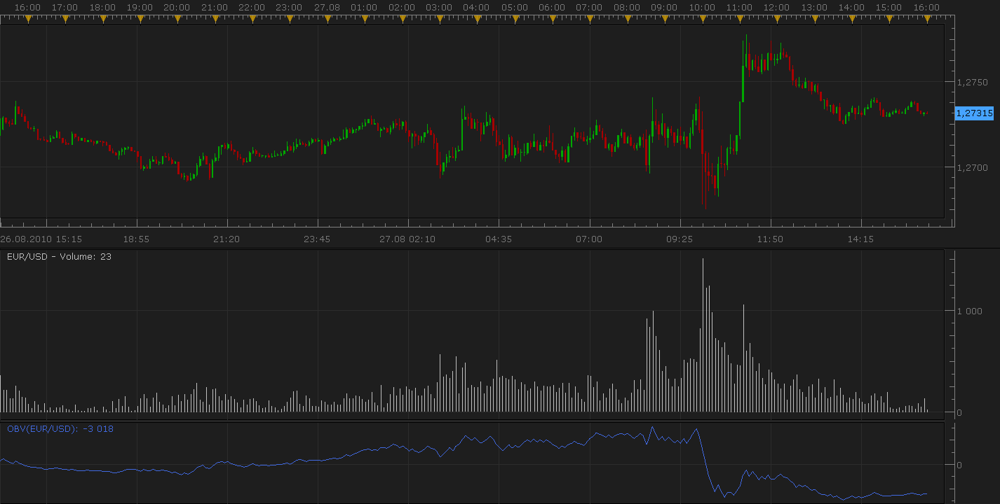
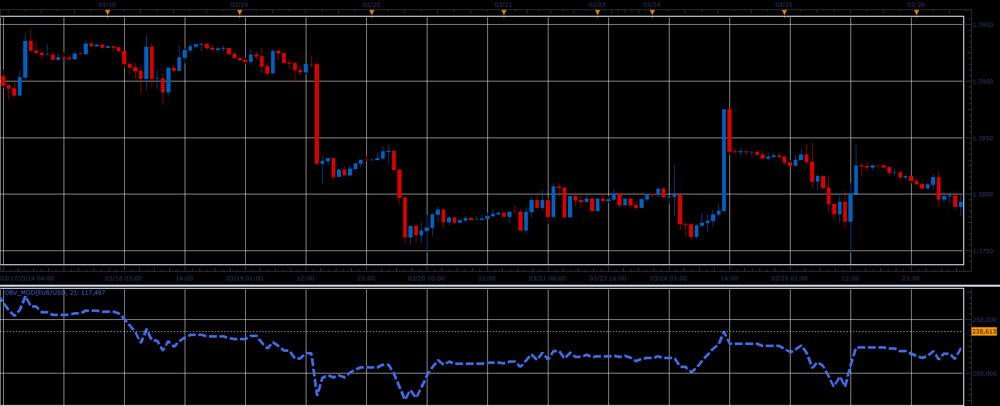

# Volume Indicator: On Balance Volume

> Source: https://fxcodebase.com/code/viewtopic.php?f=17&t=1962  
> Forum: 17 · Topic 1962 · 9 post(s)

---

## Volume Indicator: On Balance Volume

**Nikolay.Gekht** · Sat Aug 28, 2010 8:21 pm

The indicator detects momentum, the calculation of which relates volume to price change. OBV provides a running total of volume and shows whether this volume is flowing in or out of a given security. This indicator was developed by Joe Granville.

Formula:
OBV = OBVprevious + VOLUME IF close > closeprevious
OBV = OBVprevious - VOLUME IF close < closeprevious
OBV = OBVprevious IF close = closeprevious

 

Download:

 [obv.lua](files/3986/obv.lua)

The indicator was revised and updated

---

## Re: Volume Indicator: On Balance Volume

**trendwatch** · Thu Sep 06, 2012 5:07 am

Hi coding wizards,

I know I should place this reqeust in an other thread but this indicator is related to the OBV. So, could you translate this mq4. I've attached the file.

Many investors think that PVT is more precise than OBV in showing the dynamics of trade volume. It is so because we add one and the same volume to the OBV value disregarding whether the closing price was just a little bit higher or twice as high. In the case of PVT, we add a small part of the volume to the current cumulate value if the relative change of price is not big. If the price changed considerably, a large part of the volume is added to the PVT value.

PVT (i) = ((CLOSE (i) - CLOSE (i - 1)) / CLOSE (i - 1)) * VOLUME (i) + PVT (i - 1)

Thanks for all your hard work!

---

## Re: Volume Indicator: On Balance Volume

**Apprentice** · Thu Sep 06, 2012 9:08 am

You can find PVT here.
[viewtopic.php?f=17&t=23071](https://fxcodebase.com/code/viewtopic.php?f=17&t=23071)

---

## Re: Volume Indicator: On Balance Volume

**trendwatch** · Fri Feb 21, 2014 2:47 am

I would like to ask if you could maybe convert the attached code to lua. It's a standard OBV, but with small modifications in the calculation. It's supposed to show less fake movement. Thanks!

---

## Re: Volume Indicator: On Balance Volume

**Apprentice** · Sat Feb 22, 2014 6:10 am

Your request is added to the development list.

---

## Re: Volume Indicator: On Balance Volume

**Apprentice** · Sat Feb 22, 2014 6:57 am

Requested can be found here.
[viewtopic.php?f=17&t=60338](https://fxcodebase.com/code/viewtopic.php?f=17&t=60338)

---

## Re: Volume Indicator: On Balance Volume

**Alexander.Gettinger** · Thu Apr 03, 2014 10:48 am

**Modified On Balance Volume:**

Formula:
OBV = OBVprevious + VOLUME IF close > closeprevious+Gate
OBV = OBVprevious - VOLUME IF close < closeprevious-Gate
OBV = OBVprevious IF close = closeprevious

If Gate=0, the indicator equivalent to the initial On Balance Volume.

 

Download:

 [obv_mod.lua](files/93347/obv_mod.lua)

---

## Re: Volume Indicator: On Balance Volume

**Alexander.Gettinger** · Thu Apr 03, 2014 10:54 am

MQL4 version of On Balance Volume: [viewtopic.php?f=38&t=60488](https://fxcodebase.com/code/viewtopic.php?f=38&t=60488).

---

## Re: Volume Indicator: On Balance Volume

**Apprentice** · Fri Jun 16, 2017 7:26 am

The indicator was revised and updated.
