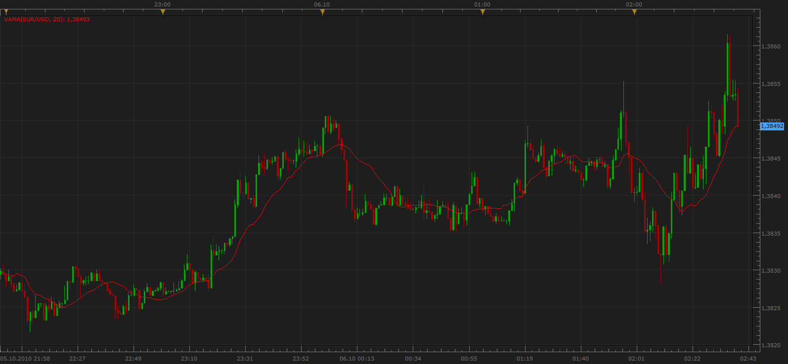
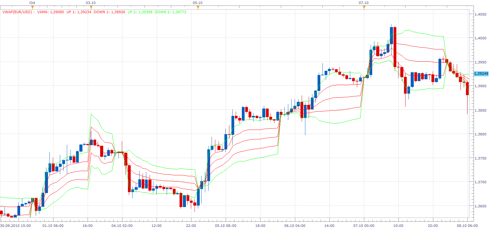

# Volume Indicator: Volume Adjusted Moving Average (VAMA)

> Source: https://fxcodebase.com/code/viewtopic.php?f=17&t=2349  
> Forum: 17 · Topic 2349 · 42 post(s)

---

## Volume Indicator: Volume Adjusted Moving Average (VAMA)

**Apprentice** · Wed Oct 06, 2010 1:45 am



Volume Adjusted Moving Average ( VAMA)
 It is calculated by dividing the value of transactions, by the total volume for the period of interest.

 [VAMA.lua](files/5045/VAMA.lua)

---

## Re: Volume Indicator: Volume Adjusted Moving Average (VAMA)

**gg_frx** · Sat Oct 09, 2010 9:15 am

in my opinion this is not real VWAP indicator.
here some links
[http://www.linnsoft.com/tour/techind/vwap.htm](http://www.linnsoft.com/tour/techind/vwap.htm)
[http://stockcharts.com/help/doku.php?id ... ghted_aver](http://stockcharts.com/help/doku.php?id=chart_school:technical_indicators:vwap_intraday#volume_weighted_aver)
[http://ensign.editme.com/vwap](http://ensign.editme.com/vwap)

VWAP usually works from left (beginning of the day ) to right ( now or end of the day) than restarts for next session.
actual VAMA indicator works from right to left, adding data like a classical moving average for a given number of bars, so at every new bar the calculated trading horizon is not from the beginning of the day but from now to x bars in the past on the current timeframe.

actual coded formula is the same as that on the links ?
or the VAMA use a different formula ?

anyway i think that is better to create a new real VWAP indicator with:
- possibility to use close price or typical price (close is the standard)
- possibility to define a start and end time ( begin of the trading session and end of the day are standard in stock markets but in forex market there are more sessions an is more flexible)
- possibility to use upper and lower bands with standard deviation, or a given value in pip or other ... (please look at the given linnsoft link)

ty

---

## Re: Volume Indicator: Volume Adjusted Moving Average (VAMA)

**Apprentice** · Sat Oct 09, 2010 9:33 am

Thanks for the warning

The three formulas, each slightly different.
I am satisfied with the current version, the formula corresponds to your example.

I can write the indicator, indicators, which will have the opportunity for adding bands, and some of your other suggestions, Create in sesion version or option .

The only thing that can change the current indicator is a choice between the types of streams.

---

## Re: Volume Indicator: Volume Adjusted Moving Average (VAMA)

**Apprentice** · Sun Oct 10, 2010 3:08 pm



Volume Weighted Average Price (VWAP)
Unlike VAMA, VWAP handled only Intraday timeframe.
Calculate the VWAP indicator from the beginning of the trading day.

 [VWAP.lua](files/5112/VWAP.lua)

---

## Re: Volume Indicator: Volume Adjusted Moving Average (VAMA)

**gg_frx** · Mon Oct 11, 2010 3:26 pm

> **Apprentice wrote:**
>
>
> VWAP.png
>
>
> Volume Weighted Average Price (VWAP)
> Unlike VAMA, VWAP handled only Inraday timeframe.
> Calculate the VWAP indicator from the beginning of the trading day.
>
>
> VWAP.lua

thank for the fast coding
i tested the indicator but i found that it restarts at 4.00 GMT (7.00 on your chart example)
this is not the beginning of trading day in forex market ... in theory the start is at 22 GMT, but can be most useful if you add an option where we can set a start time and an end time so we can trace, for instance, only asian session or only the european session or only 5 hours from a particular chart pattern.

---

## Re: Volume Indicator: Volume Adjusted Moving Average (VAMA)

**patick** · Tue Oct 12, 2010 4:12 pm


If anyone is interested, I added 1 more std dev line to the code. You can see from the picture it is very helpful to have that 3rd deviation.

gg-frx - You actually don't what the indy to start at the beginning of the trade day. It needs a certain amount of prior volume for its calculations. I think Apprentice picked a good time. Try it out and see.

```lua
-- Indicator profile initialization routine
-- Defines indicator profile properties and indicator parameters
-- TODO: Add minimal and maximal value of numeric parameters and default color of the streams
function Init()
    indicator:name("Volume Weighted Average Price (VWAP)");
    indicator:description("Volume Weighted Average Price (VWAP)");
    indicator:requiredSource(core.Bar);
    indicator:type(core.Indicator);
   indicator:setTag("group", "Volume Indicators");
   
   indicator.parameters:addGroup("Band Parameters");
   indicator.parameters:addBoolean("BAND", "Show Bands", "" , true);   
   indicator.parameters:addDouble("ONE", "First Multiplier", "" , 1);
   indicator.parameters:addDouble("TWO", "Second Multiplier", "" , 2);
   indicator.parameters:addDouble("THREE", "Third Multiplier", "" , 3);
   indicator.parameters:addGroup("Price Type");
   indicator.parameters:addString("Type", "CLOSE", "", "C");
    indicator.parameters:addStringAlternative("Type", "OPEN", "", "O");
    indicator.parameters:addStringAlternative("Type", "HIGH", "", "H");
    indicator.parameters:addStringAlternative("Type", "LOW", "", "L");
    indicator.parameters:addStringAlternative("Type","CLOSE", "", "C");
    indicator.parameters:addStringAlternative("Type", "MEDIAN", "", "M");
    indicator.parameters:addStringAlternative("Type", "TYPICAL", "", "T");
    indicator.parameters:addStringAlternative("Type", "WEIGHTED", "", "W");
   
   
    indicator.parameters:addInteger("width","Width", "", 1, 1, 5);
    indicator.parameters:addInteger("style", "Style", "", core.LINE_SOLID);
    indicator.parameters:setFlag("style", core.FLAG_LINE_STYLE);
    indicator.parameters:addColor("VAMA_color", "Color of VWAP Line", "", core.rgb(0, 0, 255));
   
   indicator.parameters:addGroup("First band Line Style");
   indicator.parameters:addInteger("widthONE","Width", "", 1, 1, 5);
    indicator.parameters:addInteger("styleONE", "Style", "", core.LINE_SOLID);
    indicator.parameters:setFlag("styleONE", core.FLAG_LINE_STYLE);
    indicator.parameters:addColor("ONE_color", "Band Color", "", core.rgb(255, 0, 0));
   
   indicator.parameters:addGroup("Second band Line Style");
   indicator.parameters:addInteger("widthTWO","Width", "", 1, 1, 5);
    indicator.parameters:addInteger("styleTWO", "Style", "", core.LINE_SOLID);
    indicator.parameters:setFlag("styleTWO", core.FLAG_LINE_STYLE);
    indicator.parameters:addColor("TWO_color", "Band Color", "", core.rgb(0, 255, 0));
   
   indicator.parameters:addGroup("Third band Line Style");
   indicator.parameters:addInteger("widthTHREE","Width", "", 1, 1, 5);
    indicator.parameters:addInteger("styleTHREE", "Style", "", core.LINE_SOLID);
    indicator.parameters:setFlag("styleTHREE", core.FLAG_LINE_STYLE);
    indicator.parameters:addColor("THREE_color", "Band Color", "", core.rgb(255, 0, 0));
   
end

-- Indicator instance initialization routine
-- Processes indicator parameters and creates output streams
-- TODO: Refine the first period calculation for each of the output streams.
-- TODO: Calculate all constants, create instances all subsequent indicators and load all required libraries

local first;
local source = nil;
local PriceTimesVolume;
local VAMA = nil;
local host;
local offset;
local weekoffset;
local s=nil
local e=nil;
local START=nil;
local Type;
local p;
local RAW;
local DEV;
local UP={};
local DOWN={};
local BAND;
local ONE;
local TWO;
local THREE;

function Prepare()
   ONE=instance.parameters.ONE;
   TWO=instance.parameters.TWO;
    THREE=instance.parameters.THREE
   Type=instance.parameters.Type;
   BAND=instance.parameters.BAND;
    source = instance.source;
    first = source:first();
   
    if Type == "O" then
        p = source.open;
    elseif Type == "H" then
        p = source.high;
    elseif Type == "L" then
        p = source.low;
    elseif Type == "M" then
        p = source.median;
    elseif Type == "T" then
        p = source.typical;
    elseif Type == "W" then
        p = source.weighted;
    else
        p = source.close;
    end
   
   host = core.host;
   offset = host:execute("getTradingDayOffset");
    weekoffset = host:execute("getTradingWeekOffset");
   
   PriceTimesVolume = instance:addInternalStream(first,0);   

    local name = profile:id() .. "(" .. source:name() .. ")";
    instance:name(name);
    VAMA = instance:addStream("VAMA", core.Line, name, "VAMA", instance.parameters.VAMA_color, first);
   VAMA:setWidth(instance.parameters.width);
    VAMA:setStyle(instance.parameters.style);
   
   if BAND then
   
   RAW=instance:addInternalStream (first, 0)
   UP[1] = instance:addStream("UP"..1, core.Line, name, "UP 1", instance.parameters.ONE_color, first);
   UP[1]:setWidth(instance.parameters.widthONE);
    UP[1]:setStyle(instance.parameters.styleONE);
   DOWN[1] = instance:addStream("DOWN"..1, core.Line, name, "DOWN 1", instance.parameters.ONE_color, first);
   DOWN[1]:setWidth(instance.parameters.widthONE);
    DOWN[1]:setStyle(instance.parameters.styleONE);
   UP[2] = instance:addStream("UP"..2, core.Line, name, "UP 2", instance.parameters.TWO_color, first);
   UP[2]:setWidth(instance.parameters.widthTWO);
    UP[2]:setStyle(instance.parameters.styleTWO);
   DOWN[2] = instance:addStream("DOWN"..2, core.Line, name, "DOWN 2", instance.parameters.TWO_color, first);
   DOWN[2]:setWidth(instance.parameters.widthTWO);
    DOWN[2]:setStyle(instance.parameters.styleTWO);
   UP[3] = instance:addStream("UP"..3, core.Line, name, "UP 3", instance.parameters.THREE_color, first);
   UP[3]:setWidth(instance.parameters.widthTHREE);
    UP[3]:setStyle(instance.parameters.styleTHREE);
   DOWN[3] = instance:addStream("DOWN"..3, core.Line, name, "DOWN 3", instance.parameters.THREE_color, first);
   DOWN[3]:setWidth(instance.parameters.widthTHREE);
    DOWN[3]:setStyle(instance.parameters.styleTHREE);
   end

end

-- Indicator calculation routine
-- TODO: Add your code for calculation output values
function Update(period)
    if period >= first and source:hasData(period) then
   
             if core.getcandle("D1", source:date(period),0, 0) ~= s then
             s, e = core.getcandle("D1", source:date(period),0, 0);
             START = findDateFast(source, s, false);   
             end
   
        PriceTimesVolume[period]=p[period] *source.volume[period];
      
       if START ~= -1 then      
            VAMA[period] = core.sum(PriceTimesVolume,core.range(START,period))/core.sum(source.volume,core.range(START, period));   
            
            if BAND then
            RAW[period] = p[period]-VAMA[period];
            DEV=core.stdev (RAW, core.range(START, period));
            UP[1][period]=  VAMA[period] + DEV*ONE;
            DOWN[1][period]=VAMA[period] - DEV*ONE;
            UP[2][period]=  VAMA[period] + DEV*TWO;
            DOWN[2][period]=VAMA[period] - DEV*TWO;
            UP[3][period]=  VAMA[period] + DEV*THREE;
            DOWN[3][period]=VAMA[period] - DEV*THREE;
            end
      end
      
    end
   
end

function findDateFast(stream, date, precise)
    local datesec = nil;
    local periodsec = nil;
    local min, max, mid;

    datesec = math.floor(date * 86400 + 0.5)

    min = 0;
    max = stream:size() - 1;

    while true do
        mid = math.floor((min + max) / 2);
        periodsec = math.floor(stream:date(mid) * 86400 + 0.5);
        if datesec == periodsec then
            return mid;
        elseif datesec > periodsec then
            min = mid + 1;
        else
            max = mid - 1;
        end
        if min > max then
            if precise then
                return -1;
            else
                return min - 1;
            end
        end
    end
end
```

 [VWAP.lua](files/5157/VWAP.lua)

---

## Re: Volume Indicator: Volume Adjusted Moving Average (VAMA)

**gg_frx** · Wed Jan 19, 2011 4:52 am

i resumed this old thread to ask if is possible to insert start and end time in **vwap** indicator and add the 3rd deviation too like patick

ty

---

## Re: Volume Indicator: Volume Adjusted Moving Average (VAMA)

**bomberone3** · Tue Oct 25, 2011 3:41 pm

Is it possible add the POC value?

---

## Re: Volume Indicator: Volume Adjusted Moving Average (VAMA)

**Apprentice** · Tue Oct 25, 2011 4:53 pm

I did not get the impression that this indicator has a POC, value.
Can you elaborate.

---

## Re: Volume Indicator: Volume Adjusted Moving Average (VAMA)

**bomberone3** · Wed Oct 26, 2011 2:12 am

I read book about market profile, so I ask if is it possible add poc and vpoc.

---

## Re: Volume Indicator: Volume Adjusted Moving Average (VAMA)

**Apprentice** · Wed Oct 26, 2011 2:16 am

On this indicator, no.
But I have written Market Profile indicator.
You can find it here.
[http://fxcodebase.com/code/viewtopic.ph ... lit=market](https://fxcodebase.com/code/viewtopic.php?f=17&t=2640&hilit=market)

---

## Re: Volume Indicator: Volume Adjusted Moving Average (VAMA)

**order66** · Thu Oct 27, 2011 2:35 pm

POC and VPOC have nothing do to with this indicator.

Point of Control is simply the price at which the most trading activity took place.

Volume Point of Control is pretty much the same since it's the price where the most volume took place.

POC is usually used if you're trading Market Profile and VPOC is used if you're trading Volume Profile.

---

## Re: Volume Indicator: Volume Adjusted Moving Average (VAMA)

**bomberone3** · Fri Oct 28, 2011 2:20 am

Is it possible add a multiday vwap without resetting value at a end of a day?.

---

## Re: Volume Indicator: Volume Adjusted Moving Average (VAMA)

**bomberone3** · Fri Oct 28, 2011 6:42 am

Ops i forgot also the TWAP multiday.
If you go to tradestation forum you could have a great idea how does it works.
Here there is a very good exaplaination
[https://www.tradestation.com/en/educati ... rage-price](https://www.tradestation.com/en/education/labs/analysis-concepts/time-weighted-average-price)
My best.

---

## Re: Volume Indicator: Volume Adjusted Moving Average (VAMA)

**bomberone3** · Fri Oct 28, 2011 2:42 pm

Dear order66 ,

I don't understant the difference between market profile and volume profile, could you explain please and post any image or examples please?

---

## Re: Volume Indicator: Volume Adjusted Moving Average (VAMA)

**order66** · Sat Oct 29, 2011 5:25 pm

Market Profile shows what prices were traded over time.

Volume Profile is how much was traded at what price.

---

## Re: Volume Indicator: Volume Adjusted Moving Average (VAMA)

**bomberone3** · Sat Oct 29, 2011 5:42 pm

Why many traders combine this 2 trading analisys?

---

## Re: Volume Indicator: Volume Adjusted Moving Average (VAMA)

**Apprentice** · Sun Oct 30, 2011 7:05 am

I'm not sure how to get the data, he realized Tick Volume on some levels.
I have to think about it.

---

## Re: Volume Indicator: Volume Adjusted Moving Average (VAMA)

**Alexander.Gettinger** · Fri Jun 22, 2012 2:22 pm

MQL4 version of VAMA: [viewtopic.php?f=38&t=20488](https://fxcodebase.com/code/viewtopic.php?f=38&t=20488)

---

## Re: Volume Indicator: Volume Adjusted Moving Average (VAMA)

**maweno** · Wed Oct 31, 2012 1:56 pm

Hi!

It is possible to enter the start time manuel?
Can you modify the code?

Thanks.

---

## Re: Volume Indicator: Volume Adjusted Moving Average (VAMA)

**Apprentice** · Thu Nov 01, 2012 3:03 am

this option is for VWAP

---

## Re: Volume Indicator: Volume Adjusted Moving Average (VAMA)

**Coondawg71** · Wed Mar 20, 2013 11:06 pm

Can we please modify the VWAP indicator to operate the same as the FIBB with Alert.

The FIBB with Alert has all the functions necessary for operation of alerts.

Thanks,

sjc

---

## Re: Volume Indicator: Volume Adjusted Moving Average (VAMA)

**Apprentice** · Thu Mar 21, 2013 5:34 am

Your request is added to the development list.

---

## Re: Volume Indicator: Volume Adjusted Moving Average (VAMA)

**Coondawg71** · Thu Aug 22, 2013 2:58 pm

Can we please request a Volume Adjusted Moving Average MACD with Histogram and user line and color options.

Thanks,

sjc

---

## Re: Volume Indicator: Volume Adjusted Moving Average (VAMA)

**Apprentice** · Fri Aug 23, 2013 2:01 am

Your request is added to the development list.

---

## Re: Volume Indicator: Volume Adjusted Moving Average (VAMA)

**Apprentice** · Sat Aug 24, 2013 5:37 am

Try this version
[viewtopic.php?f=17&t=59293](https://fxcodebase.com/code/viewtopic.php?f=17&t=59293)

---

## Re: Volume Indicator: Volume Adjusted Moving Average (VAMA)

**Coondawg71** · Fri Oct 04, 2013 10:02 am


*Request for 2 additional deviations added to Vwap indicator*

Can we please request the ADDITION of two additional deviations to the standard VWAP indicator. I would suggest the default settings of 1, 1.618, 2.618, 3.618, 4.236.

Thanks,

sjc

---

## Re: Volume Indicator: Volume Adjusted Moving Average (VAMA)

**Apprentice** · Fri Oct 04, 2013 11:23 am

Indicator has been completely rewritten.
Two additional lines added.

---

## Re: Volume Indicator: Volume Adjusted Moving Average (VAMA)

**Patrick Sweet** · Mon Oct 07, 2013 4:55 pm

Thanks Apprentice!
Are there any other changes in formula in the re-write or is it identical?
Thanks again!

---

## Re: Volume Indicator: Volume Adjusted Moving Average (VAMA)

**Apprentice** · Tue Oct 08, 2013 2:10 am

We use same formula, improved algorithm.

---

## Re: Volume Indicator: Volume Adjusted Moving Average (VAMA)

**Patrick Sweet** · Wed Oct 09, 2013 1:19 am

Great!
Comparing the two, I see differences occassionally (rarely) but when they appear they are indeed better measures as far as I can see. Nice!

---

## Re: Volume Indicator: Volume Adjusted Moving Average (VAMA)

**trendwatch** · Mon Feb 09, 2015 2:08 pm

Could you change the VWAP indy so that it uses the new Real Volume, and not the tick volume?

---

## Re: Volume Indicator: Volume Adjusted Moving Average (VAMA)

**Apprentice** · Wed Feb 11, 2015 3:56 am

For now I do not plan to use the real volume,
As it is, it is offered through an external server.
Not by regular FXCM price servers.

---

## Re: Volume Indicator: Volume Adjusted Moving Average (VAMA)

**Coondawg71** · Fri Apr 17, 2015 12:59 pm

> **Coondawg71 wrote:**
> Can we please modify the VWAP indicator to operate the same as the FIBB with Alert.
>
> The FIBB with Alert has all the functions necessary for operation of alerts.
>
>
> Thanks,
>
> sjc

______________________________________

Please bump up.

Thanks!!!

sjc

---

## Re: Volume Indicator: Volume Adjusted Moving Average (VAMA)

**4x4partners** · Wed Apr 22, 2015 7:41 pm

Hi there -

Would it be possible to convert the VWAP indy into a strategy -- or at the very least get alerts when price crosses each deviation band?

Thanks a lot
4x4

---

## Re: Volume Indicator: Volume Adjusted Moving Average (VAMA)

**Apprentice** · Thu Apr 23, 2015 5:40 am

It is possible.
Your request is added to the development list.

---

## Re: Volume Indicator: Volume Adjusted Moving Average (VAMA)

**4x4partners** · Tue May 05, 2015 6:48 am

Hi Apprentice,

Is it possible for a strategy to get the value of the VAMA (central line) from an instance of VWAP by using something like this:

VWAP.VAMA:size() - 1

Thanks in advance for your reply.
Best
4x4

---

## Re: Volume Indicator: Volume Adjusted Moving Average (VAMA)

**Apprentice** · Wed May 06, 2015 7:06 am

You can access this data from Indicator or Strategy.
You can use this line.
Indicator.VAMA [Indicator.VAMA:size()-1];
This will give you the last "VAMA" line period value.
Indicator.VAMA [period];
Use, If you are interested in the current period value.
If you define VWAP call as Indicator.

---

## Re: Volume Indicator: Volume Adjusted Moving Average (VAMA)

**Coondawg71** · Thu Sep 24, 2015 4:51 am

Can we please have the Vwap indicator with bands updated so that it resets at the actual close of business each day 5pm EST, rather than the 00:00:00 midnight reset. It would be in line with all other time based indicators and most useful in that manner. Thanks!!!

sjc

---

## Re: Volume Indicator: Volume Adjusted Moving Average (VAMA)

**Apprentice** · Mon Jun 26, 2017 4:40 am

The indicator was revised and updated.

---

## Re: Volume Indicator: Volume Adjusted Moving Average (VAMA)

**Apprentice** · Sat Nov 04, 2017 6:25 am


Based on the request.
[viewtopic.php?f=27&t=65317](https://fxcodebase.com/code/viewtopic.php?f=27&t=65317)

 [VWAP.lua](files/115843/VWAP.lua)

---

## Re: Volume Indicator: Volume Adjusted Moving Average (VAMA)

**Apprentice** · Thu Apr 05, 2018 8:46 am

The indicator was revised and updated.
