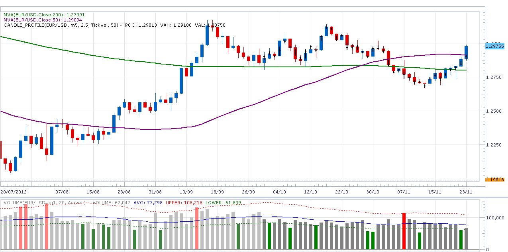

# Volume Indicator

> Source: https://fxcodebase.com/code/viewtopic.php?f=17&t=26605  
> Forum: 17 · Topic 26605 · 3 post(s)

---

## Volume Indicator

**robocod** · Sun Nov 25, 2012 7:39 am

I posted [here](https://fxcodebase.com/code/viewtopic.php?f=25&t=25722) about issues with the FXCM tick volume data. The following indicator is the one discussed in the post. It allows a lower time-frame source to be specified (e.g. 1min) which is used to reconstruct the volume data for the higher time-frame bar. To avoid long delays in loading the chart, the initial number of bars generated this way can be set (0 means the whole chart).

In general, the errors and anomalies in FXCM tick data seem to apply to the current trading week, and after the Friday close FXCM seems to "clean" the data. By using this indicator to reconstruct the volume, many of these anomalies seem to be fixed. However, the current trading day seems to have slightly higher than normal tick volume values - but I didn't find a way to overcome this. Just bare in mind that the current day's values will probably get reduced after the close.

The indicator shows the average (Simple Moving Average) of the volume, and it can also show 2 bands. The bands can be set according to the "standard deviation", or the "average". The indicator allows a multiplier to be specified for each band. The default multiplier is 2 (typical when using standard deviation mode). If you are using the "average" mode, then I suggest setting the lower band at 0.8, and the upper band at 1.4.

Here's a screenshot.

 

Here's the code.

 [volume.lua](files/46338/volume.lua)

I've also updated the [BetterVolume Indicator](https://fxcodebase.com/code/viewtopic.php?f=17&t=26606) to use this "volume reconstruction" method.

The indicator was revised and updated

---

## Re: Volume Indicator

**geblu09** · Thu Mar 07, 2013 12:23 pm

great job !!!

---

## Re: Volume Indicator

**Apprentice** · Mon May 01, 2017 6:37 am

Bump up.
