# Volume indicators with Real volume and Transactions

> Source: https://fxcodebase.com/code/viewtopic.php?f=17&t=62412  
> Forum: 17 · Topic 62412 · 30 post(s)

---

## Volume indicators with Real volume and Transactions

**Alexander.Gettinger** · Thu Jul 09, 2015 2:13 pm

The following indicators use Real volume and Transactions instead tick volume.

**Elder's Force Index** ([viewtopic.php?f=17&t=1966](http://www.fxcodebase.com/code/viewtopic.php?f=17&t=1966)).

 

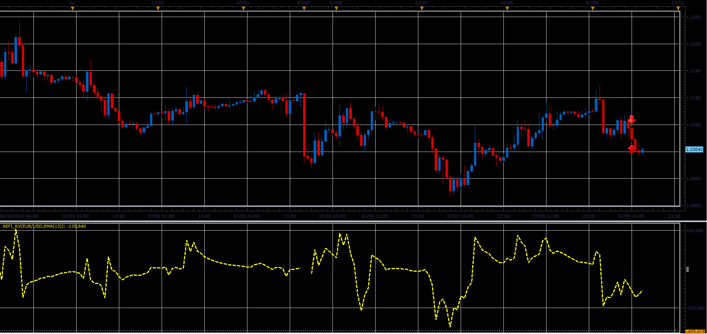

Download:

 [aefi_RV.lua](files/101341/aefi_RV.lua)

**AFL Winner oscillator** ([viewtopic.php?f=17&t=32539&p=55432](http://www.fxcodebase.com/code/viewtopic.php?f=17&t=32539&p=55432)).

 

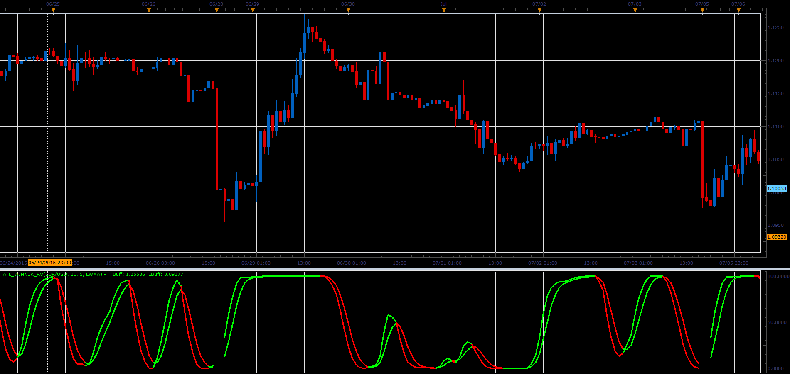

Download:

 [AFL_Winner_RV.lua](files/101341/AFL_Winner_RV.lua)

**ATR with volume (VATR)** ([viewtopic.php?f=17&t=15506&p=43405](http://www.fxcodebase.com/code/viewtopic.php?f=17&t=15506&p=43405)).

 

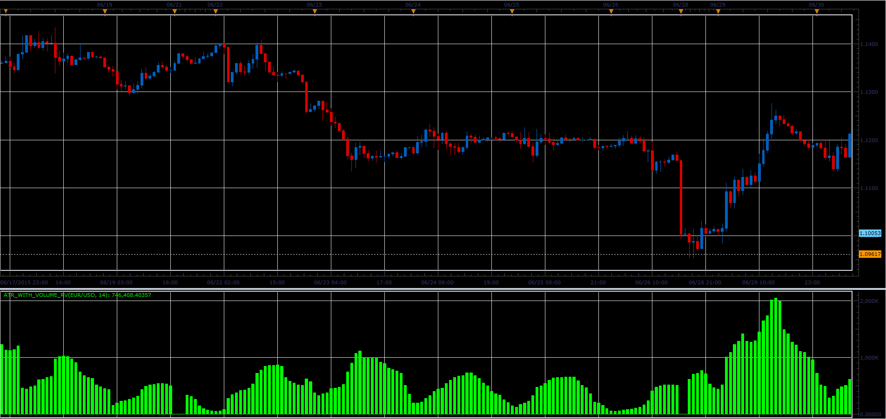

Download:

 [ATR_with_Volume_RV.lua](files/101341/ATR_with_Volume_RV.lua)

---

## Re: Volume indicators with Real volume and Transactions

**Alexander.Gettinger** · Thu Jul 09, 2015 2:50 pm

**Effort Result** ([viewtopic.php?f=17&t=62122&p=100361](http://www.fxcodebase.com/code/viewtopic.php?f=17&t=62122&p=100361)).

 

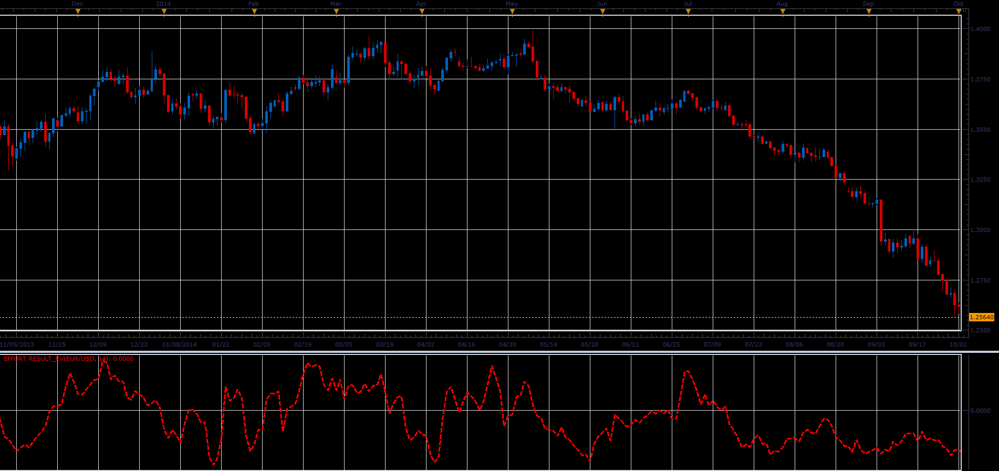

Download:

 [Effort Result_RV.lua](files/101342/Effort%20Result_RV.lua)

**Arm's Ease of Movement Value** ([http://fxcodebase.com/code/viewtopic.ph ... 54&p=21691](https://fxcodebase.com/code/viewtopic.php?f=17&t=10454&p=21691)).

 

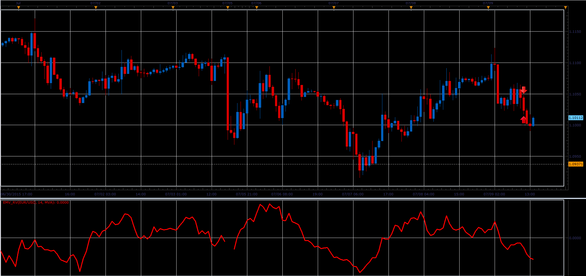

Download:

 [emv_RV.lua](files/101342/emv_RV.lua)

---

## Re: Volume indicators with Real volume and Transactions

**Alexander.Gettinger** · Thu Jul 23, 2015 9:36 am

**Ergodic Tick volume indicator** ([viewtopic.php?f=17&t=60362&p=92923](http://www.fxcodebase.com/code/viewtopic.php?f=17&t=60362&p=92923)).

 

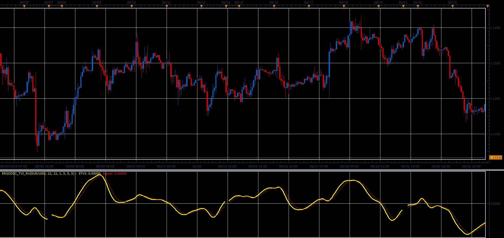

Download:

 [Ergodic_TVI_RV.lua](files/101525/Ergodic_TVI_RV.lua)

**Elastic Volume Weighted Moving Average** ([viewtopic.php?f=17&t=58939&p=88329](http://www.fxcodebase.com/code/viewtopic.php?f=17&t=58939&p=88329)).

 

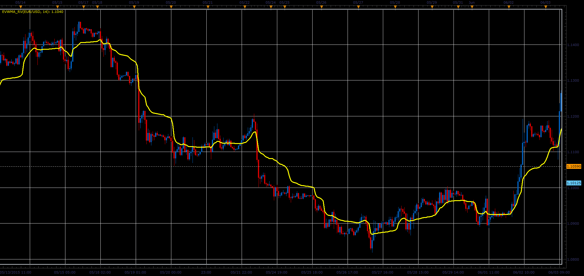

Download:

 [EVWMA_RV.lua](files/101525/EVWMA_RV.lua)

---

## Re: Volume indicators with Real volume and Transactions

**Alexander.Gettinger** · Thu Jul 23, 2015 9:43 am

**Finite Volume Elements** ([http://fxcodebase.com/code/viewtopic.php?f=17&t=27510](https://fxcodebase.com/code/viewtopic.php?f=17&t=27510)).

 

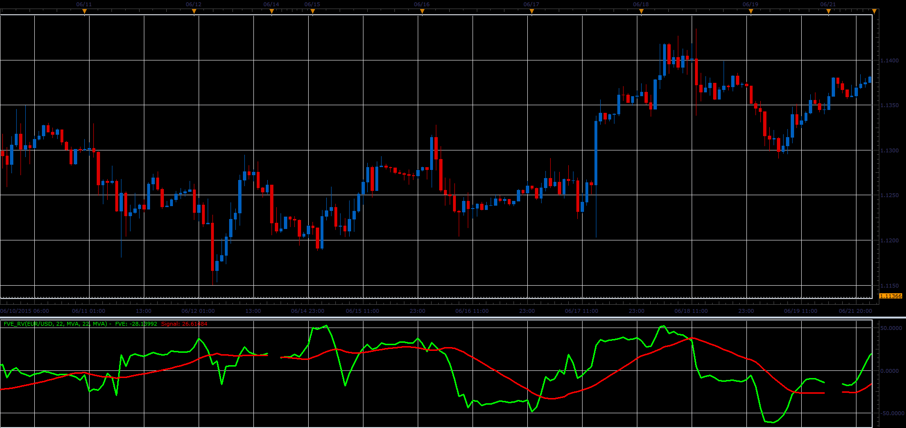

Download:

 [FVE_RV.lua](files/101526/FVE_RV.lua)

**Intraday Intensity** ([http://fxcodebase.com/code/viewtopic.ph ... 20&p=97165](https://fxcodebase.com/code/viewtopic.php?f=17&t=19120&p=97165)).

 

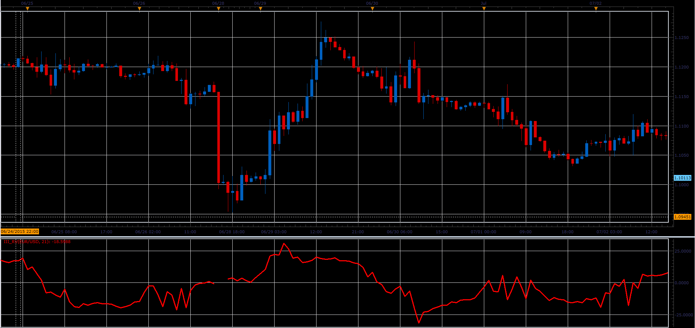

Download:

 [III_RV.lua](files/101526/III_RV.lua)

---

## Re: Volume indicators with Real volume and Transactions

**Alexander.Gettinger** · Thu Jul 23, 2015 9:46 am

**Klinger Oscillator** ([http://fxcodebase.com/code/viewtopic.ph ... 967&p=3991](https://fxcodebase.com/code/viewtopic.php?f=17&t=1967&p=3991)).

 

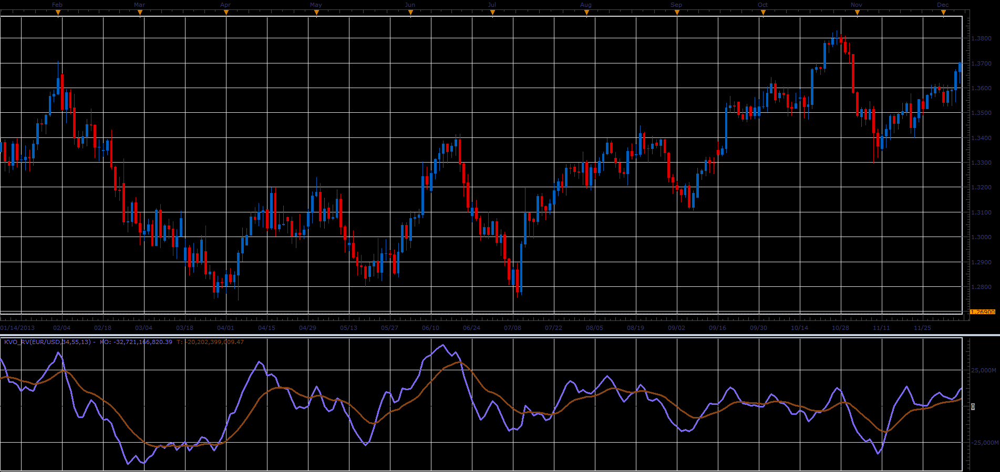

Download:

 [kvo_RV.lua](files/101527/kvo_RV.lua)

**Laguerre volume** ([http://fxcodebase.com/code/viewtopic.ph ... 42&p=55436](https://fxcodebase.com/code/viewtopic.php?f=17&t=32542&p=55436)).

 

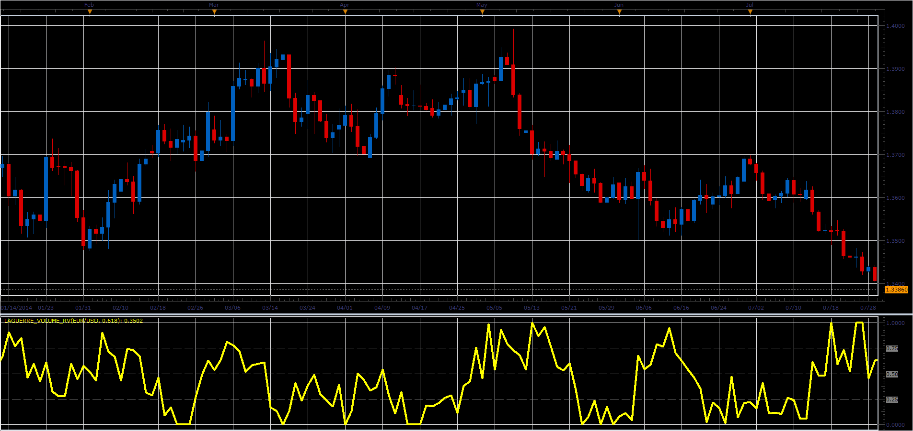

Download:

 [Laguerre_Volume_RV.lua](files/101527/Laguerre_Volume_RV.lua)

**Money Flow Index** ([http://fxcodebase.com/code/viewtopic.ph ... 63&p=15243](https://fxcodebase.com/code/viewtopic.php?f=17&t=1963&p=15243)).

 

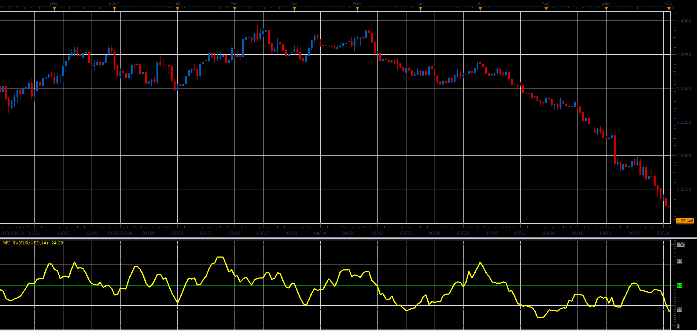

Download:

 [mfi_RV.lua](files/101527/mfi_RV.lua)

---

## Re: Volume indicators with Real volume and Transactions

**Alexander.Gettinger** · Fri Jul 24, 2015 9:32 am

**MIDAS indicator** ([http://fxcodebase.com/code/viewtopic.ph ... 94&p=88772](https://fxcodebase.com/code/viewtopic.php?f=17&t=19194&p=88772)).

 

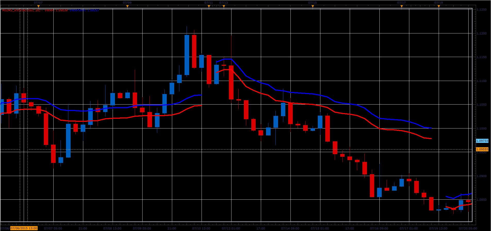

Download:

 [MIDAS_RV.lua](files/101537/MIDAS_RV.lua)

**Min max volume** ([http://fxcodebase.com/code/viewtopic.ph ... 73&p=89073](https://fxcodebase.com/code/viewtopic.php?f=17&t=59373&p=89073)).

 

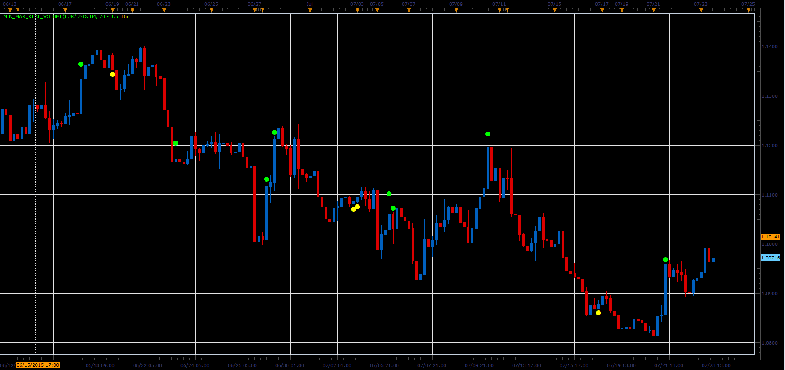

Download:

 [Min_Max_Real_Volume.lua](files/101537/Min_Max_Real_Volume.lua)

---

## Re: Volume indicators with Real volume and Transactions

**Alexander.Gettinger** · Fri Jul 24, 2015 9:34 am

**MK combo** ([http://fxcodebase.com/code/viewtopic.ph ... 66&p=99132](https://fxcodebase.com/code/viewtopic.php?f=17&t=61566&p=99132)).

 

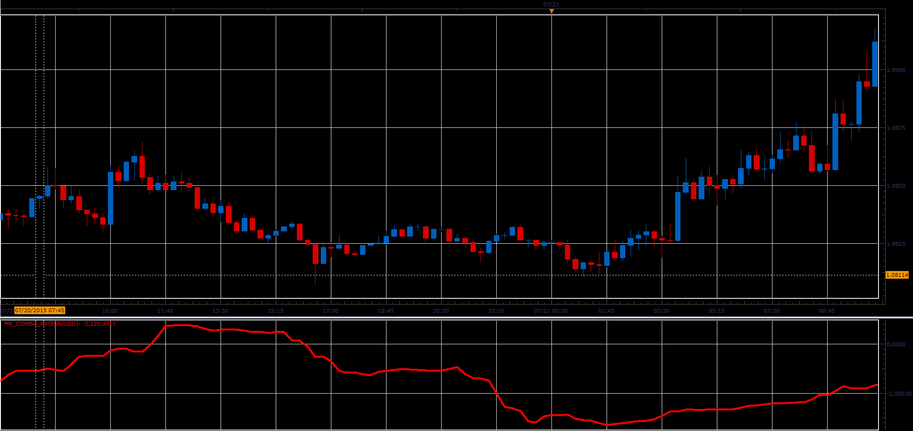

Download:

 [MK_Combo_RV.lua](files/101538/MK_Combo_RV.lua)

**Modified AdvanceDecline Line** ([http://fxcodebase.com/code/viewtopic.php?f=17&t=61228](https://fxcodebase.com/code/viewtopic.php?f=17&t=61228)).

 

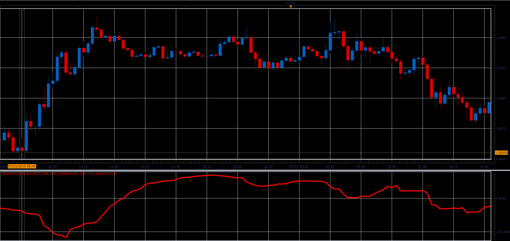

Download:

 [Modified AdvanceDecline Line_RV.lua](files/101538/Modified%20AdvanceDecline%20Line_RV.lua)

---

## Re: Volume indicators with Real volume and Transactions

**Alexander.Gettinger** · Fri Jul 24, 2015 9:36 am

**MultiVote OBV** ([http://fxcodebase.com/code/viewtopic.ph ... 32&p=96758](https://fxcodebase.com/code/viewtopic.php?f=17&t=24032&p=96758)).

 

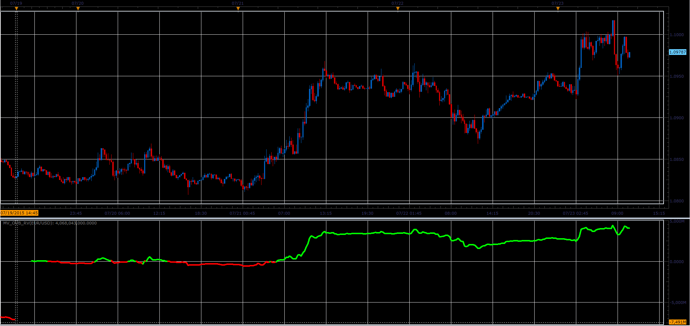

Download:

 [MV_OVB_RV.lua](files/101539/MV_OVB_RV.lua)

**Negative Volume Index** ([http://fxcodebase.com/code/viewtopic.ph ... 07&p=93406](https://fxcodebase.com/code/viewtopic.php?f=17&t=9707&p=93406)).

 

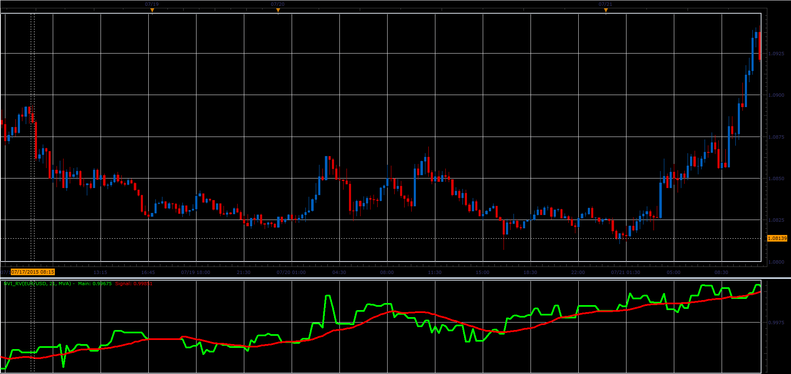

Download:

 [NVI_RV.lua](files/101539/NVI_RV.lua)

---

## Re: Volume indicators with Real volume and Transactions

**Alexander.Gettinger** · Fri Jul 24, 2015 9:39 am

**Normalized volume** ([http://fxcodebase.com/code/viewtopic.ph ... 87&p=67507](https://fxcodebase.com/code/viewtopic.php?f=17&t=41287&p=67507)).

 

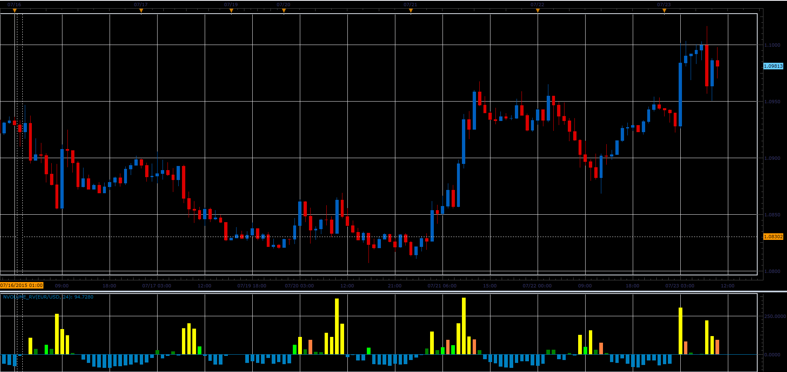

Download:

 [NVolume_RV.lua](files/101540/NVolume_RV.lua)

**On Balance Volume** ([http://fxcodebase.com/code/viewtopic.ph ... 347#p93347](https://fxcodebase.com/code/viewtopic.php?f=17&t=1962&p=93347#p93347)).

 

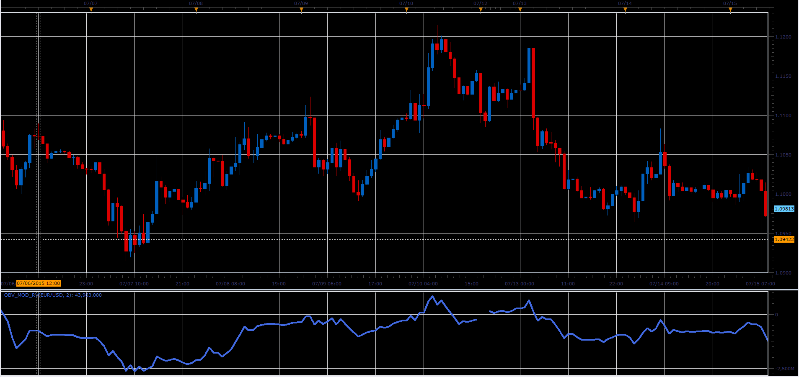

Download:

 [obv_mod_RV.lua](files/101540/obv_mod_RV.lua)

---

## Re: Volume indicators with Real volume and Transactions

**Alexander.Gettinger** · Fri Jul 24, 2015 9:42 am

**OHLC Volume** ([http://fxcodebase.com/code/viewtopic.ph ... 611&p=8678](https://fxcodebase.com/code/viewtopic.php?f=17&t=3611&p=8678)).

 

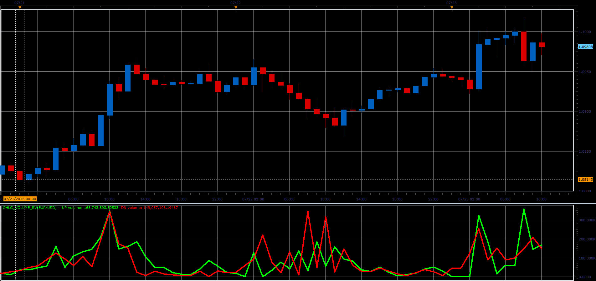

Download:

 [OHLC_Volume_RV.lua](files/101541/OHLC_Volume_RV.lua)

**Positive/negative volume** ([http://fxcodebase.com/code/viewtopic.ph ... 73&p=89073](https://fxcodebase.com/code/viewtopic.php?f=17&t=59373&p=89073)).

 

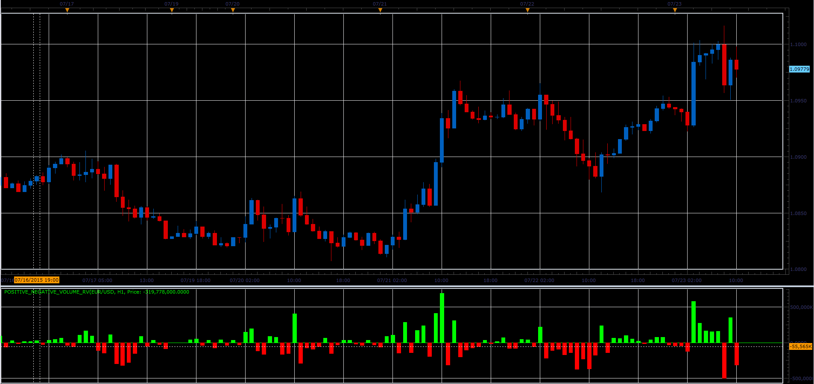

Download:

 [Positive_Negative_Volume_RV.lua](files/101541/Positive_Negative_Volume_RV.lua)

---

## Re: Volume indicators with Real volume and Transactions

**Alexander.Gettinger** · Tue Jul 28, 2015 10:37 am

**Freedom of Movement oscillator** ([viewtopic.php?f=17&t=62457](http://www.fxcodebase.com/code/viewtopic.php?f=17&t=62457)).

 

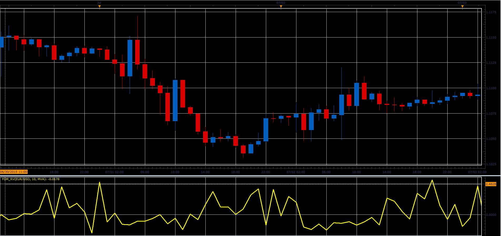

Download:

 [FoM_RV.lua](files/101570/FoM_RV.lua)

**SonicR PVA Volumes** ([http://fxcodebase.com/code/viewtopic.php?f=17&t=60177](https://fxcodebase.com/code/viewtopic.php?f=17&t=60177)).

 

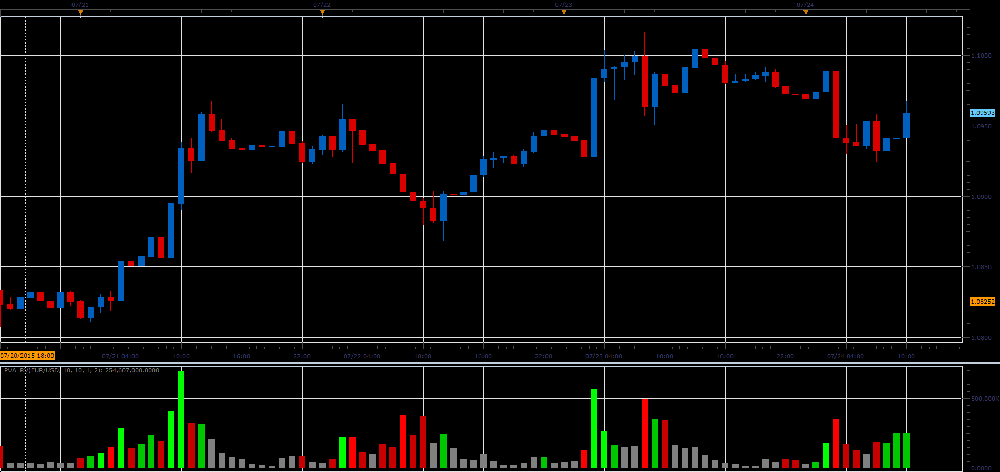

Download:

 [PVA_RV.lua](files/101570/PVA_RV.lua)

---

## Re: Volume indicators with Real volume and Transactions

**Alexander.Gettinger** · Tue Jul 28, 2015 10:39 am

**Positive Volume Index** ([viewtopic.php?f=17&t=7886&p=17488](http://www.fxcodebase.com/code/viewtopic.php?f=17&t=7886&p=17488)).

 

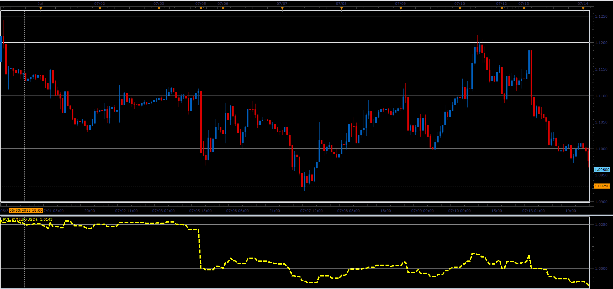

Download:

 [PVI_RV.lua](files/101571/PVI_RV.lua)

**PVI smoothed oscillator** ([viewtopic.php?f=17&t=59617&p=89869](http://www.fxcodebase.com/code/viewtopic.php?f=17&t=59617&p=89869)).

 

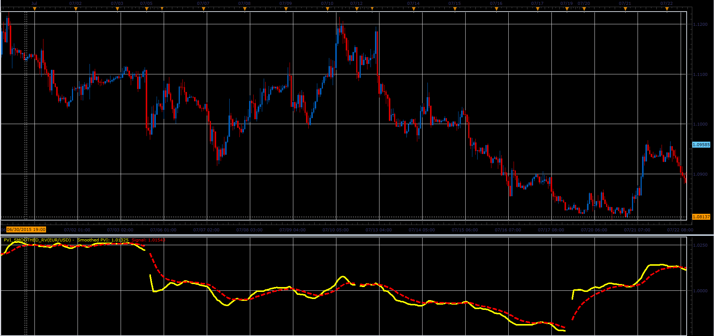

Download:

 [PVI_Smoothed_RV.lua](files/101571/PVI_Smoothed_RV.lua)

---

## Re: Volume indicators with Real volume and Transactions

**Alexander.Gettinger** · Tue Jul 28, 2015 10:41 am

**Percentage Volume Oscillator** ([http://fxcodebase.com/code/viewtopic.php?f=17&t=27744](https://fxcodebase.com/code/viewtopic.php?f=17&t=27744)).

 

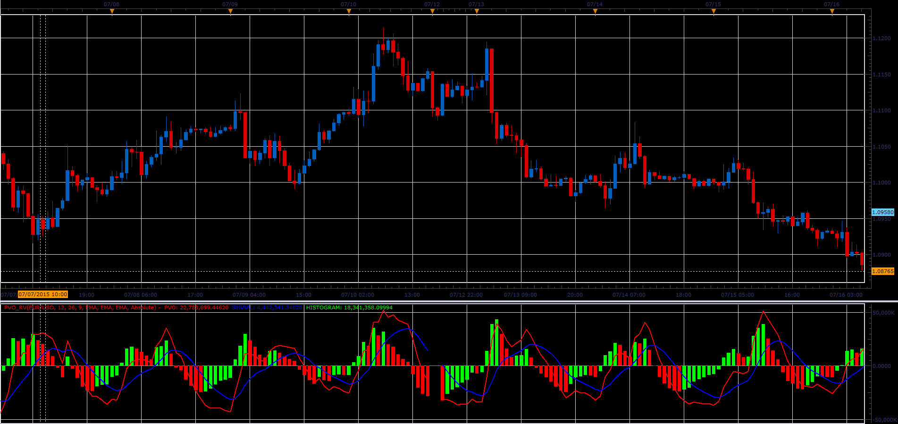

Download:

 [PVO_RV.lua](files/101572/PVO_RV.lua)

**Price Volume Trend** ([http://fxcodebase.com/code/viewtopic.php?f=17&t=23071](https://fxcodebase.com/code/viewtopic.php?f=17&t=23071)).

 

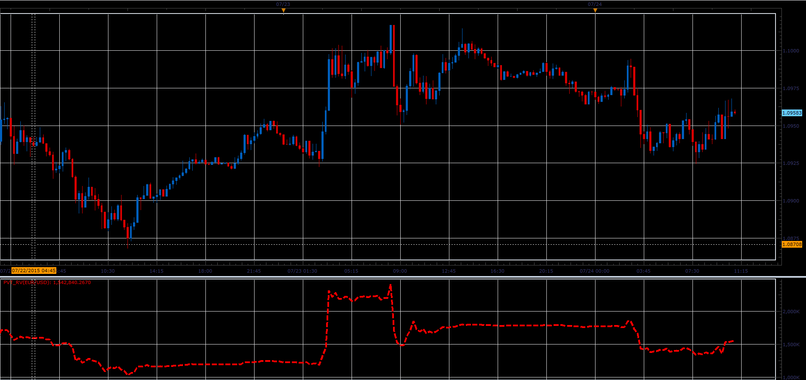

Download:

 [PVT_RV.lua](files/101572/PVT_RV.lua)

---

## Re: Volume indicators with Real volume and Transactions

**Alexander.Gettinger** · Tue Jul 28, 2015 10:46 am

**Rainbow Volume** ([viewtopic.php?f=17&t=26221&p=101530](http://www.fxcodebase.com/code/viewtopic.php?f=17&t=26221&p=101530)).

 

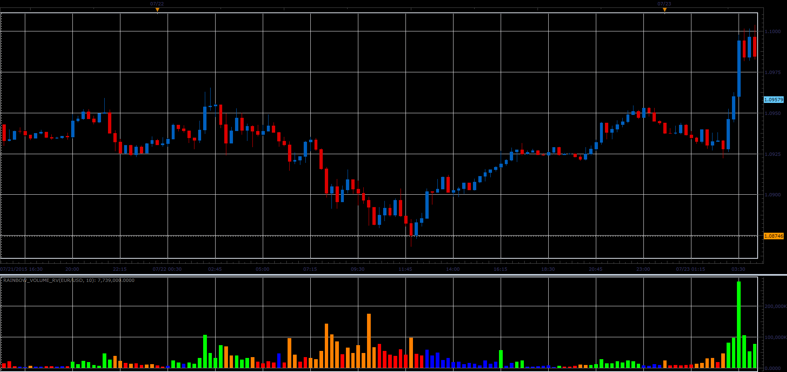

Download:

 [Rainbow_Volume_RV.lua](files/101573/Rainbow_Volume_RV.lua)

**RangeVolume Ratio** ([http://fxcodebase.com/code/viewtopic.php?f=17&t=60274](https://fxcodebase.com/code/viewtopic.php?f=17&t=60274)).

 

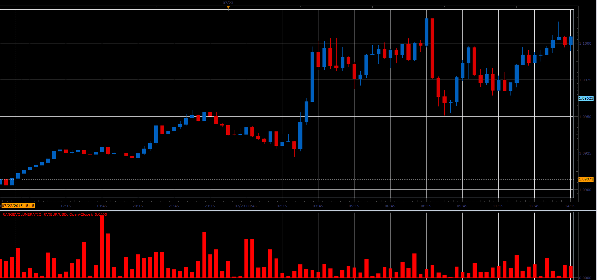

Download:

 [RangeVolumeRatio_RV.lua](files/101573/RangeVolumeRatio_RV.lua)

---

## Re: Volume indicators with Real volume and Transactions

**Alexander.Gettinger** · Tue Jul 28, 2015 10:48 am

**RBVI oscillator** ([viewtopic.php?f=17&t=12226&p=27987](http://www.fxcodebase.com/code/viewtopic.php?f=17&t=12226&p=27987)).

 

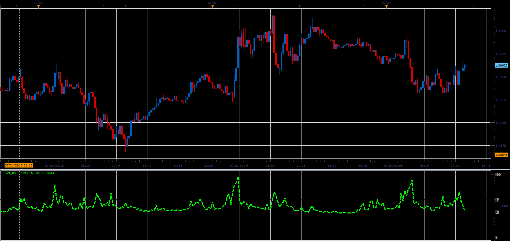

Download:

 [RBVI_RV.lua](files/101574/RBVI_RV.lua)

**Relative Aggression Bars** ([viewtopic.php?f=17&t=34335&p=101179](http://www.fxcodebase.com/code/viewtopic.php?f=17&t=34335&p=101179)).

 

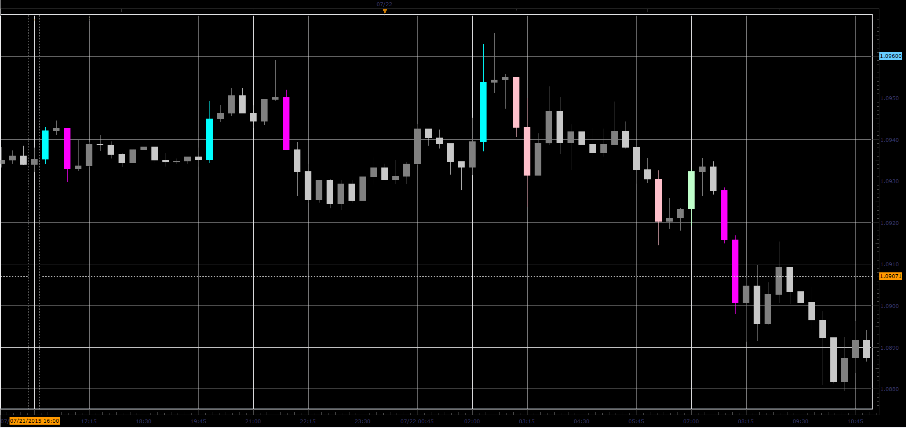

Download:

 [Relative_Aggression_Bars_RV.lua](files/101574/Relative_Aggression_Bars_RV.lua)

---

## Re: Volume indicators with Real volume and Transactions

**Alexander.Gettinger** · Tue Jul 28, 2015 10:57 am

**Sensitive oscillator** ([http://fxcodebase.com/code/viewtopic.php?f=17&t=10502](https://fxcodebase.com/code/viewtopic.php?f=17&t=10502)).

 

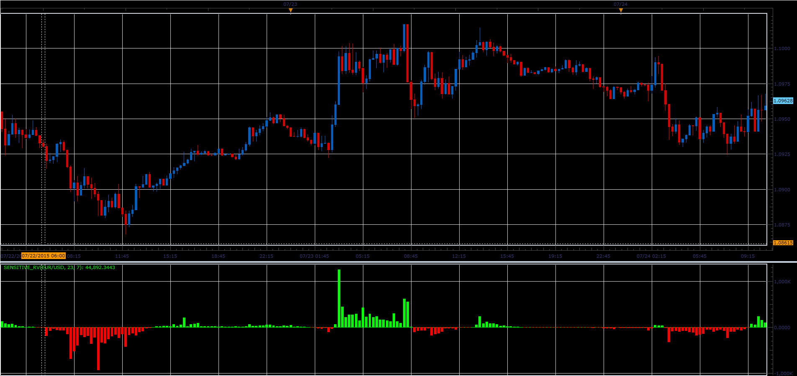

Download:

 [Sensitive_RV.lua](files/101575/Sensitive_RV.lua)

**Shmen Resistance** ([viewtopic.php?f=17&t=60274&p=92473](http://www.fxcodebase.com/code/viewtopic.php?f=17&t=60274&p=92473)).

 

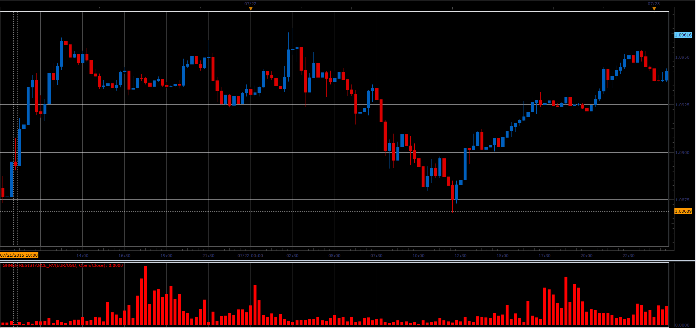

Download:

 [Shmen Resistance_RV.lua](files/101575/Shmen%20Resistance_RV.lua)

---

## Re: Volume indicators with Real volume and Transactions

**Alexander.Gettinger** · Tue Jul 28, 2015 10:59 am

**Smart Money Pressure** ([viewtopic.php?f=17&t=60741&p=94214](http://www.fxcodebase.com/code/viewtopic.php?f=17&t=60741&p=94214)).

 

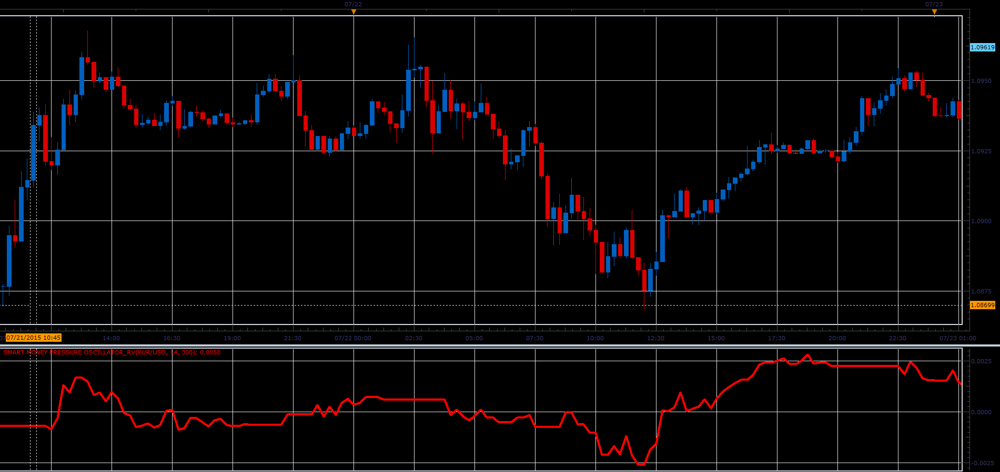

Download:

 [Smart Money Pressure Oscillator_RV.lua](files/101576/Smart%20Money%20Pressure%20Oscillator_RV.lua)

**Short-term Volume and Price Oscillator** ([http://fxcodebase.com/code/viewtopic.ph ... 80&p=28557](https://fxcodebase.com/code/viewtopic.php?f=17&t=15080&p=28557)).

 

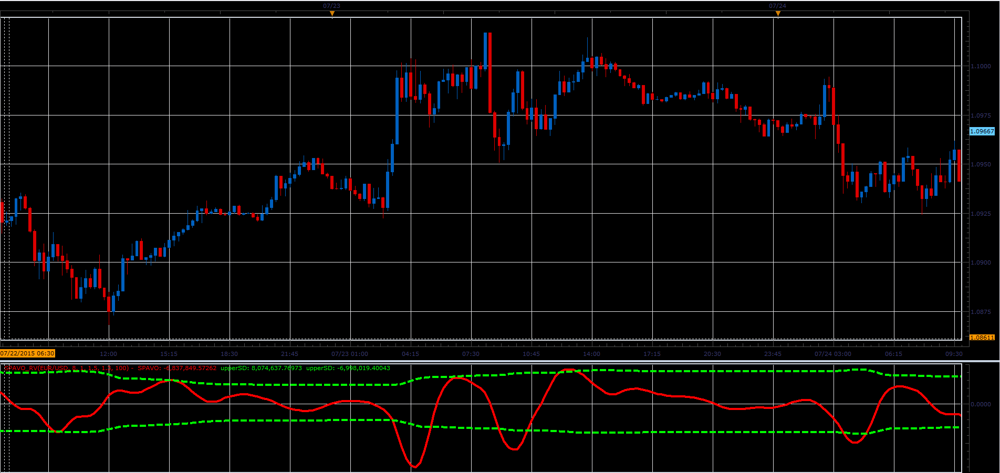

Download:

 [SPAVO_RV.lua](files/101576/SPAVO_RV.lua)

---

## Re: Volume indicators with Real volume and Transactions

**Alexander.Gettinger** · Tue Jul 28, 2015 11:03 am

**Symphonie Extreme indicator** ([viewtopic.php?f=17&t=15511](http://www.fxcodebase.com/code/viewtopic.php?f=17&t=15511)).

 

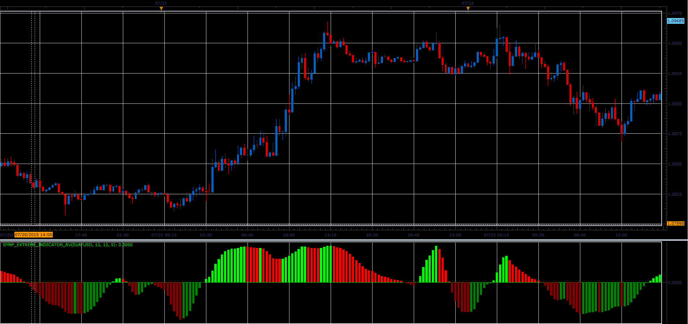

Download:

 [Symp_Extreme_Indicator_RV.lua](files/101577/Symp_Extreme_Indicator_RV.lua)

**Trade Volume Index** ([viewtopic.php?f=17&t=60565&p=94302](http://www.fxcodebase.com/code/viewtopic.php?f=17&t=60565&p=94302)).

 

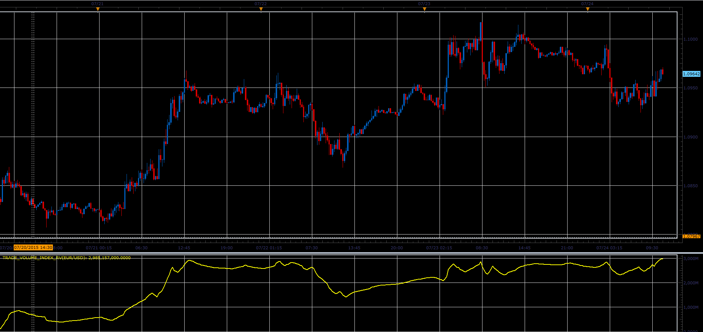

Download:

 [Trade_Volume_Index_RV.lua](files/101577/Trade_Volume_Index_RV.lua)

---

## Re: Volume indicators with Real volume and Transactions

**Alexander.Gettinger** · Thu Jul 30, 2015 9:30 am

**Ticks Volume Indicator** ([viewtopic.php?f=17&t=23995&p=41244](http://www.fxcodebase.com/code/viewtopic.php?f=17&t=23995&p=41244)).

 

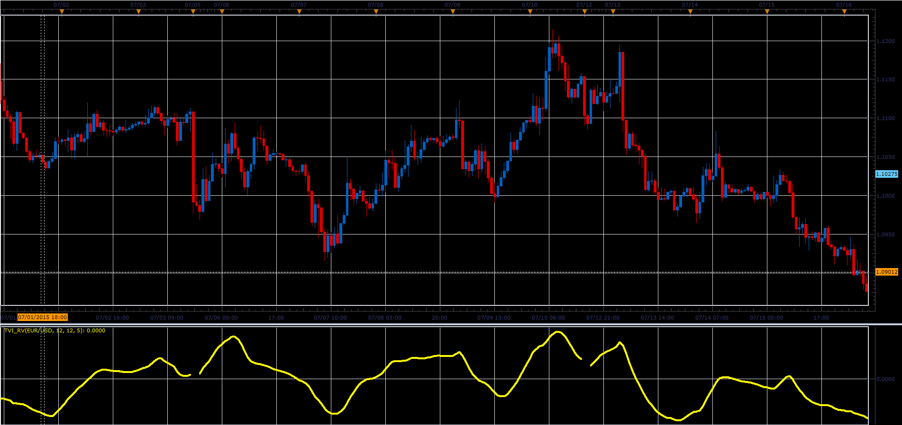

Download:

 [TVI_RV.lua](files/101604/TVI_RV.lua)

**Twiggs Money Flow** ([viewtopic.php?f=17&t=4782&p=97289](http://www.fxcodebase.com/code/viewtopic.php?f=17&t=4782&p=97289)).

 

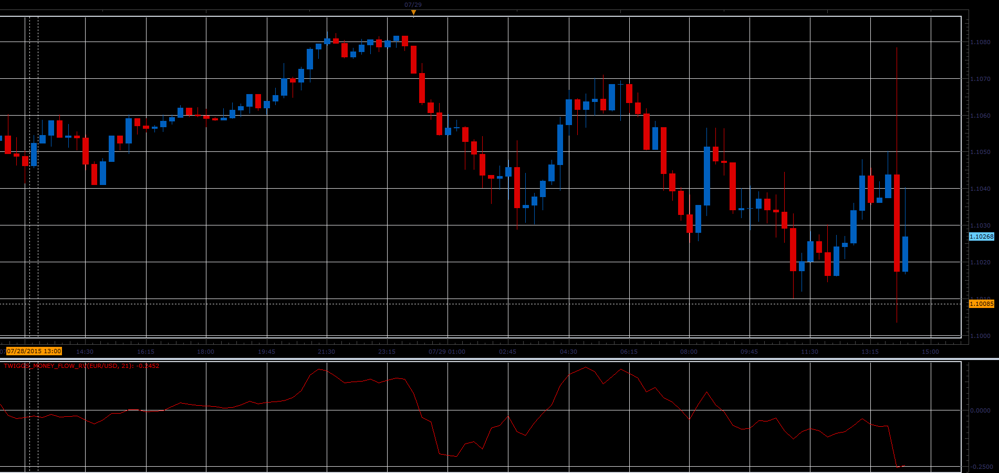

Download:

 [Twiggs_Money_Flow_RV.lua](files/101604/Twiggs_Money_Flow_RV.lua)

---

## Re: Volume indicators with Real volume and Transactions

**Alexander.Gettinger** · Thu Jul 30, 2015 9:32 am

**Volume Accumulation Percentage Indicator** ([viewtopic.php?f=17&t=59830&p=90707](http://www.fxcodebase.com/code/viewtopic.php?f=17&t=59830&p=90707)).

 

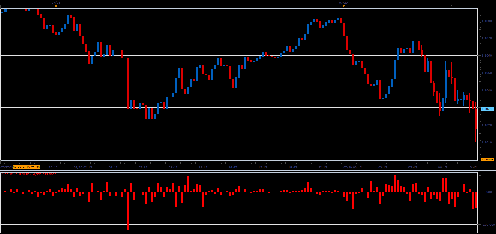

Download:

 [VA2_RV.lua](files/101605/VA2_RV.lua)

 

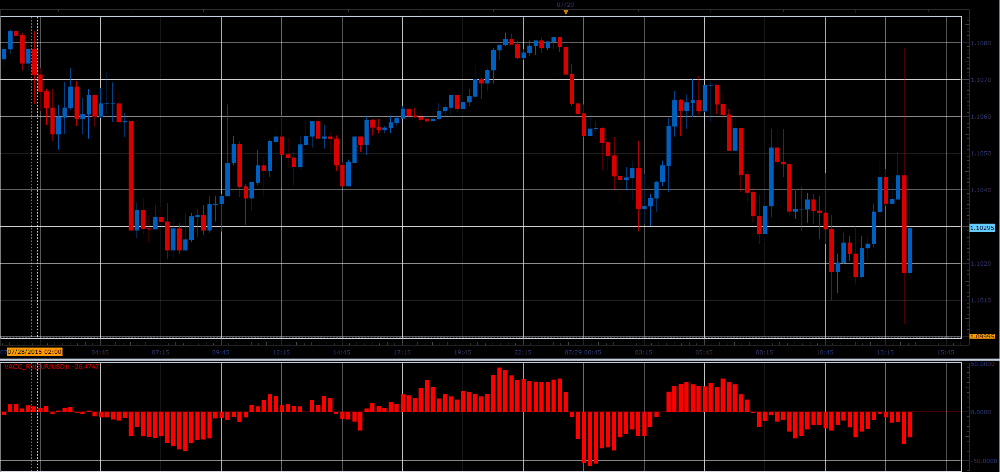

Download:

 [VACC_RV.lua](files/101605/VACC_RV.lua)

---

## Re: Volume indicators with Real volume and Transactions

**Alexander.Gettinger** · Thu Jul 30, 2015 9:34 am

**Volume Adjusted Moving Average** ([viewtopic.php?f=17&t=2349](http://www.fxcodebase.com/code/viewtopic.php?f=17&t=2349)).

 

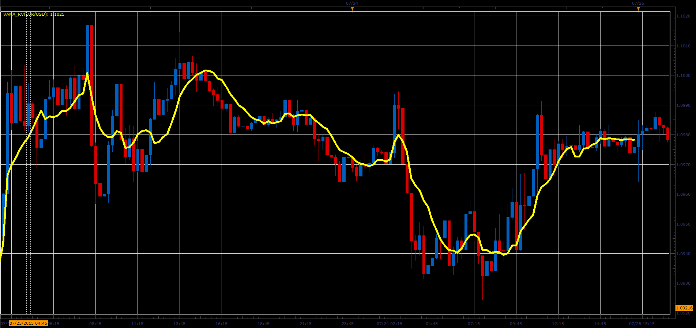

Download:

 [VAMA_RV.lua](files/101606/VAMA_RV.lua)

**VAMA MACD** ([viewtopic.php?f=17&t=59293&p=95855](http://www.fxcodebase.com/code/viewtopic.php?f=17&t=59293&p=95855)).

 

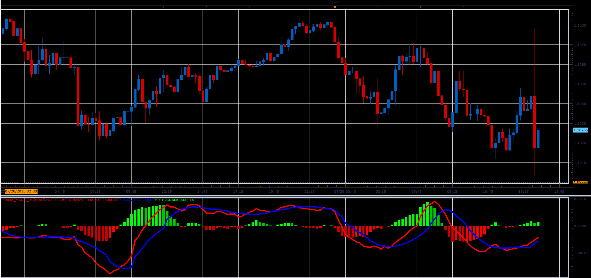

Download:

 [VAMA_MACD_RV.lua](files/101606/VAMA_MACD_RV.lua)

---

## Re: Volume indicators with Real volume and Transactions

**Alexander.Gettinger** · Thu Jul 30, 2015 9:39 am

**ATR with volume** ([viewtopic.php?f=17&t=15506&p=43405](http://www.fxcodebase.com/code/viewtopic.php?f=17&t=15506&p=43405)).

 

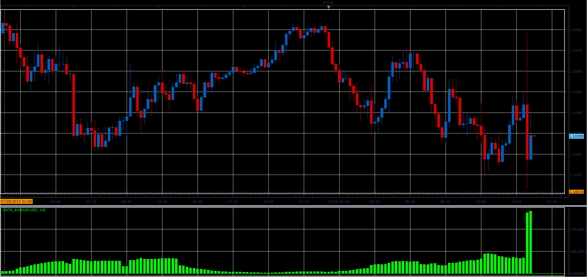

Download:

 [VATR_RV.lua](files/101607/VATR_RV.lua)

**VOLUME FLOW INDICATOR** ([http://fxcodebase.com/code/viewtopic.php?f=17&t=27497](https://fxcodebase.com/code/viewtopic.php?f=17&t=27497)).

 

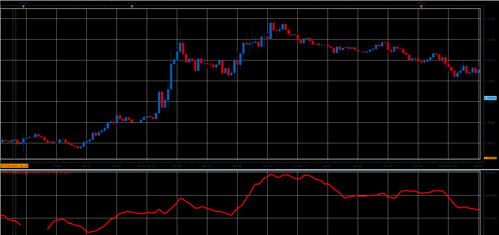

Download:

 [VFI_RV.lua](files/101607/VFI_RV.lua)

**Voltest** ([viewtopic.php?f=17&t=12322&p=97221](http://www.fxcodebase.com/code/viewtopic.php?f=17&t=12322&p=97221)).

 

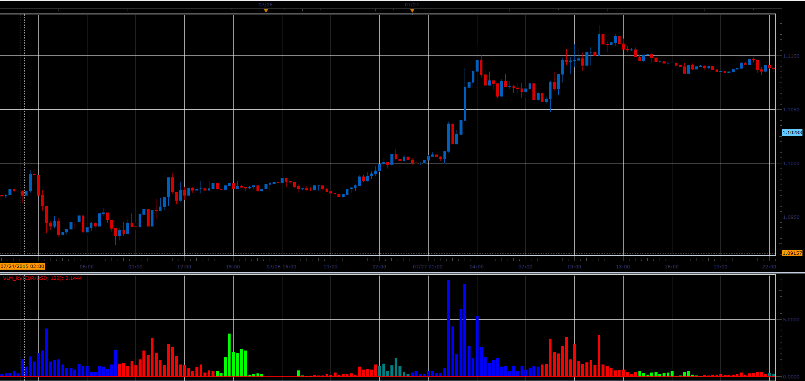

Download:

 [VLM_RV.lua](files/101607/VLM_RV.lua)

---

## Re: Volume indicators with Real volume and Transactions

**Alexander.Gettinger** · Thu Jul 30, 2015 9:49 am

**VolMA indicator** ([http://fxcodebase.com/code/viewtopic.php?f=17&t=18973](https://fxcodebase.com/code/viewtopic.php?f=17&t=18973)).

 

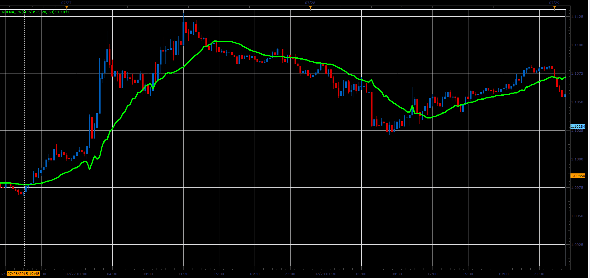

Download:

 [VolMA_RV.lua](files/101608/VolMA_RV.lua)

**Volume Price Momentum Oscillator** ([http://fxcodebase.com/code/viewtopic.php?f=17&t=61222](https://fxcodebase.com/code/viewtopic.php?f=17&t=61222)).

 

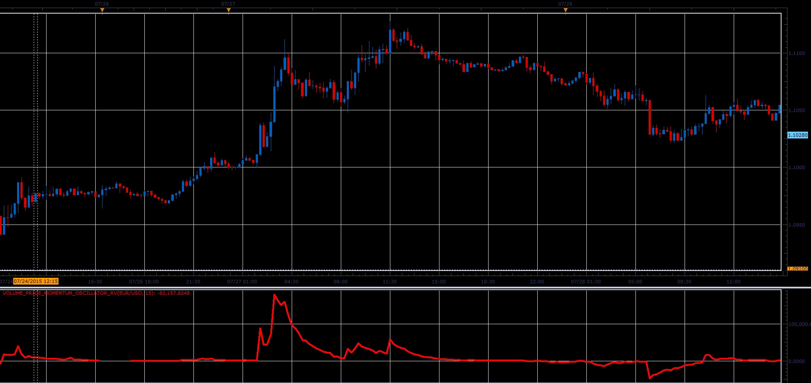

Download:

 [Volume_Price_Momentum_Oscillator_RV.lua](files/101608/Volume_Price_Momentum_Oscillator_RV.lua)

---

## Re: Volume indicators with Real volume and Transactions

**Alexander.Gettinger** · Thu Jul 30, 2015 9:51 am

**Volume candles** ([viewtopic.php?f=17&t=11786&p=23589](http://www.fxcodebase.com/code/viewtopic.php?f=17&t=11786&p=23589)).

 

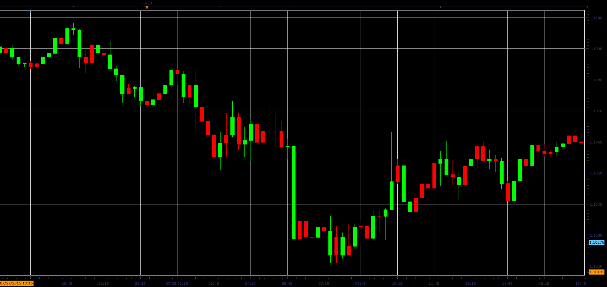

Download:

 [Volume_Candles_RV.lua](files/101609/Volume_Candles_RV.lua)

**Volume price confirmation indicator** ([viewtopic.php?f=17&t=3478&p=100965](http://www.fxcodebase.com/code/viewtopic.php?f=17&t=3478&p=100965)).

 

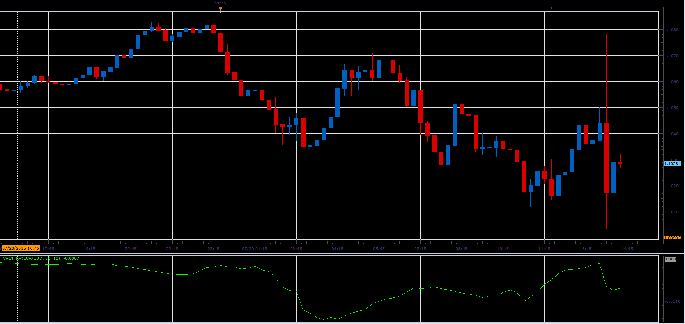

Download:

 [VPCI_RV.lua](files/101609/VPCI_RV.lua)

---

## Re: Volume indicators with Real volume and Transactions

**Alexander.Gettinger** · Thu Jul 30, 2015 9:53 am

**Weight of Evidence** ([viewtopic.php?f=17&t=62054&p=100611](http://www.fxcodebase.com/code/viewtopic.php?f=17&t=62054&p=100611)).

 

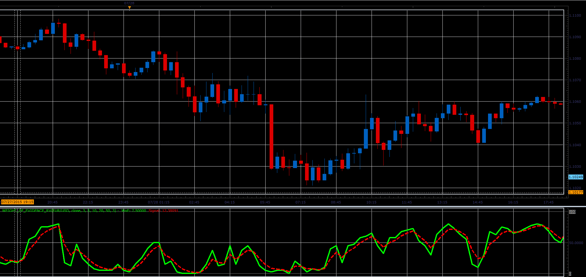

Download:

 [Weight_of_Evidence_RV.lua](files/101610/Weight_of_Evidence_RV.lua)

**Weis Wave Volume Indicator** ([viewtopic.php?f=17&t=59573](http://www.fxcodebase.com/code/viewtopic.php?f=17&t=59573)).

 

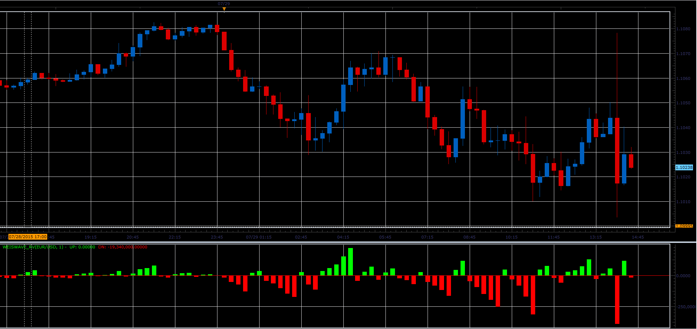

Download:

 [WeisWave_RV.lua](files/101610/WeisWave_RV.lua)

---

## Re: Volume indicators with Real volume and Transactions

**Alexander.Gettinger** · Thu Jul 30, 2015 9:56 am

**Weight Volume Move-Adjusted Moving Average** ([viewtopic.php?f=17&t=60155&p=91721](http://www.fxcodebase.com/code/viewtopic.php?f=17&t=60155&p=91721)).

 

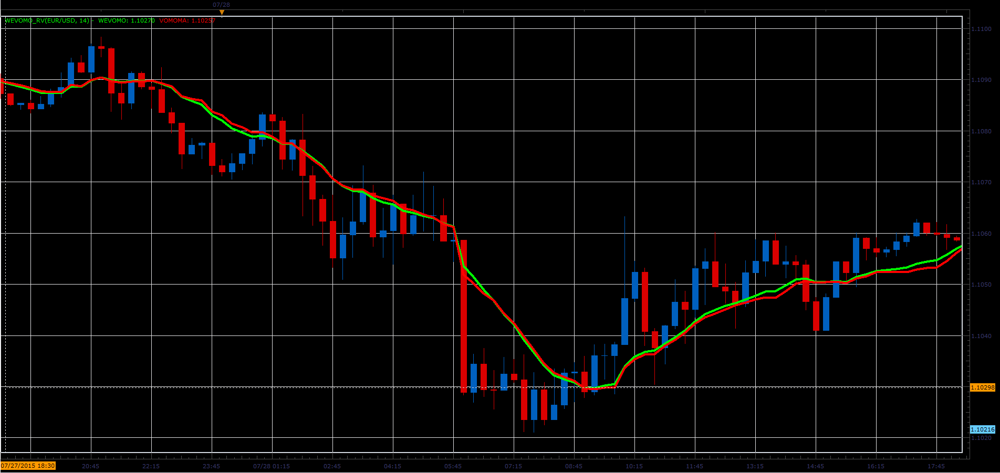

Download:

 [WEVOMO_RV.lua](files/101611/WEVOMO_RV.lua)

**Winer oscillator** ([viewtopic.php?f=17&t=32203&p=55235](http://www.fxcodebase.com/code/viewtopic.php?f=17&t=32203&p=55235)).

 

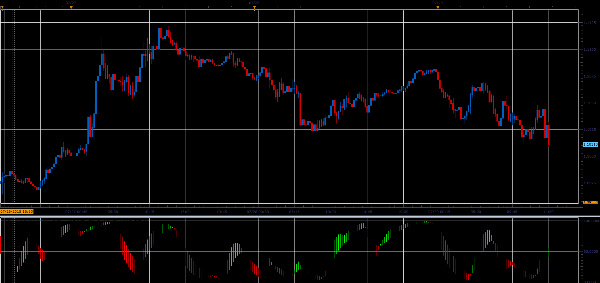

Download:

 [Winer_RV.lua](files/101611/Winer_RV.lua)

---

## Re: Volume indicators with Real volume and Transactions

**Alexander.Gettinger** · Thu Jul 30, 2015 9:57 am

**Wyckoff PV Histogram** ([http://fxcodebase.com/code/viewtopic.php?f=17&t=22630](https://fxcodebase.com/code/viewtopic.php?f=17&t=22630)).

 

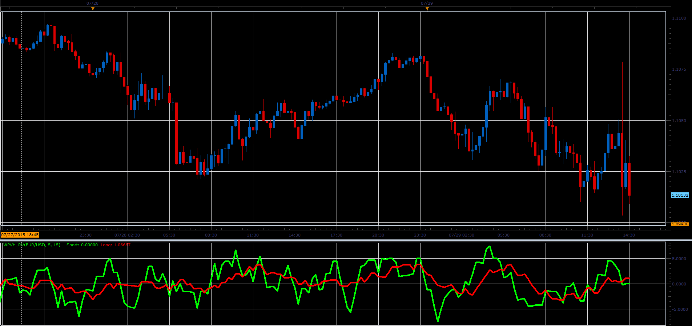

Download:

 [WPVH_RV.lua](files/101612/WPVH_RV.lua)

**Zero Point Force** ([viewtopic.php?f=17&t=27690&p=48462](http://www.fxcodebase.com/code/viewtopic.php?f=17&t=27690&p=48462)).

 

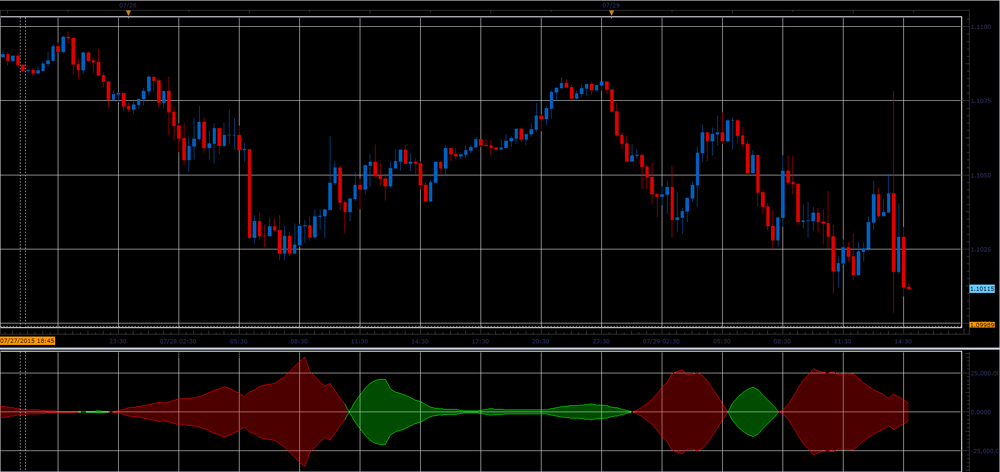

Download:

 [ZPF_RV.lua](files/101612/ZPF_RV.lua)

---

## Re: Volume indicators with Real volume and Transactions

**takisd** · Fri Jul 31, 2015 6:18 pm

Dear Alexander,
First of all I would like to thank you for all these useful indicators working with real volume.
I was wondering if you can help me out with one indicator that I use most of all and this is Weis Wave.

Unfortunately when I load this indicator after a very short while its crashing Trading Station- (I am using renko view but it also crashes on regular time candlesticks). I can send you the report produced by Trading station if needed. I would really appreciate if you could fix this and also add the wave line and the label with the volume number on the chart.

Thanks again,
Takis D

---

## Re: Volume indicators with Real volume and Transactions

**Dashil** · Mon Sep 28, 2015 1:06 pm

Thank you man.
Thanks to you, I have made good progress in Lua language.

---

## Re: Volume indicators with Real volume and Transactions

**Apprentice** · Sun Feb 04, 2018 7:11 pm

The Indicator was revised and updated.
