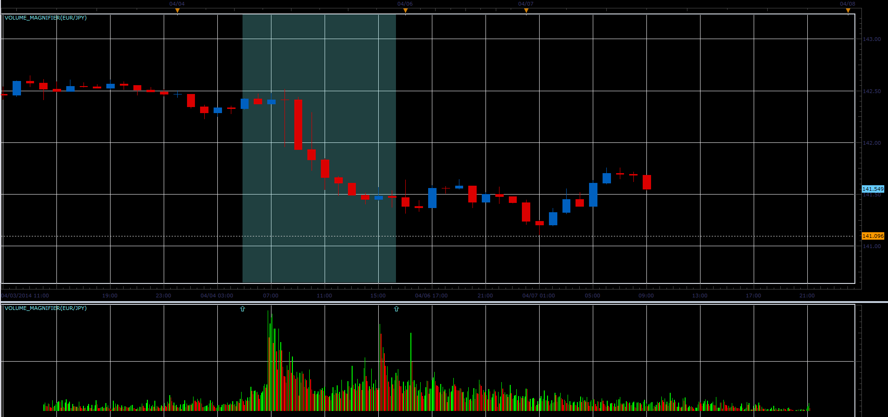
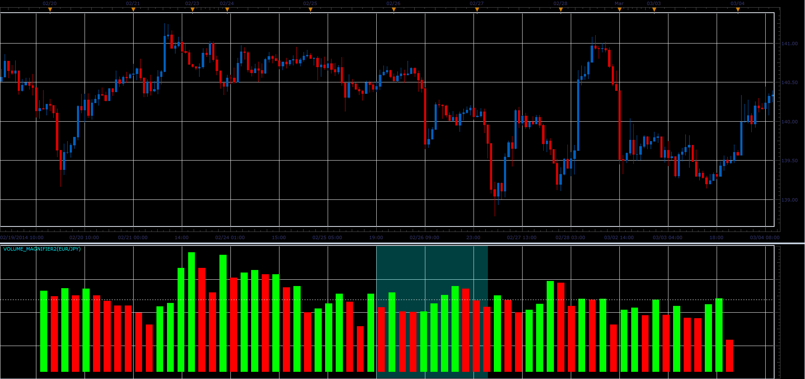

# Volume magnifier

> Source: https://fxcodebase.com/code/viewtopic.php?f=17&t=60510  
> Forum: 17 · Topic 60510 · 3 post(s)

---

## Volume magnifier

**Alexander.Gettinger** · Mon Apr 07, 2014 9:07 am

The indicator shows in an additional window more detailed volume history for the selected area of the main chart.
The indicator supports different ways of presenting charts.
To move the start and end points of the magnifier is used the menu invoked by right mouse button.

 

Download:

 [Volume_Magnifier.lua](files/93411/Volume_Magnifier.lua)

The indicator was revised and updated

---

## Re: Volume magnifier

**Alexander.Gettinger** · Mon Apr 07, 2014 9:08 am

The indicator shows the position of the visible chart on the larger timeframe chart.

 

Download:

 [Volume_Magnifier2.lua](files/93412/Volume_Magnifier2.lua)

---

## Re: Volume magnifier

**Apprentice** · Fri Jun 16, 2017 6:45 am

The indicator was revised and updated.
