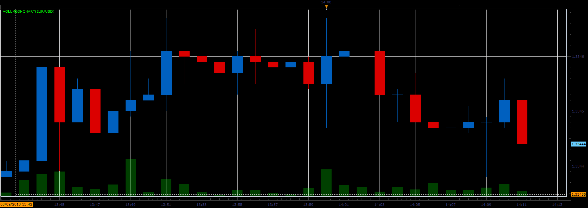
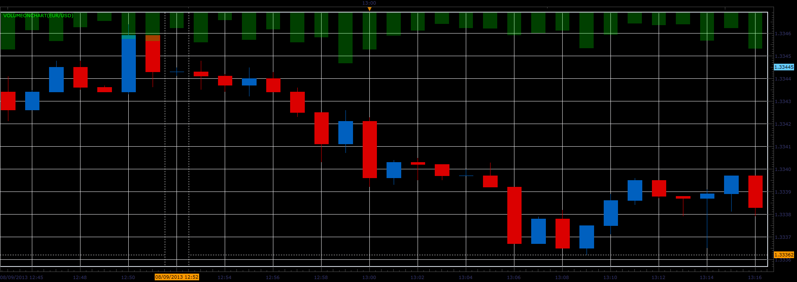

# Volume on main chart

> Source: https://fxcodebase.com/code/viewtopic.php?f=17&t=58824  
> Forum: 17 · Topic 58824 · 9 post(s)

---

## Volume on main chart

**Alexander.Gettinger** · Fri Aug 09, 2013 1:14 pm

The indicator shows the volume in the main window (top or bottom).

 

 

Download:

 [VolumeOnChart.lua](files/88189/VolumeOnChart.lua)

The indicator was revised and updated

---

## Re: Volume on main chart

**Apprentice** · Tue Oct 15, 2013 1:54 am

Bump Up

---

## Re: Volume on main chart

**mjf1288** · Fri Dec 13, 2013 12:40 pm

I was wondering if you could change this so that it automatically adjusts to the instrument being displayed. Thanks!

---

## Re: Volume on main chart

**Apprentice** · Sat Dec 14, 2013 1:31 pm

[VolumeOnChart.lua](files/91522/VolumeOnChart.lua)

Try to use This version, it will automatically adjust to chart instrument.

---

## Re: Volume on main chart

**mjf1288** · Mon Dec 16, 2013 8:17 pm

Thank you very much!

---

## Re: Volume on main chart

**Swissy** · Mon Dec 23, 2013 8:03 pm

> **Apprentice wrote:**
>
>
> VolumeOnChart.lua
>
>
> Try to use This version, it will automatically adjust to chart instrument.

Would it be possible to make your on chart volume similar to this updated Better volume indicator? What's most important is having the color bars, not so much interested in showing the moving avg or any info that legends may display when it's normally added as a separate indicator window. Just the color coded based on better volume coding. Hope the request is understandable. Thank you.

[viewtopic.php?f=17&t=26606&p=62988&hilit=Better+Volume#p62988](https://fxcodebase.com/code/viewtopic.php?f=17&t=26606&p=62988&hilit=Better+Volume#p62988)

---

## Re: Volume on main chart

**Apprentice** · Wed Dec 25, 2013 2:46 pm

Your request is added to the development list.

---

## Re: Volume on main chart

**Swissy** · Sun Jan 05, 2014 7:36 pm

> **Apprentice wrote:**
> Your request is added to the development list.

Thank you. Look forward to it.

---

## Re: Volume on main chart

**Apprentice** · Sun Aug 06, 2017 7:15 am

The indicator was revised and updated.
