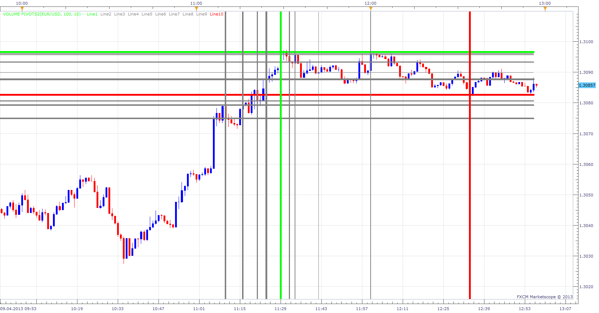
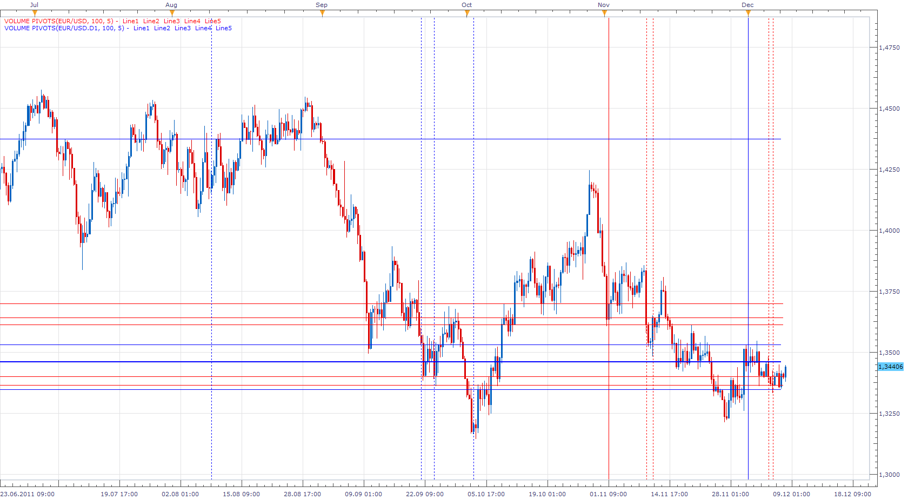

# Volume Pivots

> Source: https://fxcodebase.com/code/viewtopic.php?f=17&t=2779  
> Forum: 17 · Topic 2779 · 31 post(s)

---

## Volume Pivots

**Apprentice** · Tue Nov 23, 2010 2:06 pm

The indicator will 'look back' a user defined number of bars,
to find the user defined number of highest turnover (volume).
After this calculation, the software then draws horizontal S/R lines at these price levels.
Climax High Volume Option
If volume[period-2] <= volume[period-1]
 and volume[period-1] >= volume[period]

 [Volume Pivots.lua](files/6326/Volume%20Pivots.lua)

You can define up to five style zones.
If u use only five Lines, 1. & 5. Zone Lines will be overwritten by Min. Max Lines.

 [Buy Sell Volume Pivots.lua](files/6326/Buy%20Sell%20Volume%20Pivots.lua)

With Buy Sell Volume Pivots u will have separate indications for Buy and Sell volume.
Buy Volume for advancing price.
Sell Volume for declining price.

 [Volume Pivots.lua](files/6326/Volume%20Pivots%20%282%29.lua)

 [Buy Sell Volume Pivots Old.lua](files/6326/Buy%20Sell%20Volume%20Pivots%20Old.lua)

---

## Re: Volume Pivots

**patick** · Tue Nov 23, 2010 8:28 pm

Nice. I use vol climax now and find it extremely helpful. Thanks.

One suggestion, if possible, to add a MTF functionality. As an example, plot the m5 vol climax on a m1 chart.

---

## Re: Volume Pivots

**Apprentice** · Wed Nov 24, 2010 2:49 am

Good suggestion.

---

## Re: Volume Pivots

**Apprentice** · Fri Nov 26, 2010 6:06 am

Update.

Vertical lines added to help you, Finding High Volume Bars.
Solid Line, shows the highest volume in the given time frame.

---

## Re: Volume Pivots

**patick** · Wed Dec 15, 2010 1:33 pm

Apprentice,

When/if you get around to updating this indy, may I please make another request?

If you look at volume profiles you can notice a distinct pattern that is closely associated with each market session (Europe / US / Asian), therefore it is much more productive, and profitable, to limit analysis accordingly. So, if you had an option to draw volume pivots per session instead of amount of bars, it would be a great benefit.

Additionally, I notice there's a "fractal" component in the calculation, so the climax volume line will always be delayed by 2 bars. I'm not sure what the purpose of the delay is. If you have time, could you please be elaborate?

Thank you very much.

---

## Re: Volume Pivots

**Apprentice** · Wed Dec 15, 2010 4:06 pm

Good idea, but I think that this problem is better solved by a new indicator.

The delay is the result of the definition of fractals.
Simply can not be identified earlier.

---

## Re: Volume Pivots

**Apprentice** · Thu Dec 08, 2011 8:36 am

For Patick. Yours, MTF request is now obsolete,
as the MTFe functionality is now supported from TS.
through choice of time frame for indicator data source.

---

## Re: Volume Pivots

**nsaale** · Tue Feb 05, 2013 7:20 am

How exactly do you use this indicator?

---

## Re: Volume Pivots

**Apprentice** · Tue Feb 05, 2013 1:08 pm

This indicator indicates the past Levels, Zones with increased Volume.
Future areas of resistance / support can be expected at the same levels.
Trading ideas would be, open/close trade on break through or rejection away from these lines.

---

## Re: Volume Pivots

**Blackcat2** · Wed Feb 06, 2013 7:37 am

Could you please add the option to change line style and width?

Thanks

BC

---

## Re: Volume Pivots

**Apprentice** · Wed Feb 06, 2013 2:04 pm

Style Option Added.

---

## Re: Volume Pivots

**speakinmymind** · Mon Apr 08, 2013 4:25 am

Can you place a color for each line based on how much volume is at each line? Basically, I like the ability to spot the largest volume easily, but it would be even better if I had the second largest, third largest, (and so forth) by different color.

Thanks!

---

## Re: Volume Pivots

**Apprentice** · Tue Apr 09, 2013 5:06 am

Additional style options added.
With the addition of Max and Min Volume.
You can define up to five style zones.

---

## Re: Volume Pivots

**speakinmymind** · Tue Apr 09, 2013 6:31 am

I can't seem to get zone 1's line to appear... otherwise great! and thanks!

---

## Re: Volume Pivots

**rplust** · Tue Apr 09, 2013 6:35 am

Hi,
why is it that the Indicator does not update i.e. the end of the line does not extend with each new candle?

---

## Re: Volume Pivots

**Apprentice** · Tue Apr 09, 2013 6:51 am

If u use only five Lines, 1. & 5. Zone Lines will be overwritten by Min. Max Lines.
Try to use 10 lines.

---

## Re: Volume Pivots

**rplust** · Tue Apr 09, 2013 11:53 am

I actually use 10 Lines. But anyway, as you have fixed this issue I will download and try it again. These volume pivots are great for trading. Thank you for your time and effort!

---

## Re: Volume Pivots

**rplust** · Tue Apr 09, 2013 12:02 pm

I have installed the update. But when I want to put it on the chart it does not allow to do it....[string "Volume Pivots.lua"]137 The fifth parameter must be a number

---

## Re: Volume Pivots

**Apprentice** · Tue Apr 09, 2013 12:49 pm

update, all issue are now fixed.

---

## Re: Volume Pivots

**rplust** · Wed Apr 10, 2013 3:41 am

Works fine now. Thank you!

---

## Re: Volume Pivots

**Coondawg71** · Fri Apr 12, 2013 9:47 am

I'm getting an error...

133:5th parameter must be a number

please advise.

thanks,

sjc

---

## Re: Volume Pivots

**Coondawg71** · Fri Apr 12, 2013 10:50 pm

I understand this indicator to function only to show max volume within period time frame selected by user. Can we please request this indicator to be more specific. Separating the volume into max buy and max sell would be much more useful. Such as the attached indicator illustrates. Can we please consider converting BMC Volume Analysis indicator to Lua. If possible, I will formally post request in appropriate forum.

Thanks,

Sjc

[http://www.forexfactory.com/attachment. ... 1232359861](http://www.forexfactory.com/attachment.php?attachmentid=193210&d=1232359861)

---

## Re: Volume Pivots

**Apprentice** · Mon Apr 15, 2013 6:00 am

Do you have uncoded version of BMC Volume Analysis Indicator or its description.

max buy will be for up candles
max sell will be for down candles

---

## Re: Volume Pivots

**Coondawg71** · Mon Apr 15, 2013 9:17 am

1.) Please ignore post about error, I had to delete first version, update now working.

2.) Correct, Buy = Max Buy Volume and Sell = Max Sell Volume

I apologize, I do not have access to uncoded indicator. Forum posting of description added as attachment.

thanks,

sjc

[http://www.forexfactory.com/showthread.php?t=146436](http://www.forexfactory.com/showthread.php?t=146436)

---

## Re: Volume Pivots

**Apprentice** · Tue Apr 23, 2013 2:27 pm

Buy Sell Volume Pivot indicator added to topmost (first) post of this topic.

---

## Re: Volume Pivots

**speakinmymind** · Sat Aug 03, 2013 6:27 pm

I see the option to remove the vertical lines, can you please add the option to remove the horizontal lines instead?

---

## Re: Volume Pivots

**Apprentice** · Mon Aug 05, 2013 2:42 am

Your request is added to the development list.

---

## Re: Volume Pivots

**Apprentice** · Mon Sep 02, 2013 3:37 am

Show Horizontal Lines option added.

---

## Re: Volume Pivots

**Apprentice** · Thu Jul 27, 2017 9:53 am

The indicator was revised and updated.

---

## Re: Volume Pivots

**Apprentice** · Sun Oct 07, 2018 9:12 am

The indicator was revised and updated.

---

## Re: Volume Pivots

**Apprentice** · Thu May 28, 2020 8:30 am

Old version update.
The new version introduced.
