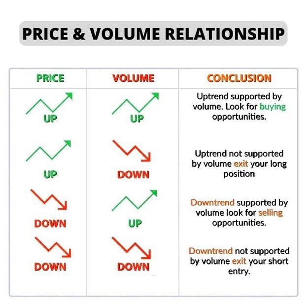

# Volume Price Analysis Overlay

> Source: https://fxcodebase.com/code/viewtopic.php?f=17&t=72959  
> Forum: 17 · Topic 72959 · 2 post(s)

---

## Volume Price Analysis Overlay

**Apprentice** · Tue Nov 22, 2022 5:11 am

 

If this example volume is not smoothed,
The indicator will allow you to smooth the volume by using the average volume of the last N candles.

 [Volume Price Analysis Overlay.lua](files/148419/Volume%20Price%20Analysis%20Overlay.lua)

---

## Re: Volume Price Analysis Overlay

**Apprentice** · Tue Nov 22, 2022 5:43 am

Advanced version of Volume Price Analysis Overlay
Regular Version of Volume Price Analysis Overlay
Volume > MA Of Volume

Advanced Version of Volume Price Analysis Overlay
1. MA Of Volume > 2. MA Of Volume
1. MA Of Price > 2. MA Of Price

 [Smoothed Volume Price Analysis Overlay.lua](files/148420/Smoothed%20Volume%20Price%20Analysis%20Overlay.lua)
