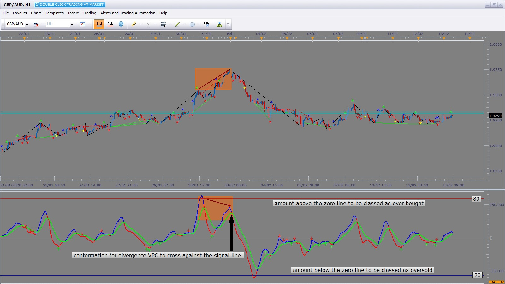
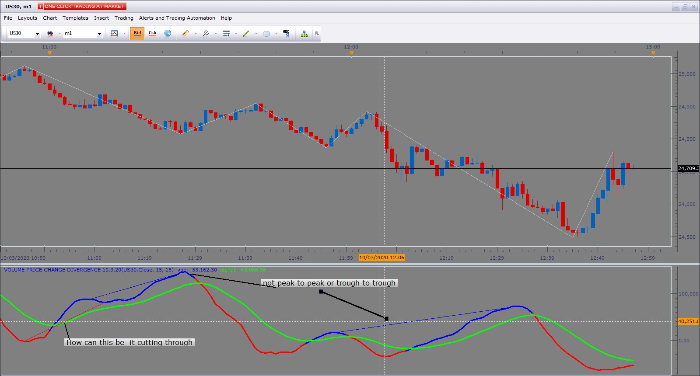

# Volume Price Change

> Source: https://fxcodebase.com/code/viewtopic.php?f=17&t=65729  
> Forum: 17 · Topic 65729 · 39 post(s)

---

## Volume Price Change

**Apprentice** · Mon Feb 12, 2018 10:19 am

Based on the request.
[viewtopic.php?f=27&t=65715](https://fxcodebase.com/code/viewtopic.php?f=27&t=65715)

 [Volume Price Change.lua](files/117732/Volume%20Price%20Change.lua)

 [Volume Price Change with Alert.lua](files/117732/Volume%20Price%20Change%20with%20Alert.lua)

 

 [Range Volume Price Change.lua](files/117732/Range%20Volume%20Price%20Change.lua)

---

## Re: Volume Price Change

**Paul W** · Tue Apr 03, 2018 9:58 am

A very good indicator

have incorporated into 1 minute chart

is it possible for "Volume Price Change" to support tick charts ?

am curious to see how it would follow price

thanks

---

## Re: Volume Price Change

**Apprentice** · Wed Apr 04, 2018 5:16 am

 [Tick Time Frame Timed Volume Price Change.lua](files/118447/Tick%20Time%20Frame%20Timed%20Volume%20Price%20Change.lua)

 [Tick Price Change.lua](files/118447/Tick%20Price%20Change.lua)

Only like this.
In any case, the volume component is lost.

---

## Re: Volume Price Change

**Paul W** · Wed Apr 04, 2018 8:18 pm

it was a thought

thanks for your effort

---

## Re: Volume Price Change

**Apprentice** · Tue Dec 18, 2018 8:57 am

Volume Price Change with Alert added.

---

## Re: Volume Price Change

**minifire18** · Tue Dec 18, 2018 1:47 pm

> **Apprentice wrote:**
> Volume Price Change with Alert added.

Thank you works perfect

---

## Re: Volume Price Change

**minifire18** · Wed Dec 19, 2018 10:43 am

> **minifire18 wrote:**
>
>
> > **Apprentice wrote:**
> > Volume Price Change with Alert added.
>
>
> Thank you works perfect

Hey not sure if can be done but is it possible to have indicators overlay in same oscillators space the two topic below
[http://fxcodebase.com/code/viewtopic.ph ... tic#p98381](https://fxcodebase.com/code/viewtopic.php?f=17&t=35371&p=113956&hilit=stochastic#p98381)

[download/file.php?id=23415](http://www.fxcodebase.com/code/download/file.php?id=23415)

Would keep all parameters the same so in the stochastics with alerts would still be able to mark out over bought/sold % and still get the alerts at them areas and when cross over
And with the volume price change with alert would still have the horizontal line on the zero line (without tag)and still get alert as is now but if you can make a little adjustment when below the zero and signal line if you can make the font slightly bolder then if only below signal and above the zero line and when above zero & signal line bolder then if above the signal but below the zero line
Thanks in advance

---

## Re: Volume Price Change

**Apprentice** · Thu Dec 20, 2018 2:49 pm

So, the task is to have "Volume Price Change with alert" will above-mentioned specifics?

---

## Re: Volume Price Change

**minifire18** · Thu Dec 20, 2018 5:18 pm

> **Apprentice wrote:**
> So, the task is to have "Volume Price Change with alert" will above-mentioned specifics?

Yes if possible please

---

## Re: Volume Price Change

**Apprentice** · Fri Dec 21, 2018 5:08 am

Your request is added to the development list under Id Number 4382

---

## Re: Volume Price Change

**Apprentice** · Sat Dec 22, 2018 10:15 am

Try this version.

 [Volume Price Change with Alert.minifire18.lua](files/123000/Volume%20Price%20Change%20with%20Alert.minifire18.lua)

Done! But don't understand this part:
And with the volume price change with alert would still have the
horizontal line on the zero line (without tag)and still get alert as
is now but if you can make a little adjustment when below the zero and
signal line if you can make the font slightly bolder then if only
below signal and above the zero line and when above zero & signal line
bolder then if above the signal but below the zero line

---

## Re: Volume Price Change with alert

**minifire18** · Thu Jun 06, 2019 4:07 am

Apprentice
Can this indicator be coded for MT4 pls
minifire

---

## Re: Volume Price Change

**Apprentice** · Thu Jun 06, 2019 5:57 am

Your request is added to the development list under Id Number 4701

---

## Re: Volume Price Change

**Apprentice** · Sat Jun 08, 2019 2:38 am

Mt4/Mq4 version.
[viewtopic.php?f=38&t=68550](https://fxcodebase.com/code/viewtopic.php?f=38&t=68550)

---

## Re: Volume Price Change with Alert

**minifire18** · Tue Feb 11, 2020 4:32 am

Apprentice
Would you be able to add divergences with alerts to Volume Price Change with Alert
thanks
minifire

---

## Re: Volume Price Change

**Apprentice** · Tue Feb 11, 2020 5:54 am

Your request is added to the development list.
Development reference 706.

---

## Re: Volume Price Change

**Apprentice** · Tue Feb 11, 2020 6:44 am

minifire18, something like this?

 [Volume Price Change with Alert.minifire18.lua](files/131221/Volume%20Price%20Change%20with%20Alert.minifire18.lua)

---

## Re: Volume Price Change

**minifire18** · Tue Feb 11, 2020 9:16 am

Apprentice
Can you code to draw on the oscillator from last peak to peak when the VPC has created a lower high from last peak and price created a higher high or VPC created a higher low from last peak to peak and price created a lower low (regular divergences.) Price creates a higher low and VPC creates lower low or, price creates a lower high an VPC creates a higher high (hidden divergences)

Thanks minifire

---

## Re: Volume Price Change

**Apprentice** · Wed Feb 12, 2020 1:21 pm

Your request is added to the development list.
Development reference 713.

---

## Re: Volume Price Change

**Apprentice** · Thu Feb 13, 2020 4:22 am

This is exactly what it does.

---

## Re: Volume Price Change

**minifire18** · Thu Feb 13, 2020 5:16 am

Hi Apprentice
Can you code to draw on the oscillator not on the price action chart peak to previous peak. Using the zigzag for conformation of highs and lows on price, conformation for divergence VPC to cross against the signal line. For the over bought / over sold part use set like on slow stochastics amount above the zero line to be classed as over bought and amount below the zero line to be classed as oversold and have the zero cross alert and signal cross alert on the oscillator not on the price action

 

Thanks minifire

---

## Re: Volume Price Change

**minifire18** · Mon Mar 09, 2020 4:03 am

Hey Apprentice & team
can this task be put on the development list as per request to draw on the oscillator not on the price action thanks
ninifire

---

## Re: Volume Price Change

**Apprentice** · Mon Mar 09, 2020 6:27 am

Your request is added to the development list.
Development reference 835.

---

## Re: Volume Price Change

**Apprentice** · Tue Mar 10, 2020 6:18 am

[Volume Price Change Divergence.lua](files/131833/Volume%20Price%20Change%20Divergence.lua)

I didn't manage to find any divergences. The case on the screenshot doesn't have a divergence: lines are misaligned. Our divergence algorithm doesn't allow any tolerance on divergence.

---

## Re: Volume Price Change

**minifire18** · Tue Mar 10, 2020 10:10 am

Hi Apprentice,
When scroll back on chart get this error code.
An error occurred during the calculation of the indicator 'VOLUME PRICE CHANGE DIVERGENCE 10.3.20(US30.Close, 15, 15)'. The error details: C:/Program Files (x86)/Candleworks/FXTS2/Indicators/Custom/Volume Price Change Divergence 10.3.20.lua:162: Specified index is out of range.
Also can it be calculated from using zigzag and conformation VPC crosses signal line as in screenshot the 1st divergence is not going from peak to peak or trough to trough but cutting trough, and would be able to add the zero line and alerts when VPC crosses the signal line and if you can add a histogram with 4 colour option (2 colour above the zero line and 2 colour below as like in the trix lua
thank you guys
minifire

 

---

## Re: Volume Price Change

**Apprentice** · Tue Mar 10, 2020 12:14 pm

Your request is added to the development list.
Development reference 850.

---

## Re: Volume Price Change

**Apprentice** · Wed Mar 11, 2020 5:07 am

[Volume Price Change Divergence.lua](files/131867/Volume%20Price%20Change%20Divergence.lua)

Try this version.

---

## Re: Volume Price Change

**minifire18** · Thu Mar 12, 2020 3:09 am

Hi Apprentice & Team,
No problems with scrolling back thanks,can you add alerts when VPC crosses the signal line and and if you can add a histogram with 4 colour option (2 colour above the zero line and 2 colour below as like in the trix lua
thank you guys

---

## Re: Volume Price Change

**Apprentice** · Thu Mar 12, 2020 5:58 am

Your request is added to the development list.
Development reference 855.

---

## Re: Volume Price Change

**Apprentice** · Fri Mar 13, 2020 5:29 am

[Volume Price Change Divergence.lua](files/131912/Volume%20Price%20Change%20Divergence.lua)

Try this version.

---

## Re: Volume Price Change

**sydneygithinji** · Fri Mar 20, 2020 2:48 pm

Create it in mq4

---

## Re: Volume Price Change

**sydneygithinji** · Fri Mar 20, 2020 2:50 pm

Hi, create Andrew pitch fork indicator with volume price change Included in mq4.
Thanks

---

## Re: Volume Price Change

**Apprentice** · Sat Mar 21, 2020 5:56 am

Can you provide a description, chart or example of some similar implementation?

---

## Re: Volume Price Change

**sydneygithinji** · Mon Mar 23, 2020 1:11 pm

Hi, sorry please convert it to mq4

---

## Re: Volume Price Change

**Apprentice** · Tue Mar 24, 2020 9:01 am

Your request is added to the development list.
Development reference 933.

---

## Re: Volume Price Change

**Apprentice** · Mon Mar 30, 2020 7:06 am

Try this version.
[viewtopic.php?f=38&t=68550](https://fxcodebase.com/code/viewtopic.php?f=38&t=68550)

---

## Re: Volume Price Change

**xpf2003** · Sun Jul 30, 2023 9:59 am

This looks like a very interesting indicator. Is it possible to change this from absolute values to a range between -100 and +100, please? I could have tried this, but the framework you are using (e.g. AStream) is new to me, and I do not want to mess things up.

---

## Re: Volume Price Change

**Apprentice** · Mon Jul 31, 2023 5:32 pm

We have added your request to the development list.
Development reference 651.

---

## Re: Volume Price Change

**Apprentice** · Thu Aug 03, 2023 4:58 am

Range Volume Price Change added.
[https://fxcodebase.com/code/viewtopic.php?f=17&t=65729](https://fxcodebase.com/code/viewtopic.php?f=17&t=65729)
