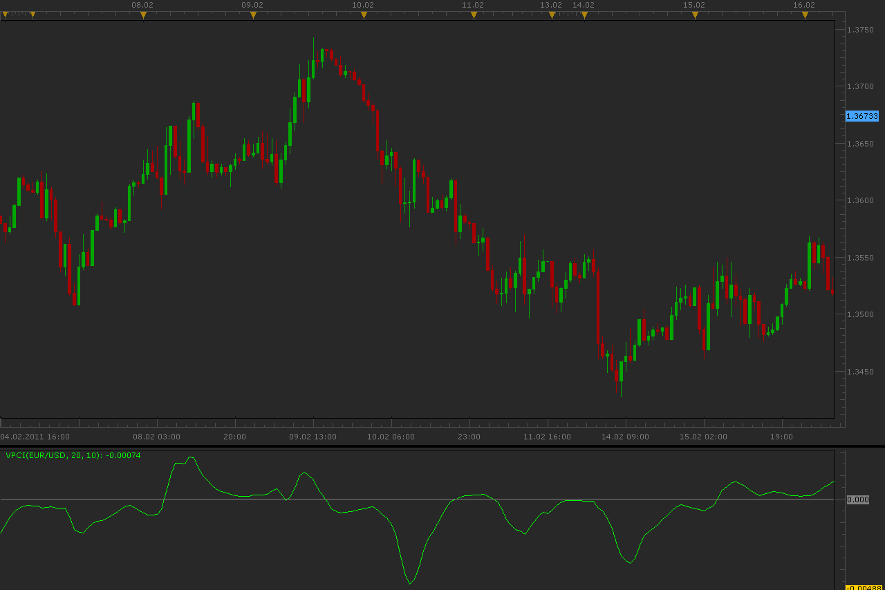

# Volume price confirmation indicator (VPCI)

> Source: https://fxcodebase.com/code/viewtopic.php?f=17&t=3478  
> Forum: 17 · Topic 3478 · 4 post(s)

---

## Volume price confirmation indicator (VPCI)

**Alexander.Gettinger** · Mon Feb 21, 2011 12:11 am

VPCI find the relation between price and volume.
Formulas:
VPCI=VPC*VPR*VM, where
VPC=VWMA(Slow_period)-SMA(Slow_period),
VWMA=Sum(Price_close*Volume),
SMA=Sum(Price_close),
VPR=VWMA(Fast_period)/SMA(Fast_period),
VM=(Sum(Volume,Fast_period)*Slow_period)/(Sum(Volume,Slow_period)*Fast_period).

 

Download:

 [VPCI.lua](files/8285/VPCI.lua)

The indicator was revised and updated

MQ4/MT4 version.
[viewtopic.php?f=38&t=61609](https://fxcodebase.com/code/viewtopic.php?f=38&t=61609)

---

## Re: Volume price confirmation indicator (VPCI)

**nookie** · Mon Jun 15, 2015 5:52 am

Can we convert this to histogram style with green for rising and red for declining values ?

---

## Re: Volume price confirmation indicator (VPCI)

**Apprentice** · Tue Jun 16, 2015 2:49 am

Bar Option Added.

---

## Re: Volume price confirmation indicator (VPCI)

**Apprentice** · Tue Jul 04, 2017 9:25 am

The indicator was revised and updated.
